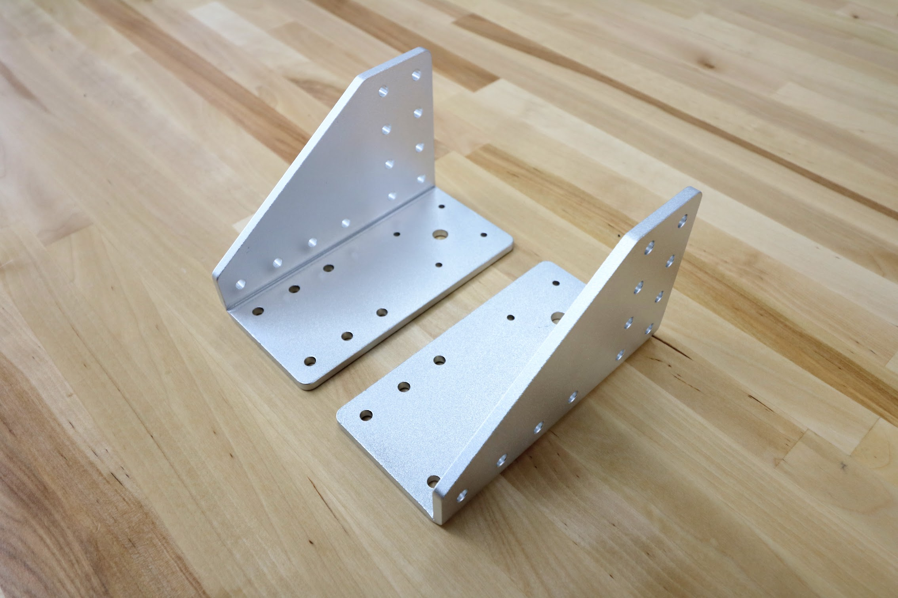
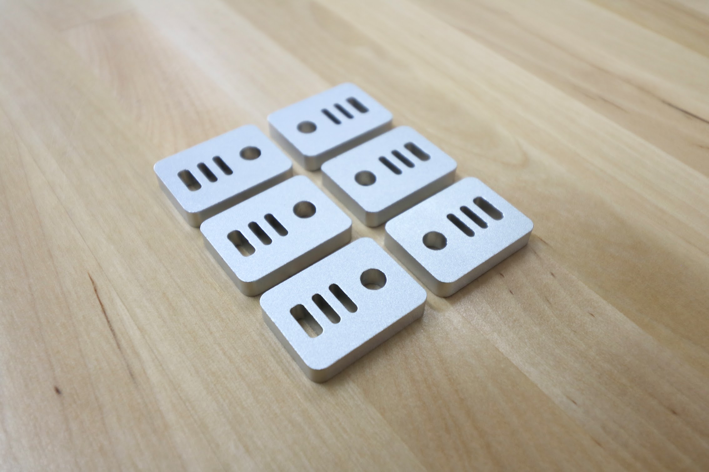

* toc
{:toc}

|Qty.                          |Component                     |$/Unit                        |$ Subtotal                    |
|------------------------------|------------------------------|------------------------------|------------------------------|
|4                             |[Track End Plates](#track-end-plates)|$7.00                         |$28.00
|2                             |[Track Joining Plates](#track-joining-plates)|$10.00                        |$20.00
|2                             |[Gantry Wheel Plates](#gantry-wheel-plates)|$15.00                        |$30.00
|2                             |[Gantry Corner Brackets](#gantry-corner-brackets)|$20.00                        |$40.00
|1                             |[Cross-Slide Plate](#cross-slide-plate)|$15.00                        |$15.00
|1                             |[Z-Axis Motor Mount](#z-axis-motor-mount)|$15.00                        |$15.00
|2                             |[Toolbays](#toolbays) |$25.00                        |$50.00
|18                            |[Horizontal CC Supports](#horizontal-cable-carrier-cc-supports)|$10.00                        |$180.00
|6                             |[Vertical CC Supports](#vertical-cable-carrier-cc-supports)|$10.00                        |$60.00
|1                             |[Long CC Mount](#long-cable-carrier-cc-mount)|$5.00                         |$5.00
|1                             |[CC Spacer Block](#cable-carrier-cc-spacer-block)|$5.00                         |$5.00
|2                             |[Cable Guides](#cable-guides)|$5.00                         |$5.00
|6                             |[Belt Clips](#belt-clips)|$3.00                         |$18.00
|**48**                        |**TOTALS**                    |                              |**$471.00**

<iframe class="embedly-embed" src="//cdn.embedly.com/widgets/media.html?src=https%3A%2F%2Fwww.youtube.com%2Fembed%2F3gW5PSsSMhQ%3Ffeature%3Doembed&url=http%3A%2F%2Fwww.youtube.com%2Fwatch%3Fv%3D3gW5PSsSMhQ&image=https%3A%2F%2Fi.ytimg.com%2Fvi%2F3gW5PSsSMhQ%2Fhqdefault.jpg&key=02466f963b9b4bb8845a05b53d3235d7&type=text%2Fhtml&schema=youtube" width="854" height="480" scrolling="no" frameborder="0" allowfullscreen></iframe>

# Track End Plates



|                              |                              |
|------------------------------|------------------------------|
|**Thickness**                 |5mm
|**Material**                  |6061 Aluminum
|**Surface Treatments**        |Tumble polished Sand blasted Clear anodized
|**Mass**                      |0.063kg
|**Volume**                    |23.2cm3
|**Price**                     |$7.00
|**Quantity**                  |4

# Track Joining Plates

|                              |                              |
|------------------------------|------------------------------|
|**Thickness**                 |5mm
|**Material**                  |6061 Aluminum
|**Surface Treatments**        |Tumble polished Sand blasted Clear anodized
|**Mass**                      |0.101kg
|**Volume**                    |37.0cm3
|**Price**                     |$10.00
|**Quantity**                  |2

# Gantry Wheel Plates

|                              |                              |
|------------------------------|------------------------------|
|**Thickness**                 |5mm
|**Material**                  |6061 Aluminum
|**Surface Treatments**        |Tumble polished Sand blasted Clear anodized
|**Mass**                      |0.287kg
|**Volume**                    |105.5cm3
|**Price**                     |$15.00
|**Quantity**                  |2

# Gantry Corner Brackets



|                              |                              |
|------------------------------|------------------------------|
|**Thickness**                 |5mm
|**Material**                  |5052 Aluminum
|**Surface Treatments**        |Tumble polished Sand blasted Clear anodized
|**Mass**                      |0.211kg
|**Volume**                    |77.6cm3
|**Price**                     |$20.00
|**Quantity**                  |2 (1 left-hand and 1 right-hand version)

# Cross-Slide Plate

|                              |                              |
|------------------------------|------------------------------|
|**Thickness**                 |5mm
|**Material**                  |6061 Aluminum
|**Surface Treatments**        |Tumble polished Sand blasted Clear anodized
|**Mass**                      |0.334kg
|**Volume**                    |122.7cm3
|**Price**                     |$15.00
|**Quantity**                  |1

# Z-Axis Motor Mount
This component securely attached the z-axis motor to the z-axis extrusion.

|                              |                              |
|------------------------------|------------------------------|
|**Material**                  |Machined 6061 Aluminum
|**Surface Treatments**        |Tumble polished Sandblasted Clear anodized
|**Color**                     |Silver
|**Mass**                      |
|**Volume**                    |
|**3D Printable?**             |Yes
|**Price**                     |$30
|**Quantity**                  |1

# Toolbays

<iframe class="embedly-embed" src="//cdn.embedly.com/widgets/media.html?src=https%3A%2F%2Fwww.youtube.com%2Fembed%2FvjvIB5wXmRo%3Ffeature%3Doembed&url=http%3A%2F%2Fwww.youtube.com%2Fwatch%3Fv%3DvjvIB5wXmRo&image=https%3A%2F%2Fi.ytimg.com%2Fvi%2FvjvIB5wXmRo%2Fhqdefault.jpg&key=02466f963b9b4bb8845a05b53d3235d7&type=text%2Fhtml&schema=youtube" width="854" height="480" scrolling="no" frameborder="0" allowfullscreen></iframe>



|                              |                              |
|------------------------------|------------------------------|
|**Thickness**                 |5mm
|**Material**                  |5052 Aluminum
|**Surface Treatments**        |Tumble polished Sand blasted Black anodized Laser engraved logo
|**Mass**                      |0.828kg
|**Volume**                    |304.4cm3
|**Price**                     |$25.00
|**Quantity**                  |2

# Horizontal Cable Carrier (CC) Supports
These parts are used to mount and support both the x-axis and y-axis cable carriers. The gusset also functions as an area for cables, tubes, and LED light strips to be routed through.



|                              |                              |
|------------------------------|------------------------------|
|**Material**                  |Machined 6061 Aluminum
|**Surface Treatments**        |Tumble polished Sandblasted Clear anodized
|**Color**                     |Silver
|**Mass**                      |
|**Volume**                    |
|**3D Printable?**             |Yes
|**Price**                     |$10
|**Quantity**                  |18

# Vertical Cable Carrier (CC) Supports
These parts are used to guide and support the z-axis cable carrier. The gusset also functions as an area for the z-axis motor's cables to be routed through.

|                              |                              |
|------------------------------|------------------------------|
|**Material**                  |Machined 6061 Aluminum
|**Surface Treatments**        |Tumble polished Sandblasted Clear anodized
|**Color**                     |Silver
|**Mass**                      |
|**Volume**                    |
|**3D Printable?**             |Yes
|**Price**                     |$10
|**Quantity**                  |6

# Long Cable Carrier (CC) Mount
This part allows the y-axis cable carrier to be mounted to the cross-slide plate.

|                              |                              |
|------------------------------|------------------------------|
|**Material**                  |Machined 6061 Aluminum
|**Surface Treatments**        |Tumble polished Sandblasted Clear anodized
|**Color**                     |Silver
|**Mass**                      |
|**Volume**                    |
|**3D Printable?**             |Yes
|**Price**                     |$5
|**Quantity**                  |1

# Cable Carrier (CC) Spacer Block
This component offsets the z-axis cable carrier from the cross-slide plate.

|                              |                              |
|------------------------------|------------------------------|
|**Material**                  |Machined 6061 Aluminum
|**Surface Treatments**        |Tumble polished Sandblasted Clear anodized
|**Color**                     |Silver
|**Mass**                      |
|**Volume**                    |
|**3D Printable?**             |Yes
|**Price**                     |$5.00
|**Quantity**                  |1

# Cable Guides
These simple components help organize and route the cables and tubes coming from the y-axis cable carrier.

|                              |                              |
|------------------------------|------------------------------|
|**Material**                  |Machined 6061 Aluminum
|**Surface Treatments**        |Tumble polished Sandblasted Clearanodized
|**Color**                     |Silver
|**Mass**                      |
|**Volume**                    |
|**3D Printable?**             |Yes
|**Price**                     |$10.00
|**Quantity**                  |2

# Belt Clips

|                              |                              |
|------------------------------|------------------------------|
|**Thickness**                 |5mm
|**Material**                  |6061 Aluminum
|**Surface Treatments**        |Tumble polished Sand blasted Clear anodized
|**Mass**                      |0.006kg
|**Volume**                    |2.34cm3
|**Price**                     |$3.00
|**Quantity**                  |6

