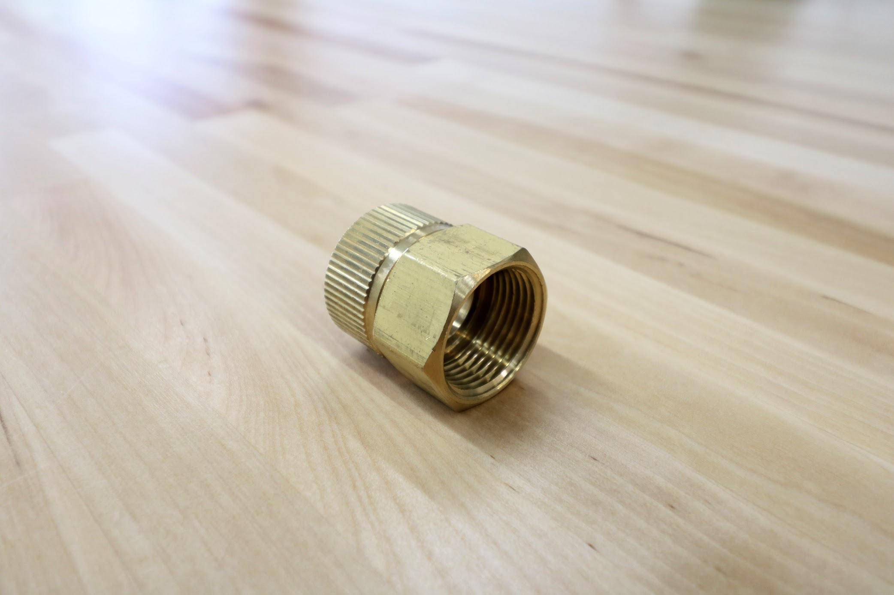
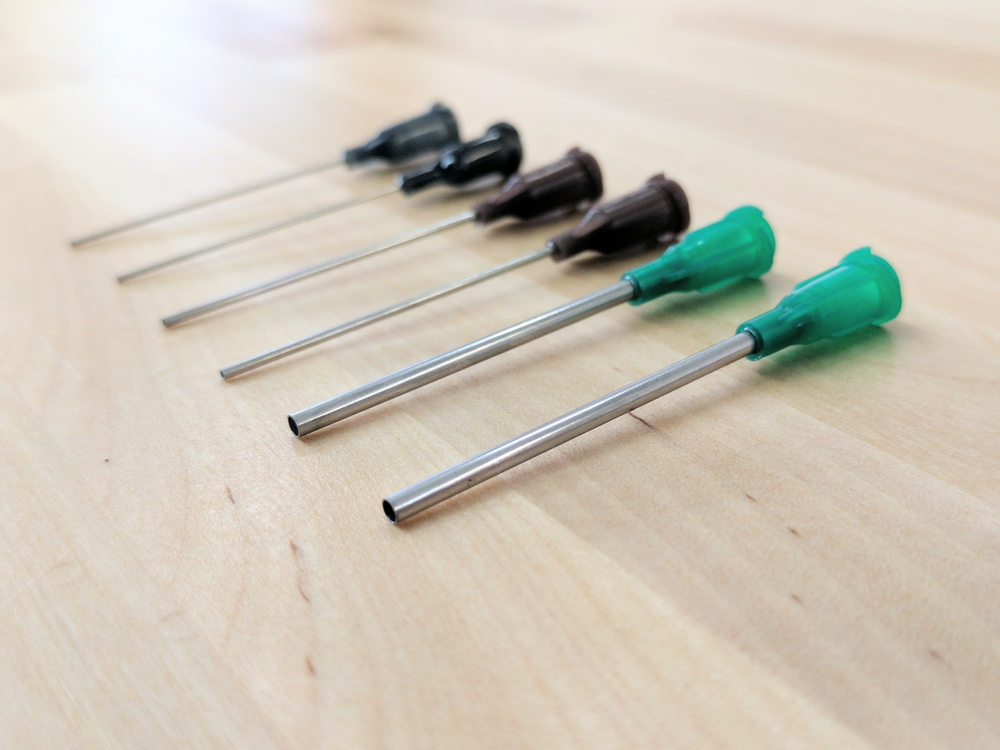

* toc
{:toc}

|Qty.                          |Component                     |$/Unit                        |Subtotal                      |
|------------------------------|------------------------------|------------------------------|------------------------------|
|2                             |[Liquid/Gas Tubes](#liquidgas-tubes)|$10.00                        |$20.00
|3                             |[Barbs](#barbs)       |$6.00                         |$18.00
|1                             |[Barbed Adapter](#barbed-adapter)|$2.00                         |$2.00
|1                             |[Garden Hose Adapter](#garden-hose-adapter)|$5.00                         |$5.00
|3                             |[O-rings](#o-rings)   |$0.50                         |$1.50
|4                             |[Grommets](#grommets) |$0.25                         |$1.00
|1                             |[Pressure Regulator](#pressure-regulator)|$6.00                         |$6.00
|1                             |[Luer Lock Adapter](#luer-lock-adapter)|$5.00                         |$5.00
|6                             |[Luer Lock Needles](#luer-lock-needles)|$3.00                         |$18.00
|**22**                        |**TOTALS**                    |                              |**$76.50**

# Liquid/Gas Tubes
These ultra flexible tubes carry liquids and gases to and from the UTM including water and vacuum air.

<iframe class="embedly-embed" src="//cdn.embedly.com/widgets/media.html?src=https%3A%2F%2Fwww.youtube.com%2Fembed%2FWQltVvwRYfE%3Ffeature%3Doembed&url=http%3A%2F%2Fwww.youtube.com%2Fwatch%3Fv%3DWQltVvwRYfE&image=https%3A%2F%2Fi.ytimg.com%2Fvi%2FWQltVvwRYfE%2Fhqdefault.jpg&key=02466f963b9b4bb8845a05b53d3235d7&type=text%2Fhtml&schema=youtube" width="854" height="480" scrolling="no" frameborder="0" allowfullscreen></iframe>

|                              |                              |
|------------------------------|------------------------------|
|**Length**                    |6m
|**Material**                  |Masterkleer PVC
|**Color**                     |Clear
|**Flexibility**               |Very Flexible
|**Compatible Tube Fittings**  |Barbs
|**Inner Diameter**            |1/4"
|**Outer Diameter**            |3/8"
|**Wall Thickness**            |1/16"
|**Bend Radius**               |1" Minimum
|**Max Pressure**              |35 psi at 73° F
|**Temperature Range**         |-45° to 165° F
|**Recommended Supplier**      |McMaster Carr - Part Number [5233K56](http://www.mcmaster.com/#5233k56)
|**Price**                     |$10.00
|**Quantity**                  |2

# Barbs
These stainless steel barbs screw into the UTM's three liquid/gas ports and accept the three liquid/gas lines coming from the z-axis cable carrier.

|                              |                              |
|------------------------------|------------------------------|
|**For Tube ID**               |1/4"
|**Threads**                   |10-32 UNF Straight Threads
|**Hex Size**                  |5/16"
|**Overall Length**            |25/32"
|**Temperature Range**         |–40° to 1200° F
|**Maximum Pressure**          |500 psi @ 72° F
|**RoHS**                      |Compliant
|**Gasket?**                   |Yes
|**Material**                  |Type 303 Stainless Steel
|**Recommended Supplier**      |McMaster Carr - Part Number [4406T14](http://www.mcmaster.com/#4406t14/=14ab6e0)
|**Price**                     |$6.00
|**Quantity**                  |3

# Barbed Adapter
This adapter threads onto the solenoid valve and is connected to the water tube leading to the UTM.

|                              |                              |
|------------------------------|------------------------------|
|**Material**                  |Nylon
|**For Tube ID**               |1/4"
|**Threads**                   |3/4" NPSM (National Pipe Straight Mechanical) connection, which is compatible with NPT threads
|**Hex Size**                  |1.25"
|**Overall Length**            |1.656"
|**Recommended Supplier**      |McMaster Carr - Part Number [5372K221](https://www.mcmaster.com/#5372k221/=14z0mfg)
|**Price**                     |$2.00
|**Quantity**                  |1

# Garden Hose Adapter
This adapter connects standard US garden hoses to the solenoid valve.

|                              |                              |
|------------------------------|------------------------------|
|**Material**                  |Brass
|**Threads**                   |3/4" Female GHT (Garden Hose Thread) 3/4" Female NPT (National Pipe Thread)
|**Swivel Type**               |Swivels until tightened
|**Seal**                      |Rubber Gasket
|**Maximum Temperature**       |195° F
|**RoHS**                      |Not compliant
|**Recommended Suppliers**     |[Zoro](https://www.zoro.com/westward-hose-to-pipe-adapter-swivel-dbl-female-4kg88/i/G0911032/)  McMaster Carr - Part Number [70815t44](https://www.mcmaster.com/#70815t44/=14jz0ff)
|**Price**                     |$5.00
|**Quantity**                  |1

# O-rings
These O-rings fit onto the UTM's liquid/gas ports and create a solid seal when tools are mounted.

|                              |                              |
|------------------------------|------------------------------|
|**Material**                  |Buna-N
|**Durometer**                 |A70 (Medium)
|**Outer Diameter**            |10.5mm
|**Inner Diameter**            |7.5mm
|**Thickness**                 |1.5mm
|**Temperature Range**         |-30° to 212° F
|**Color**                     |Black
|**Recommended Supplier**      |McMaster Carr - Part Number [1171n145](http://www.mcmaster.com/#1171n145/=14abs96)
|**Price**                     |$0.50
|**Quantity**                  |3

# Grommets
These grommets fit onto the UTM cover and allow the liquid/gas tubes and the UTM cable to pass into the UTM assembly while keeping water and dust out.

|                              |                              |
|------------------------------|------------------------------|
|**Material**                  |Rubber
|**Panel Hole Diameter**       |7/16"
|**Panel Thickness**           |3/32"
|**ID**                        |3/8"
|**OD**                        |5/8"
|**Overall Thickness**         |9/32"
|**Color**                     |Black
|**Recommended Supplier**      |McMaster Carr - Part Number [9600k33](http://www.mcmaster.com/#9600k33/=14ac8cm)
|**Price**                     |$0.25
|**Quantity**                  |4

# Pressure Regulator
This pressure regulator reduces the pressure from a municipal water supply down to 25 PSI (172 kpa, 1.72 bar) so that FarmBot can more easily control the amount of water it disperses.

|                              |                              |
|------------------------------|------------------------------|
|**Material**                  |UV resistant plastic
|**Inlet**                     |3/4 in. FHT (female hose thread)
|**Outlet**                    |3/4 in. MHT (male hose thread)
|**Color**                     |Black
|**Length**                    |6 inches (152.4mm)
|**Outer Diameter**            |1.25 inches (31.75mm)
|**Outlet Pressure**           |25 PSI (172 kpa, 1.72 bar)
|**Max Input Pressure**        |100 PSI (688 kpa, 6.88 bar)
|**Recommended Supplier**      |[Home Depot](http://www.homedepot.com/p/DIG-25-psi-Hose-Thread-Pressure-Regulator-D46/100180295)
|**Price**                     |$6.00
|**Quantity**                  |1

# Luer Lock Adapter

|                              |                              |
|------------------------------|------------------------------|
|**Price**                     |$5.00
|**Quantity**                  |1

# Luer Lock Needles

|                              |                              |
|------------------------------|------------------------------|
|**Gauges**                    |
|**Protective Covers?**        |Yes
|**Price**                     |$3.00
|**Quantity**                  |6

