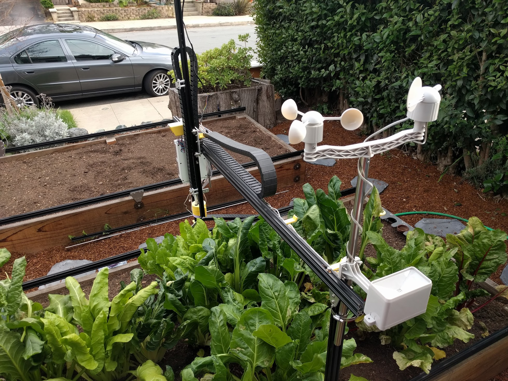

* toc
{:toc}

FarmBot Genesis has been designed to be a platform for growing plants in any way you want. What comes out-of-the-box is just the beginning of what is possible. In the following documentation pages we share just a handful of ideas for what more you can do with your FarmBot. Go ahead and explore!

_This FarmBot has been augmented with a weather station_



# What's next?

 * [Tool Spec](mods/tool-spec.md)
 * [Capture and Use Rainwater](mods/capture-and-use-rainwater.md)
 * [Turn FarmBot into a Weather Station](mods/turn-farmbot-into-a-weather-station.md)
 * [Monitor Resource Usage](mods/monitor-resource-usage.md)
 * [Power FarmBot with Solar](mods/power-farmbot-with-solar.md)
 * [Use FarmBot as a 3D CNC Camera Rig](mods/use-farmbot-as-a-3d-cnc-camera-rig.md)
 * [Complete the Cycle with Compost](mods/complete-the-cycle-with-compost.md)
 * [Add a Webcam to FarmBot](mods/add-a-webcam-to-farmbot.md)
 * [Control Lights with FarmBot](mods/control-lights-with-farmbot.md)
 * [Bees, Worms, Chickens, and More!](mods/bees-worms-chickens-and-more.md)
 * [Take Time Lapse Plant Photography](mods/take-time-lapse-plant-photography.md)
 * [Put FarmBot in a Greenhouse](mods/put-farmbot-in-a-greenhouse.md)
