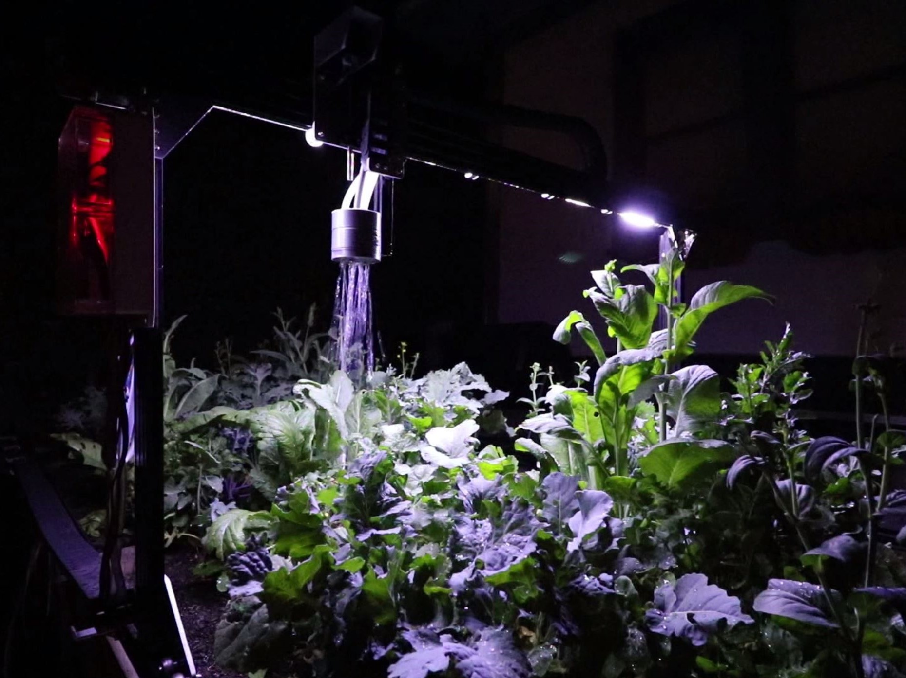
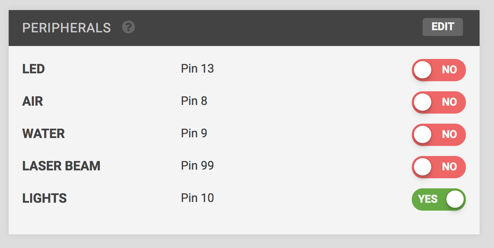
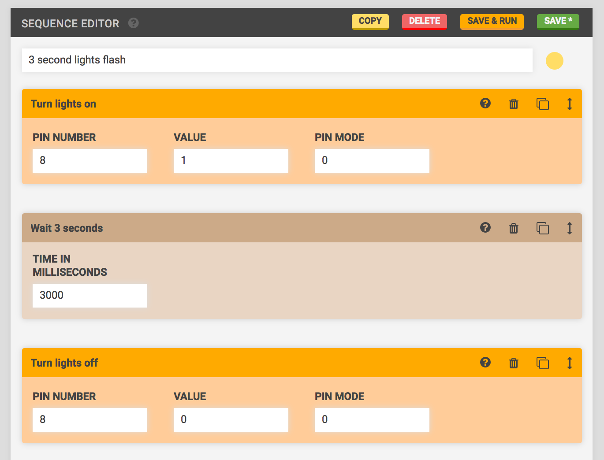

* toc
{:toc}

Want to light up your FarmBot at night so you can more easily harvest dinner-time veggies? Or maybe you want to experiment with growth rates by using specialized grow lights? Whatever the reason you want to have lights on your FarmBot, we'll show you how to do it in this easy tutorial.

# Step 1: Purchase components

|Component                     |Recommended Supplier          |Cost                          |
|------------------------------|------------------------------|------------------------------|
|Waterproof 12V Flexible LED Strip Lights|[Amazon](http://smile.amazon.com/Waterproof-Flexible-Lights-Daylight-Lumens/dp/B00JQV6U7Q/ref=redir_mobile_desktop?ie=UTF8&*Version*=1&*entries*=0)|$10.15

# Step 2: Connect the lights to the RAMPS shield

FarmBot's RAMPS shield provides multiple 12V outputs which can be used to power the LED lights. Strip 5mm of insulation off of the red and black wires coming from the LED strip.

Attach the wires to one of the RAMPS shield 12V outputs, making sure the red wire is hooked up to the positive output, while the black wire is hooked up to the negative output. Take note of the pin number you are connecting to as it will be used to control the lights from the web app later.

# Step 3: Mount or route the lights wherever desired

The LED strip we recommend purchasing is easily routed through the horizontal cable carrier supports as shown. This configuration will cast light down from the gantry onto your plants. If you would like to mount your lights elsewhere, you can use the included adhesive backing, zipties, double sided foam tape, or other means to secure the lights as desired.

# Step 4: Use the lights

In general there are two ways to use your newly installed LED lights:
## Method 1: Manually control the lights with the peripherals widget
From the **FarmBot Web App**, navigate to the **Controls** page. Click the **Edit** button in the header of the **Peripherals** widget. Create a new peripheral named "Lights" and assign it the pin number that you hooked the LED wires to on the RAMPS shield. Then click the **Save** button in the widget header and you will now have a shiny new toggle switch to operate your lights!

## Method 2: Systematically use the lights in your sequences and regimens
Because your lights are hooked up to a pin on the Arduino, you can easily create sequences that utilized the lights. Simply add a **Write Pin** step into your sequence to turn the lights on with a *pin value* of "1" and off with a *pin value* of "0". Make sure you set the *pin mode* to "0" and the *pin number* to whichever pin number you hooked up the wires to on the RAMPS shield.

