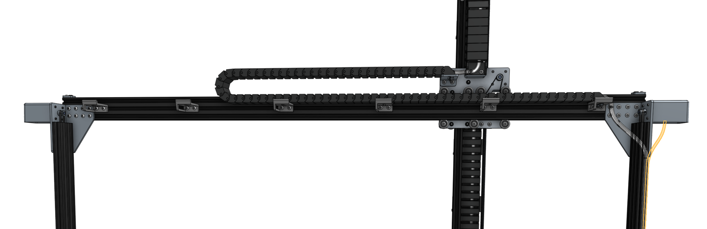

* toc
{:toc}

# Step 1: Connect the 1st x-axis motor and encoder cables

Connect the shortest **motor and encoder cables** to the first **x-axis motor and encoder** on the right side of FarmBot (when looking at the device from the back). The electronics box will be attached to this side in a later step.

_(highlighted in orange)_

# Step 2: Connect the 2nd x-axis motor and encoder cables

Connect the remaining middle length **motor and encoder cables** to the second **x-axis motor and encoder** on the left side of FarmBot (when looking at the device from the back).

Feed the motor and encoder cables through the slots in all of the **horizontal cable carrier supports** along the **gantry main beam**.

_(highlighted in orange)_

