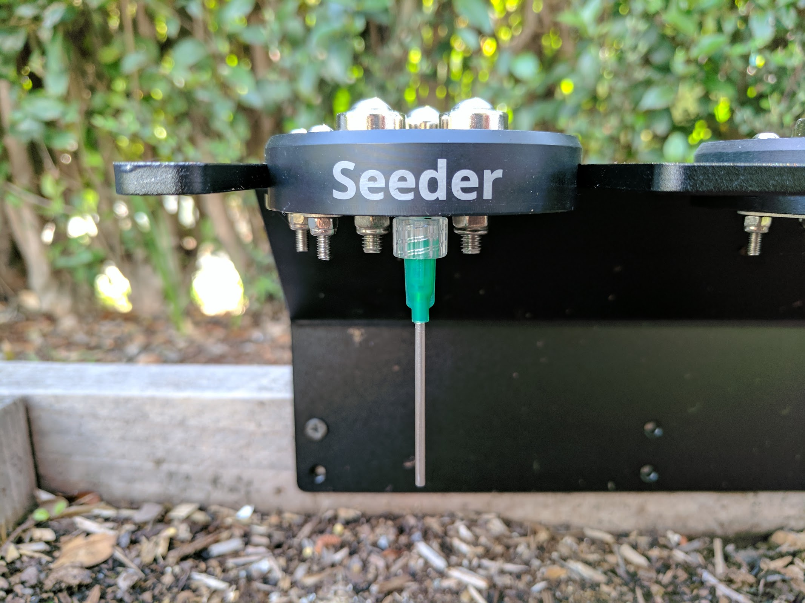
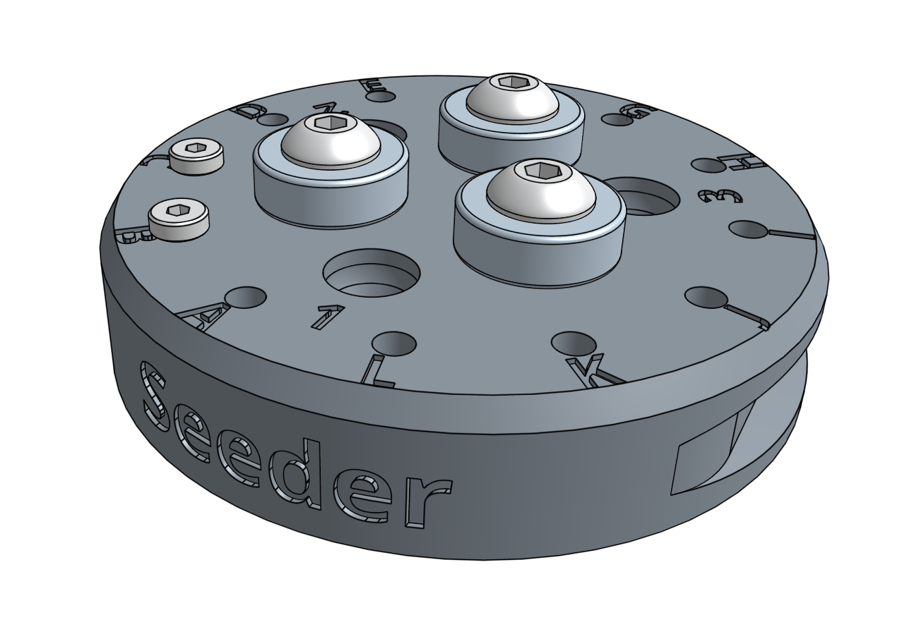
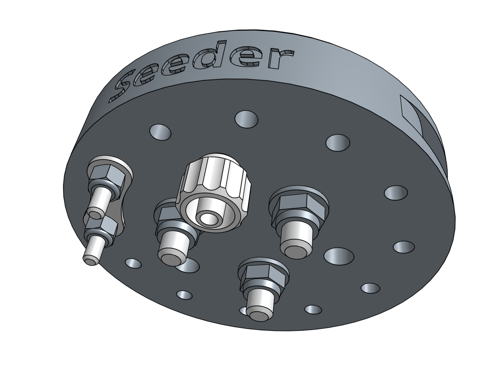
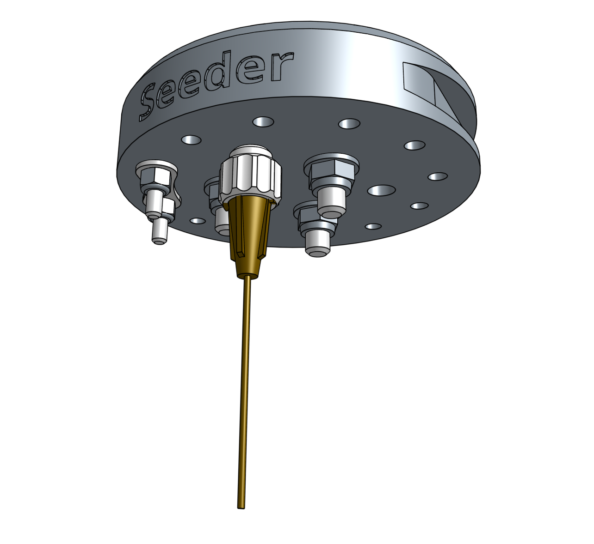
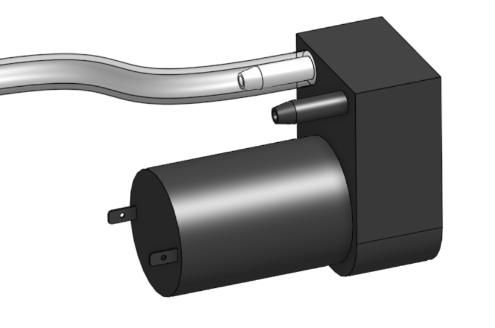
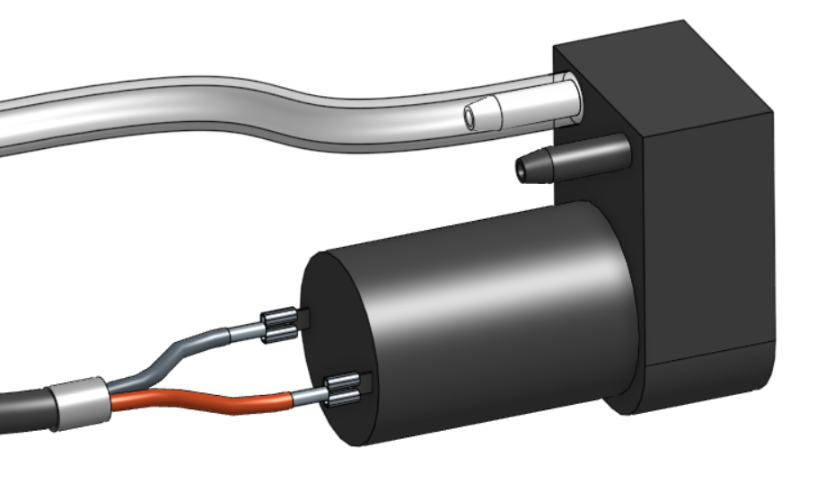
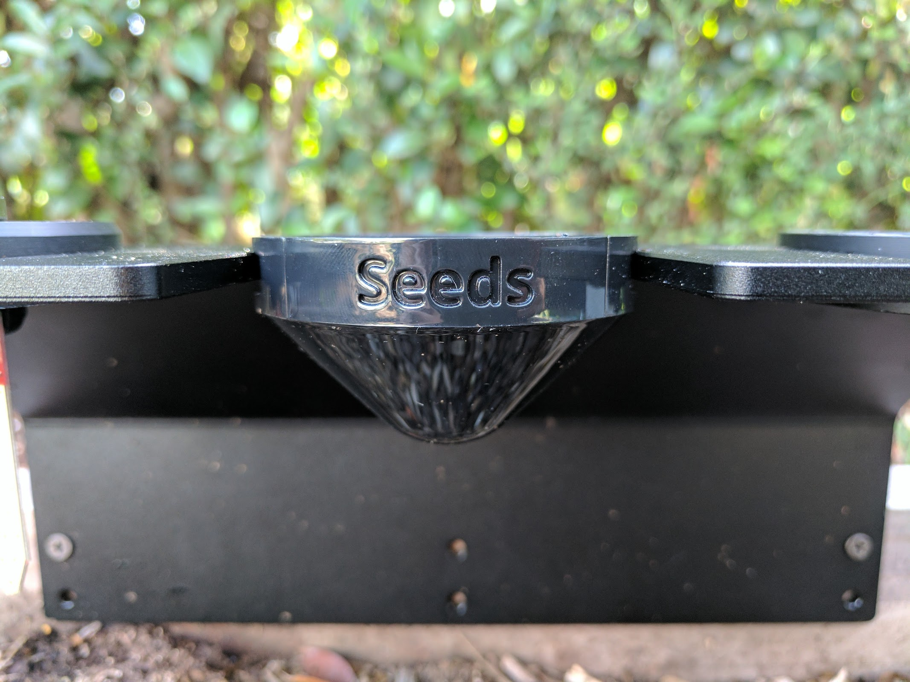
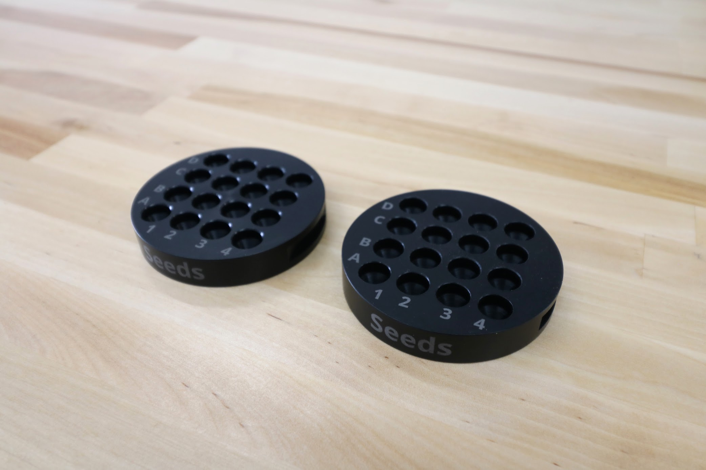
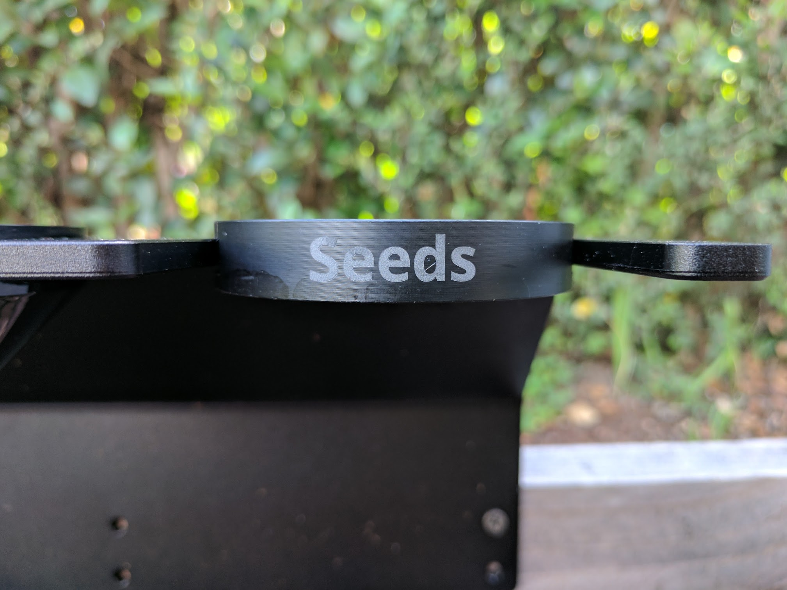

* toc
{:toc}

The seed injector works by using a strong vacuum pump to suction-hold a single seed onto the plastic tip. It is made of a single 3D printed plastic piece with a few other components screwed onto it for magnetic coupling and electronic verification with the UTM.

<iframe class="embedly-embed" src="//cdn.embedly.com/widgets/media.html?src=https%3A%2F%2Fwww.youtube.com%2Fembed%2FnXFdJIQaQB4%3Ffeature%3Doembed&url=http%3A%2F%2Fwww.youtube.com%2Fwatch%3Fv%3DnXFdJIQaQB4&image=https%3A%2F%2Fi.ytimg.com%2Fvi%2FnXFdJIQaQB4%2Fhqdefault.jpg&key=02466f963b9b4bb8845a05b53d3235d7&type=text%2Fhtml&schema=youtube" width="854" height="480" scrolling="no" frameborder="0" allowfullscreen></iframe>



# Step 1: Gather the parts and tools

Gather all the seed injector parts from the table below and lay them out in a logical manner. To complete the assembly, you will also need the following tools:

* [2mm hex driver](../../Extras/bom/miscellaneous.md#2mm-hex-driver)
* [3mm hex driver](../../Extras/bom/miscellaneous.md#3mm-hex-driver)
* [5.5mm box wrench](../../Extras/bom/miscellaneous.md#5-5mm-box-wrench)
* [8mm box wrench](../../Extras/bom/miscellaneous.md#8mm-box-wrench)

|Qty.                          |Component                     |
|------------------------------|------------------------------|
|1                             |[Seed Injector](../../Extras/bom/plastic-parts.md#seeder)
|1                             |[Luer Lock Adapter](../../Extras/bom/tubing.md#luer-lock-adapter)
|2                             |[M3 x 25mm Screws](../../Extras/bom/fasteners-and-hardware.md#m3-screws)
|2                             |[M3 Locknuts](../../Extras/bom/fasteners-and-hardware.md#m3-locknuts)
|3                             |[M5 x 30mm Screws](../../Extras/bom/fasteners-and-hardware.md#m5-screws)
|3                             |[M5 Washers](../../Extras/bom/fasteners-and-hardware.md#m5-washers)
|3                             |[M5 Locknuts](../../Extras/bom/fasteners-and-hardware.md#m5-locknuts)
|3                             |[Ring Magnets](../../Extras/bom/miscellaneous.md#ring-magnets)
|1                             |[Jumper Link](../../Extras/bom/electronics-and-wiring.md#jumper-links)
|1                             |[Luer Lock Needle](../../Extras/bom/tubing.md#luer-lock-needles)

# Step 2: Install the universal tool hardware

Install the **magnets** and tool verification **jumper link** using the instructions in the [universal tool hardware reference guide](../../FarmBot-Genesis-V1-2/reference/universal-tool-hardware.md).

# Step 3: Add the luer lock adapter

Screw the **1/4" 28 UNF to luer lock adapter** into the bottom of the **seed injector's** liquid/gas port labelled "1".

# Step 4: Selecting a luer lock needle

We've shipped all of the FarmBots with three different **luer lock needle** sizes so that you can experiment and find the best needle for your needs. The smaller needles will be better suited for smaller seeds (eg: lettuce) while the larger needles will be more suited to large seeds (eg: pumpkin). We've found that the medium sized brown needle is well suited for most seeds.

|Color                         |Gauge                         |ID                            |OD                            |
|------------------------------|------------------------------|------------------------------|------------------------------|
|Green                         |14                            |0.067"                        |0.083"
|Brown                         |19                            |0.032"                        |0.042"
|Black                         |22                            |0.019"                        |0.028"

Once you've selected a needle, attach it to the **1/4" 28 UNF to luer lock adapter** with a 1/4 turn. At any time you can quickly swap the needle out for another size or replace a damaged one.

# Step 5: Connect the vacuum pump

Slide the **vacuum tube** onto the inlet barb of the **vacuum pump**.

# Step 6: Wire up the vacuum pump

Connect the **vacuum pump cable** to the **vacuum pump's** terminals.



# Step 7: Understanding the seed containers

<iframe class="embedly-embed" src="//cdn.embedly.com/widgets/media.html?src=https%3A%2F%2Fwww.youtube.com%2Fembed%2FguJK9498ZA4%3Ffeature%3Doembed&url=http%3A%2F%2Fwww.youtube.com%2Fwatch%3Fv%3DguJK9498ZA4&image=https%3A%2F%2Fi.ytimg.com%2Fvi%2FguJK9498ZA4%2Fhqdefault.jpg&key=02466f963b9b4bb8845a05b53d3235d7&type=text%2Fhtml&schema=youtube" width="854" height="480" scrolling="no" frameborder="0" allowfullscreen></iframe>

We offer the following types of seed containers, each optimized for different purposes.

## Seed bins
The **seed bins** are for holding large amounts of one type of seed. This is best used when planting many plants of the same crop, for example: when growing microgreens. To use a seed bin, simply slide it into the **toolbay** and fill it with seeds. Then run a planting sequence from the web app with the corresponding seed bin sequence and location.

If desired, you can mix a variety of seed types into one seed bin and have FarmBot plant whatever it happens to grab. Keep in mind though that FarmBot will have no way of knowing which seeds it grabs, so only use this technique when you will be taking care of all those plants identically. An example for this again might be when growing microgreens - you can grow three different types in the same area at the same time, all in the same way, without having to do three planting sequences or otherwise treat them differently.

## Seed trays
The **seed trays** have 16 small area for holding seeds. They are best used when planting many different crops, and when the number of seeds per hole needs to be strictly controlled.

Coming soon: software features that allow you to more easily program and use the different locations of the 16 seed areas.

## Coming soon: seed canisters
How cool would it be if you could use the FarmBot web app to design your garden for up to a year in advance, and then purchase the seeds needed for that garden right from the app? This is the concept behind the seed canister - a year's supply of seeds based on your garden design, delivered to your door.

The seed canister would simply be many seed pucks stacked inside a canister. Each puck would have a unique ID, be filled with various types of seeds according to your design, and be sealed with plastic on top to ensure vitality. When needed, FarmBot would message you to load in a new seed puck. Or, there may be an included tool that can allow FarmBot to automatically pull out the next puck from the canister on its own!
