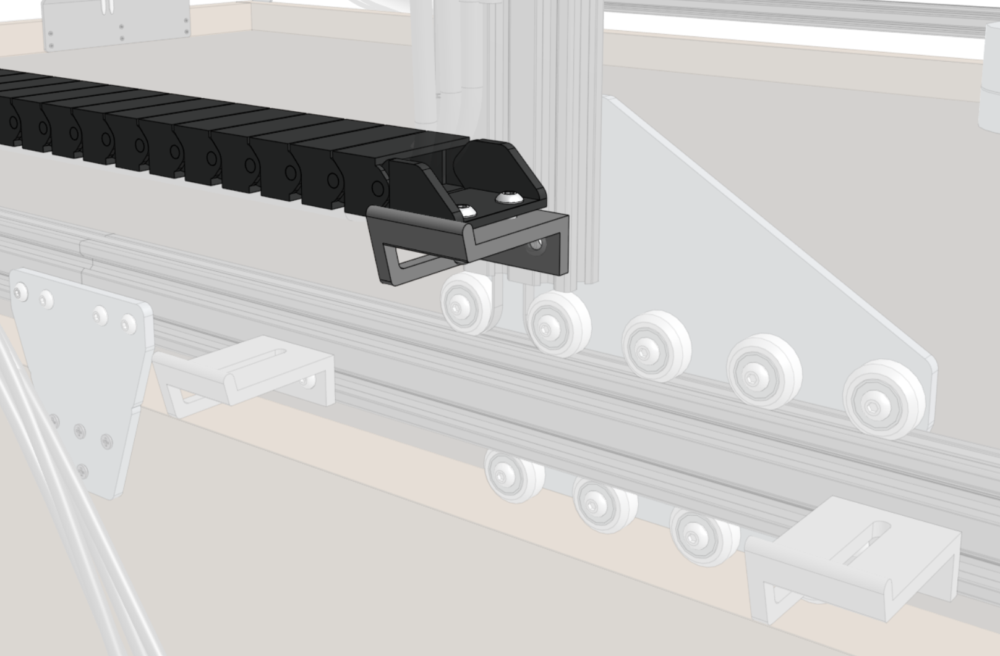

* toc
{:toc}

# Step 1: Prepare the cable carrier

Remove all of the snap-in **tabs** from the **x-axis cable carrier**. The x-axis cable carrier is the longest cable carrier in the kit. It has 90 links (1800mm long) + end pieces.

# Step 2: Orient the cable carrier

There is only one orientation that the **x-axis cable carrier** mounts to the **gantry** and **tracks**, and it is determined by the orientation of the **end pieces**. Lay the cable carrier onto the track's **horizontal cable carrier supports** but do not attach it at this time.

# Step 3: Lay out the tubing and wiring

Lay the two **liquid/gas tubes**, the two **RAMPS power cables**, the **Raspberry Pi power cable**, the **vacuum pump cable**, and the **solenoid valve cable** into the open **x-axis cable carrier**. All of the cables should have a bare-wire end sticking out the side of the cable carrier that will mount onto the gantry. All of these cables should extend beyond the cable carrier on this end by 30cm so that they can reach the appropriate location inside the electronics box.



# Step 4: Snap in some tabs

Snap in three **cable carrier tabs** at both ends of the cable carrier, and ten more spread throughout the middle of the cable carrier so that as you mount the assembly, the cables and tubing will stay in place. You do not want to snap in all of the tabs at this time because that will make it difficult to adjust any of the tubes or cables if needed.

# Step 5: Mount the cable carrier to the gantry

Carefully flip over the end of the **cable carrier** such that the end piece is positioned on the **horizontal cable carrier support** on the **gantry column**. Make sure you maintain organization of the cables and tubing when doing this.

Reduce the amount of extra tubing between the end of the **x-axis cable carrier** and the **y-axis cable carrier** by gently pulling the extra length through the **x-axis cable carrier**. It can be difficult to coax the contents around the bend of the cable carrier, so take your time and ensure that you are not pulling anything too hard.

Attach the **x-axis cable carrier** to the **horizontal cable carrier mount** using two **M5 x 16mm screws**, **M5 washers**, and **M5 locknuts**.

# Step 6: Mount the cable carrier to the tracks

Attach the other end of the **x-axis cable carrier** to the **horizontal cable carrier support** nearest the middle of the **tracks** using two **M5 x 16mm screws**, **M5 washers**, and **M5 locknuts**.

# Step 7: Snap in the remaining tabs

Once everything is situated well, snap-in the remaining **cable carrier tabs**, ensuring that you maintain organization of the cables and tubing.



# What's next?

 * [X-Axis Motors](../cables-and-tubing/x-axis-motors.md)
