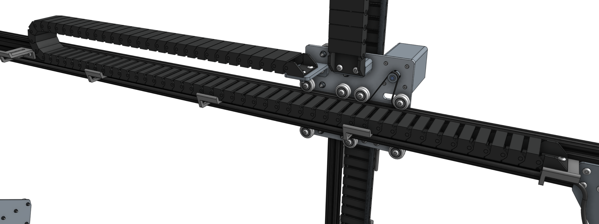
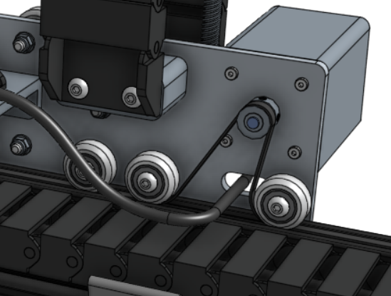
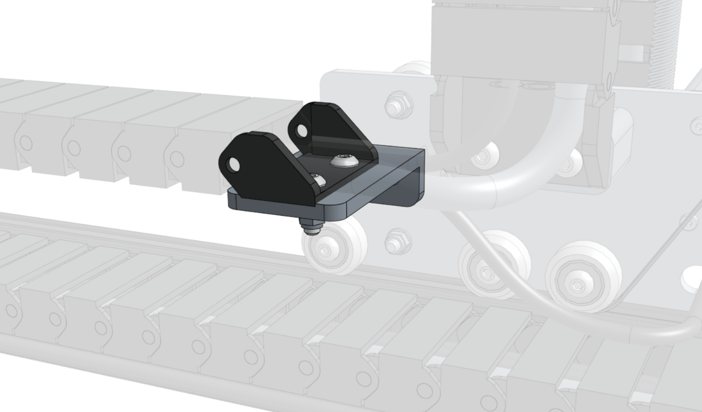
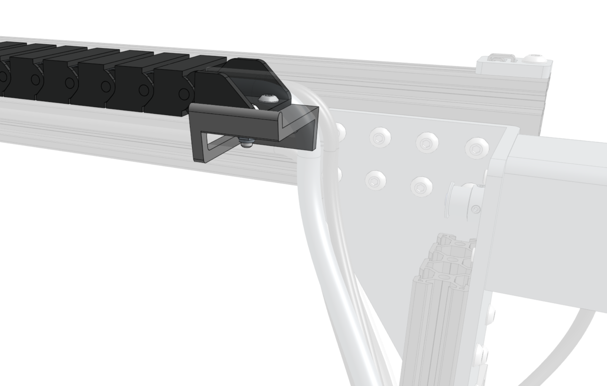

* toc
{:toc}

# Step 1: Prepare the cable carrier

Remove all of the snap-in **tabs** from the **y-axis cable carrier**. The y-axis cable carrier is the middle length cable carrier in the kit. It has 80 links in it (1600mm) + end pieces. Note that this cable carrier is very similar in size to the x-axis cable carrier. Make sure you choose the correct one.

# Step 2: Orient the cable carrier

There is only one orientation that the **y-axis cable carrier** mounts to the **cross-slide** and **gantry**, and it is determined by the orientation of the **end pieces**. Lay the cable carrier onto the gantry's **horizontal cable carrier supports** but do not attach it at this time.

# Step 3: Add the y-axis motor and encoder cables

Feed the **y-axis motor and encoder cables** through the slot in the **cross-slide plate** such that there is enough cable length so that they can be comfortably connected to the motor and encoder. However, do not plug them in at this as they can be damaged if pulled on.

# Step 4: Lay out the tubing and wiring

Lay the **y-axis motor and encoder cables** and *all* of the cables and tubes coming from the **z-axis cable carrier** (**UTM cable**, the two **liquid/gas tubes**, the **camera cable**, and the **z-axis motor and encoder cables**) into the open **y-axis cable carrier**.



# Step 5: Snap in some tabs

Snap in three **cable carrier tabs** at both ends of the cable carrier, and ten more spread throughout the middle of the cable carrier so that as you mount the assembly, the cables and tubing will stay in place. You do not want to snap in all of the tabs at this time because that will make it difficult to adjust any of the tubes or cables if needed.

# Step 6: Mount the cable carrier to the cross-slide

Carefully flip over the end of the **cable carrier** such that the end piece is positioned on the **long cable carrier mount**. Make sure you maintain organization of the cables and tubing when doing this.

Reduce the amount of extra tubing and wiring between the end of the **y-axis cable carrier** and the **z-axis cable carrier** by gently pulling the extra length through the **y-axis cable carrier**. It can be difficult to coax the contents around the bend of the cable carrier, so take your time and ensure that you are not pulling anything too hard. Never pull anything by the connector.

Attach the **y-axis cable carrier** to the **long cable carrier mount** using two **M5 x 16mm screws**, **M5 washers**, and **M5 locknuts**.

# Step 7: Mount the cable carrier to the gantry

Attach the **y-axis cable carrier** to the **horizontal cable carrier support** nearest the gantry using two **M5 x 16mm screws**, **M5 washers**, and **M5 locknuts**.

# Step 8: Snap in the remaining tabs

Once everything is situated well, snap-in the remaining **cable carrier tabs**, ensuring that you maintain organization of the cables and tubing.



# What's next?

 * [X-Axis Cable Carrier](x-axis-cable-carrier.md)
