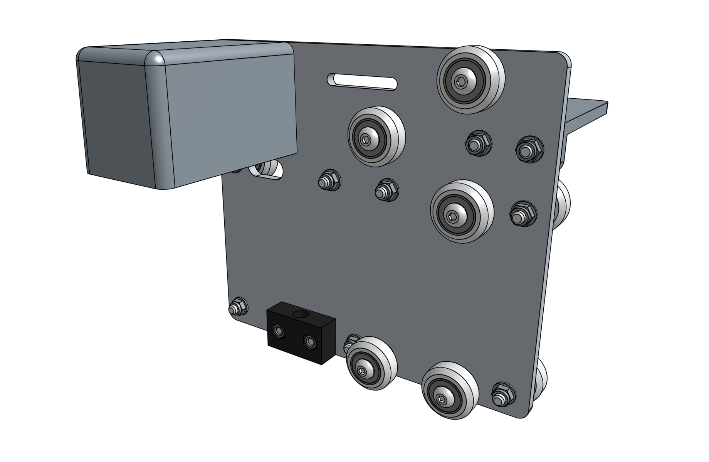
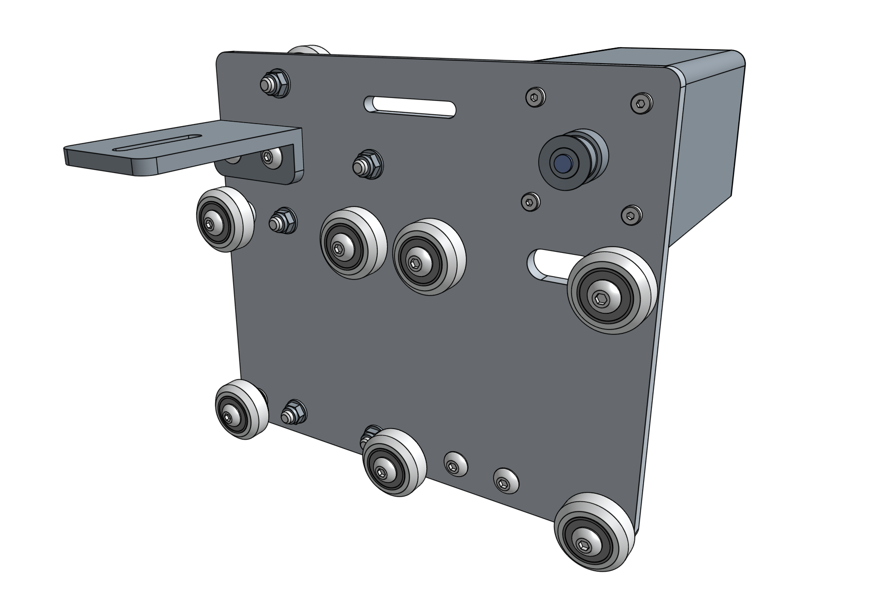

_View of the cross-slide from the front of FarmBot_

_View of the cross-slide from the back of FarmBot_

# Component list

To prepare for assembly, gather all the components from the table below and lay them out in a logical manner. To complete the assembly in the next pages, you will also need the following tools:
* [3mm hex driver](../Extras/bom/miscellaneous.md#3mm-hex-driver)
* [8mm box wrench](../Extras/bom/miscellaneous.md#8mm-box-wrench)
* [8mm wrench](../Extras/bom/miscellaneous.md#8mm-wrench)

|Qty.                          |Component                     |
|------------------------------|------------------------------|
|1                             |[Cross-Slide Plate](../Extras/bom/plates-and-brackets.md#cross-slide-plate)
|2                             |[M3 x 5mm Setscrews](../Extras/bom/fasteners-and-hardware.md#m3-screws)
|4                             |[M5 x 16mm Screws](../Extras/bom/fasteners-and-hardware.md#m5-screws)
|12                            |[M5 x 30mm Screws](../Extras/bom/fasteners-and-hardware.md#m5-screws)
|6                             |[M5 x 6mm Spacers](../Extras/bom/fasteners-and-hardware.md#m5-spacers)
|6                             |[6mm Eccentric Spacers](../Extras/bom/fasteners-and-hardware.md#m5-x-6mm-eccentric-spacers)
|14                            |[M5 Washers](../Extras/bom/fasteners-and-hardware.md#m5-washers)
|16                            |[M5 Locknuts](../Extras/bom/fasteners-and-hardware.md#m5-locknuts)
|1                             |[Horizontal Motor Housing](../Extras/bom/plastic-parts.md#horizontal-motor-housing)
|1                             |[Long CC Mount](../Extras/bom/plates-and-brackets.md#long-cable-carrier-cc-mount)
|12                            |Complete V-Wheels (one [v-wheel](../Extras/bom/drivetrain.md#v-wheels), two [bearings](../Extras/bom/drivetrain.md#bearings), and one [M5 shim](../Extras/bom/drivetrain.md#m5-shims))
|1                             |[Leadscrew Block](../Extras/bom/drivetrain.md#leadscrew-block)
|1                             |[NEMA 17 Stepper Motor with Rotary Encoder](../Extras/bom/electronics-and-wiring.md#nema-17-stepper-motors-with-rotary-encoders)
|1                             |[20 tooth GT2 Pulley](../Extras/bom/drivetrain.md#gt2-pulleys)
|1                             |[Y-Axis Belt](../Extras/bom/drivetrain.md#gt2-timing-belt)
|2                             |[M3 x 10mm Screws](../Extras/bom/fasteners-and-hardware.md#m3-screws)

# What's next?

 * [Cross-Slide Assembly](cross-slide/cross-slide-assembly.md)
