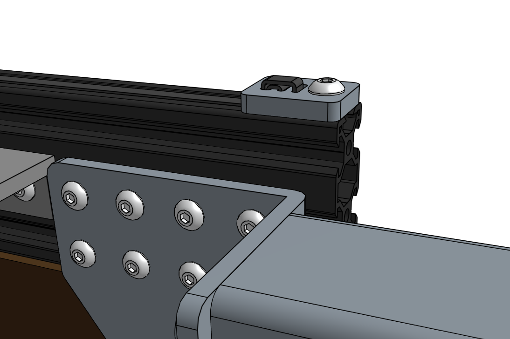

* toc
{:toc}

# Step 1: Adjust the eccentric spacers
In order for the cross-slide to slide smoothly and wobble-free on the gantry main beam, you must first adjust the eccentric spacers of the bottom three V-wheels. Adjust the eccentric spacers using the [eccentric spacer adjustment reference guide](../../FarmBot-Genesis-V1.2/reference/eccentric-spacer-adjustment.md).

# Step 2: Slide the cross-slide onto the gantry main beam
Once you have adjusted the spacers, slide the cross-slide onto the gantry main beam.

# Step 3: Feed and secure the belt
Use a **belt clip**, **M5 x 10mm screw**, and **M5 tee nut** to secure one end of the **2m long GT2 timing belt** to the end of the gantry main beam. The belt must be wrapped through the clip as outlined in the [Belt Clip Installation](../../FarmBot-Genesis-V1.2/reference/belt-clip-installation.md) reference guide.

Feed the end of the GT2 belt under the end V-wheel of your cross-slide, then over the motor pulley and under the remaining three V-Wheels. The flat side of the belt should be in contact with your V-wheels while the toothed side should engage with the teeth on the pulley.



Secure the belt at the other end of the gantry with another **belt clip**, **M5 x 10mm screw**, and **M5 tee nut**. Put a small amount of tension on the belt as you tighten the M5 screw.

# What's next?

 * [Z-Axis](../../FarmBot-Genesis-V1.2/z-axis.md)
