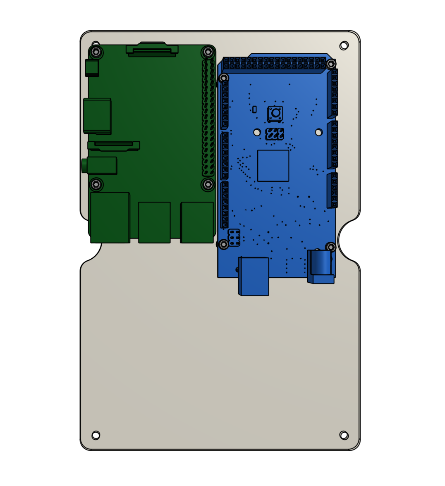

* toc
{:toc}



# Step 1: Gather the parts and tools
Gather all the parts from the table below and lay them out in a logical manner. To complete the assembly, you will also need the following tools:

* [2mm hex driver](../../Extras/bom/miscellaneous.md#2mm-hex-driver)
* [3mm hex driver](../../Extras/bom/miscellaneous.md#3mm-hex-driver)
* [Bladed screwdriver](../../Extras/bom/miscellaneous.md#bladed-screwdriver)

|Qty.                          |Component                     |
|------------------------------|------------------------------|
|16                            |[M2.5 x 4mm Screws](../../Extras/bom/fasteners-and-hardware.md#m25-screws)
|4                             |[M2.5 x 6mm Standoffs](../../Extras/bom/fasteners-and-hardware.md#m25-standoffs)
|4                             |[M2.5 x 16mm Standoffs](../../Extras/bom/fasteners-and-hardware.md#m25-standoffs)
|4                             |[M3 x 5mm Screws](../../Extras/bom/fasteners-and-hardware.md#m3-screws)
|6                             |[M4 x 16mm Screws](../../Extras/bom/fasteners-and-hardware.md#m4-screws)
|2                             |[M5 x 10mm Screws](../../Extras/bom/fasteners-and-hardware.md#m5-screws)
|2                             |[M5 Tee Nuts](../../Extras/bom/fasteners-and-hardware.md#m5-tee-nuts)
|1                             |[Electronics Housing](../../Extras/bom/electronics-and-wiring.md#electronics-housing)
|1                             |[Electronics Mounting Plate](../../Extras/bom/plastic-parts.md#electronics-mounting-plate)
|1                             |[Raspberry Pi 3](../../Extras/bom/electronics-and-wiring.md#raspberry-pi-3)
|1                             |[MicroSD Card](../../Extras/bom/electronics-and-wiring.md#microsd-card)
|1                             |[Arduino Mega 2560](../../Extras/bom/electronics-and-wiring.md#arduino-mega-2560)
|1                             |[RAMPS shield](../../Extras/bom/electronics-and-wiring.md#ramps-shield)
|4                             |[Stepper Drivers](../../Extras/bom/electronics-and-wiring.md#stepper-drivers)
|4                             |[Stepper Driver Heatsinks](../../Extras/bom/electronics-and-wiring.md#stepper-drivers)
|1                             |[USB cable (Type A male to Type B male)](../../Extras/bom/electronics-and-wiring.md#usb-cable)
|1                             |[5V power adapter](../../Extras/bom/electronics-and-wiring.md#5v-power-adapter)
|2                             |[Wire Nuts](../../Extras/bom/electronics-and-wiring.md#wire-nuts)

# Step 2: Install FarmBot OS
Follow the instructions on the [Raspberry Pi software](https://software.farm.bot/docs/farmbot-os) page to install FarmBot OS onto the **microSD card**. Then insert the microSD card into the slot in the backside of the **Raspberry Pi**.

# Step 3: Mount the Arduino
Use four **M2.5 x 4mm screws** to attach four **M2.5 x 6mm standoffs** to the **electronics mounting plate**. The screws should be on the backside of the plate while the standoffs should be on the front.



Attach the **Arduino** to the **standoffs** using four **M2.5 x 4mm screws**.

# Step 4: Mount the Raspberry Pi
Use four **M2.5 x 4mm screws** to attach four **M2.5 x 16mm standoffs** to the **electronics mounting plate**. The standoffs should be on the same side of the plate as the Arduino.

Attach the **Raspberry Pi** to the **standoffs** using four **M2.5 x 4mm screws**.

# Step 5: Connect the Arduino to the Raspberry Pi
Connect the **Arduino** to the **Raspberry Pi** with the **USB cable**. It does not matter which USB port you plug into on the Pi. If using a short cable, the lower right port is recommended.

# Step 6: Mount the plate in the housing
Attach the **electronics mounting plate** to the **electronics housing** using four **M3 x 5mm screws**.

# Step 7: Add the RAMPS shield
Align the **RAMPS shield** on top of the **Arduino**. The green connectors of the RAMPS shield should be on the same end of the board as the USB port of the Arduino.

Carefully press the two boards together.



_Press firmly._

# Step 8: Add the stepper drivers



Expose the adhesive on the bottom of the **stepper driver heatsinks**.

Attach the heatsink to the black chip on the **stepper driver**.



Mount the four **stepper drivers** on top of the **RAMPS shield**, being careful not to bend any of the pins.







# Step 9: Connect the RAMPS power cable
Use the **bladed screwdriver** to open the two screw terminals on the right side of the **green power connector** of the **RAMPS shield**. Then insert the **RAMPS power cable's wires** and tighten. The black wire (negative) should be in the right-most terminal.





# Step 10: Connect the Raspberry Pi power cable
Plug the **buck adapter** into the top right three GPIO pins of the **Raspberry Pi**. The empty header of the buck adapter should be "connected" to the upper right GPIO pin.



Twist together the free red wire from the **buck adapter** with the red wire from the **Raspberry Pi power cable**. Then screw on a **wire nut**. Repeat for the black wires.





# What's next?

 * [Attach the Electronics Box](attach-the-electronics-box.md)
