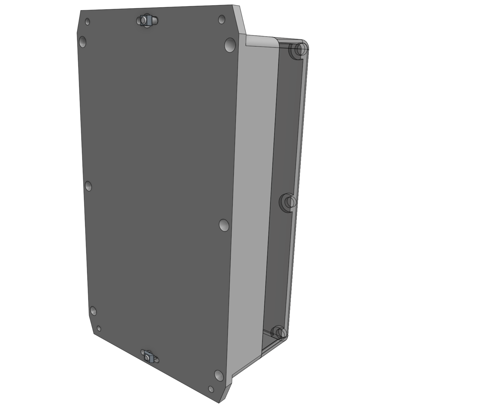
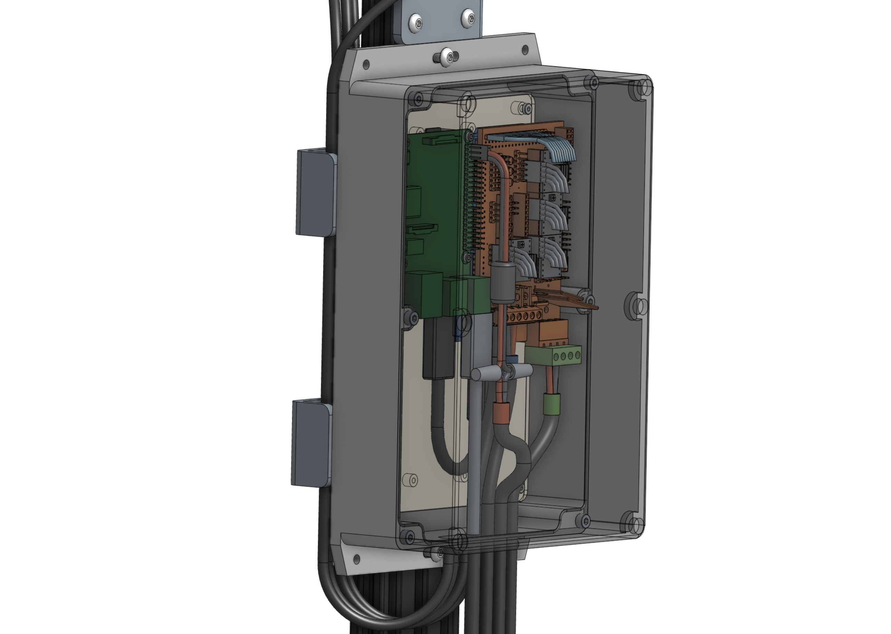
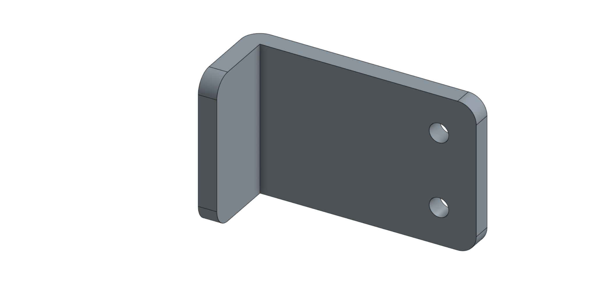
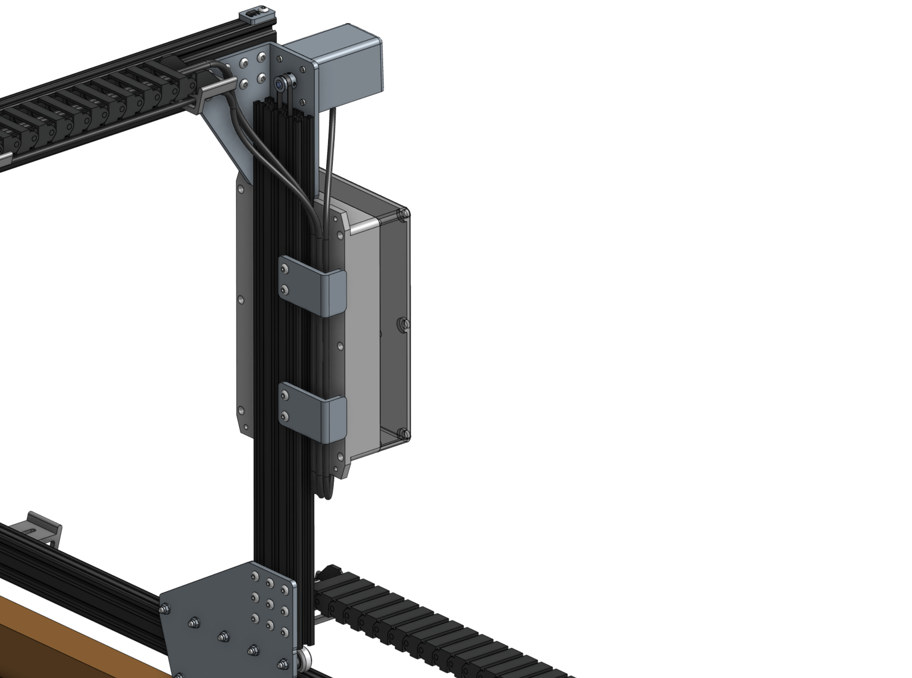

# Step 1: Gather the parts and tools

Gather all the parts from the table below and lay them out in a logical manner. To complete the assembly, you will also need the following tools:

* [3mm hex driver](../../Extras/bom/miscellaneous.md#3mm-hex-driver)

|Qty.                          |Component                     |
|------------------------------|------------------------------|
|1                             |[Electronics Housing](../../Extras/bom/electronics-and-wiring.md#electronics-housing)
|6                             |[M5 x 10mm Screws](../../Extras/bom/fasteners-and-hardware.md#m5-screws)
|6                             |[M5 Tee Nuts](../../Extras/bom/fasteners-and-hardware.md#m5-tee-nuts)
|2                             |[Cable Guides](../../Extras/bom/plates-and-brackets.md#cable-guides)

# Step 2: Add hardware to electronics box

Put **M5 x 10mm screws** through the top and bottom mounting holes of the electronics box and thread on a **tee-nut** to each.

# Step 3: Attach electronics box

Line up the electronics box with the center channel of the gantry column and tighten the attachment screws.

# Step 4: Attach the cable guides

The **Cable Guides** keep the cables going from the electronics box to the Y-Axis cable carrier and X-Axis motors neat and organized.

Add **M5 x 10mm screws** and **tee-nuts** to the **Cable Guides** and attach the cable guides as shown.

# What's next?

 * [Plug Everything In](plug-everything-in.md)
