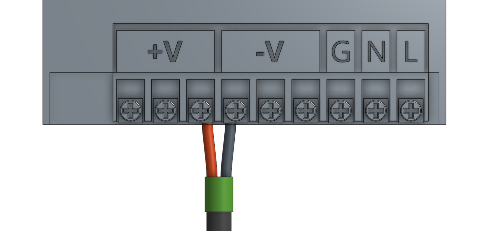
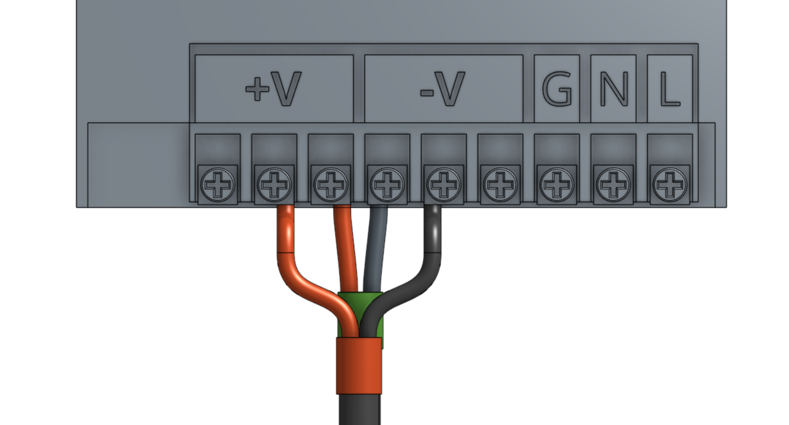
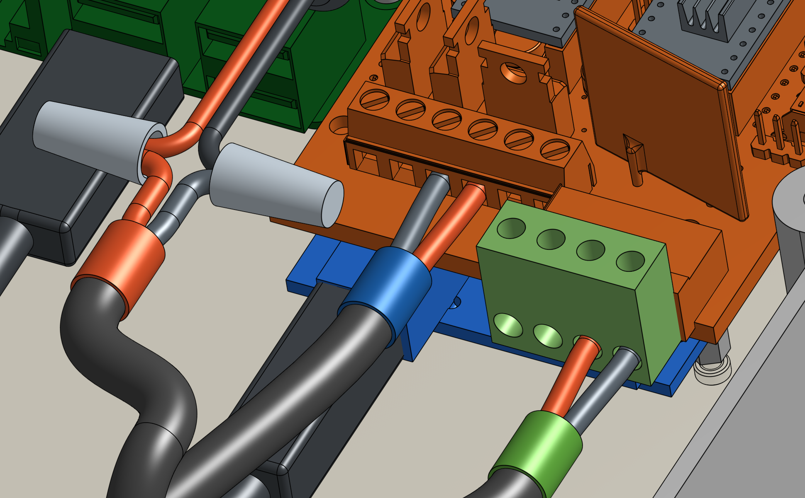
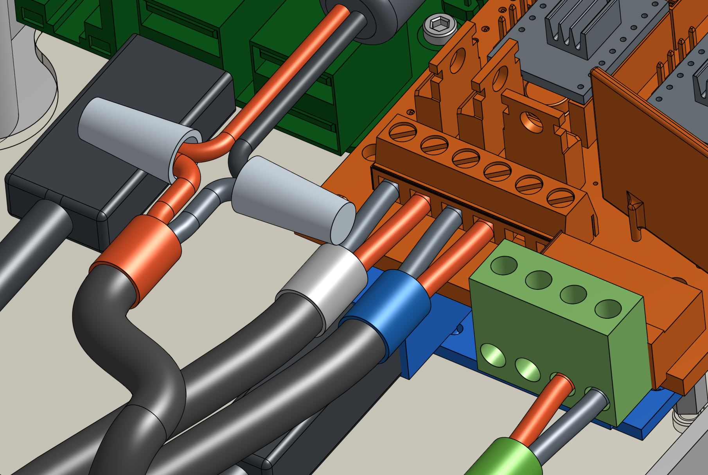
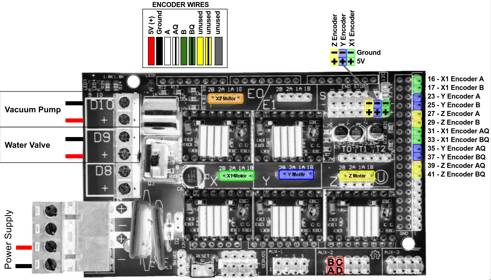
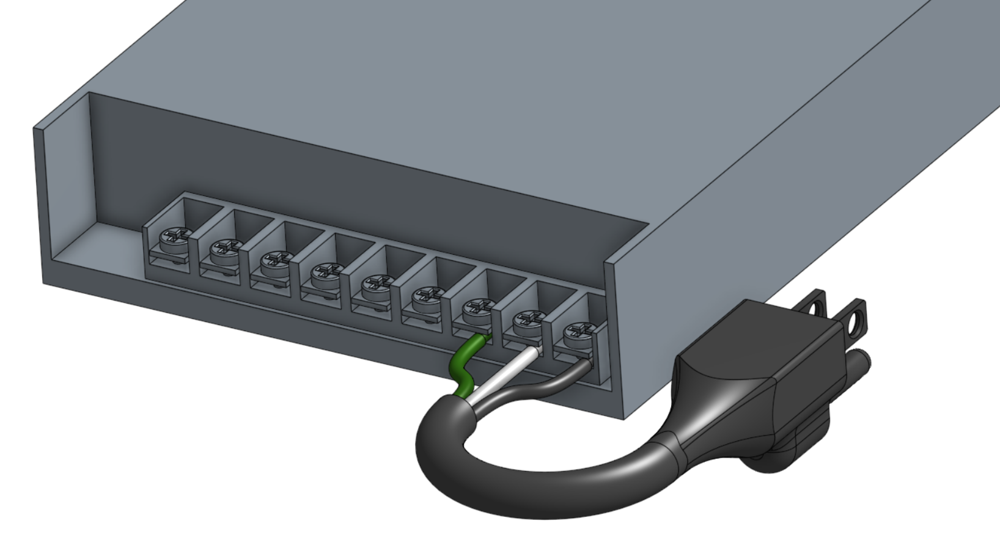
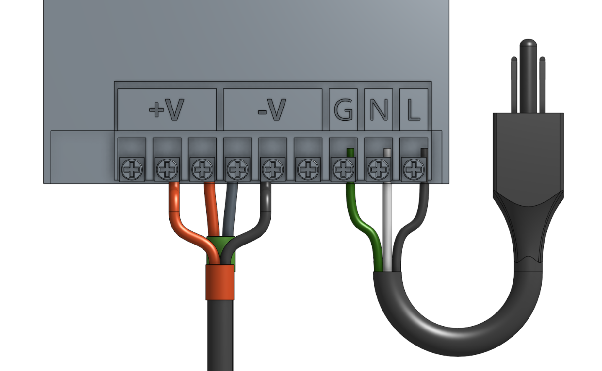
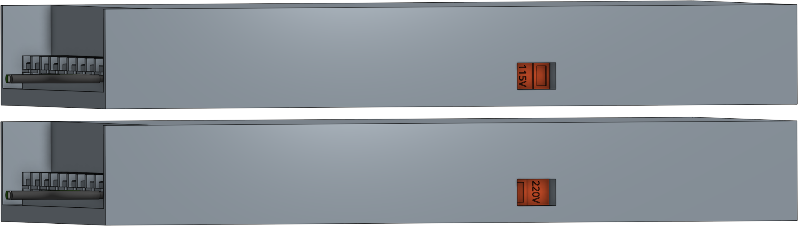
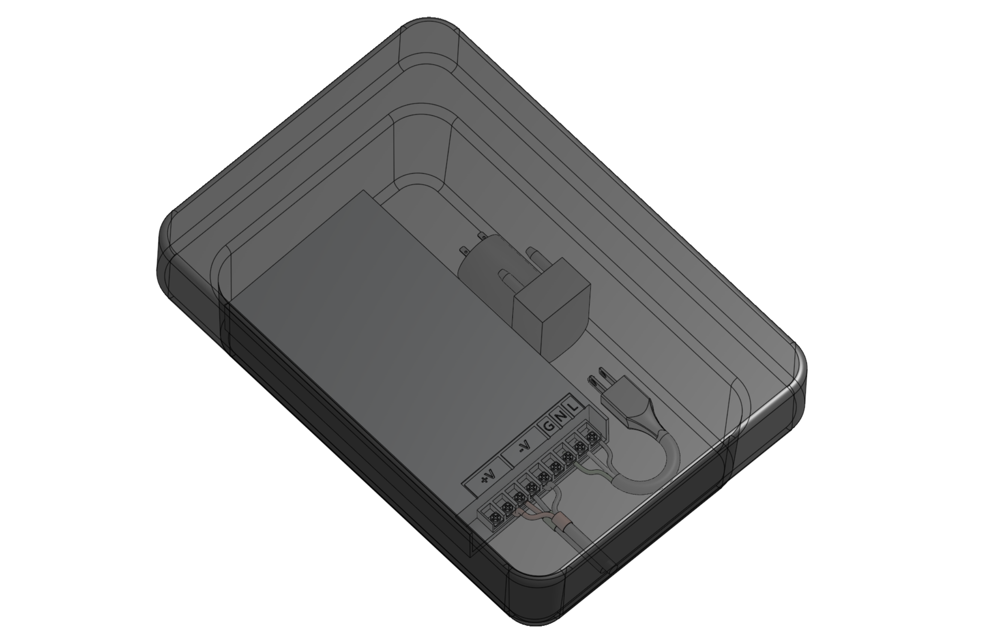
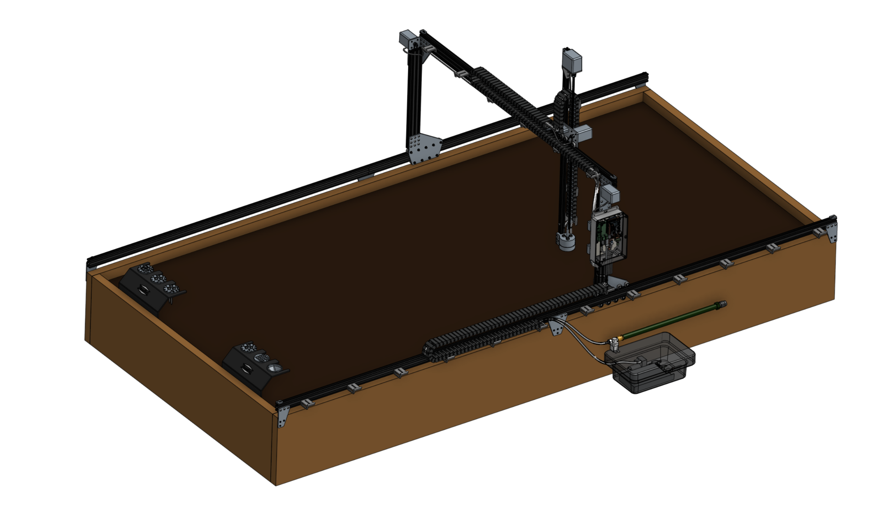

* toc
{:toc}

# Step 1: Attach the RAMPS power cable to the power supply



Attach the red (positive) wire from the **RAMPS power cable** to one of the available positive outputs on the **power supply** and tighten the screw.

Attach the black (negative) wire from the **RAMPS power cable** to one of the available negative outputs on the **power supply** and tighten the screw.

# Step 2: Attach the Raspberry Pi power cable to the power supply
Attach the red (positive) wire from the **Raspberry Pi power cable** to one of the available positive outputs on the **power supply** and tighten the screw.

Attach the black (negative) wire from the **Raspberry Pi power cable** to one of the available negative outputs on the **power supply** and tighten the screw.

# Step 3: Connect the peripherals
Connect the **solenoid valve cable** to the positive and negative terminals labelled **D9** on the **RAMPS shield**.

Connect the **vacuum pump cable** to the positive and negative terminals labelled **D10** on the **RAMPS shield**.

# Step 4: Plug in the stepper motors and rotary encoders
Plug in the **motor and encoder cables** to the **RAMPS shield** according to the following diagram.



{%
include callout.html
type="info"
title="Motor Cable Orientation"
content="You can plug the stepper motor cables into the RAMPS board in either direction: _black-red-white-yellow_ or _yellow-white-red-black_ top-to-bottom. Changing the direction that the motor wire connector is plugged in will change the direction that the motor moves. So if a motor is moving right when it should be moving left, you can change the orientation of the stepper motor wire connector on the RAMPS board.

Since the X1 and X2 motors need to be moving in opposite directions for the gantry to move, the motor wire connectors for X1 and X2 should be plugged in opposite each other (for example, yellow on top for X1 and yellow on bottom for X2)."
%}



# Step 5: Plug in the UTM cable's connectors
Plug in the UTM's wires to the RAMPS shield according to the [pin mapping table](../../FarmBot-Genesis-V1.2/utm.md).

|UTM Pin/UTM Wire              |is connected to               |and used for                  |
|------------------------------|------------------------------|------------------------------|
|A/1                           |+5V on Arduino/RAMPS          |Soil sensor
|B/2                           |Ground (0V) on Arduino/RAMPS  |Ground
|C/3                           |Pin D63 on Arduino/RAMPS - Digital-In|Tool verification
|D/4                           |Pin D59 (A5) on Arduino/RAMPS - Analog-In|Soil sensor and other analog signal tools



# Step 6: Add the power cord to the power supply
Attach the **FarmBot power plug** to the **power supply** inputs according to the following image.

# Step 7: Set the power supply input voltage
The power supply can accept both 110V and 220V power input.



Set the switch to the correct input voltage. The voltage label you see must match your country's power infrastructure.

# Step 8: Plug in the power supply



{%
include callout.html
type="danger"
title="Beware of electrical shock"
content="Remember that once you plug in the power supply, your system will be powered. Once powered, you cannot add, remove, or change any motor cables, peripheral wires, stepper drivers, etc, or you risk frying your electronics and/or being electrically shocked.

Once powered, be especially careful working around the power supply's exposed inputs and outputs, and the exposed electronics boards. **Do not touch or handle any exposed contacts or other electrical components.**"
%}

If everything looks good, and you understand the precautions needed around powered electronics, go ahead and plug FarmBot into the wall.







# Step 9: Keep power supply in outdoor box

The power supply lives inside the weatherproof **[SockitBox](http://www.sockitbox.com/size-option/285/#ad-image-3)**, along with the vacuum pump.

# What's next?

 * [Tools](../../FarmBot-Genesis-V1.2/tools.md)
