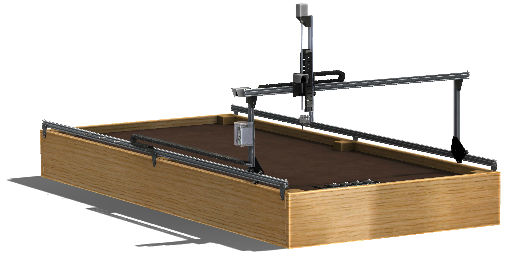
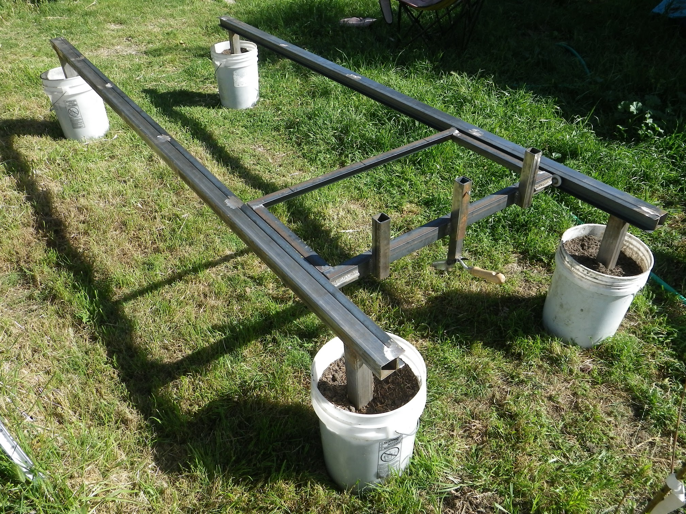

* toc
{:toc}



# [V1.1](https://genesis.farm.bot/v1.1)
Major changes: Removed the driveshaft in favor of dual x-axis motors, redesigned cable carrier supports, experimentation with the Raspberry Pi camera, new tool bay is a single bent component, new gantry corner brackets are single bent pieces, metal belt clips and cable clips, updated cross-slide, all metal z-axis motor mount, new z-axis drag chain guides, encoders and motors now have removable cables, standoffs between the electronics and the mounting plate, switched back to using the A4988 stepper drivers, improved watering nozzle design for SLA printing, switched the entire CAD workflow from Solidworks to Onshape.

# [V1.0](https://genesis.farm.bot/v1.0)
Major changes: track plate improvements, new seed injector design, larger z cable carrier, new motor housings and z motor mount, larger cross-slide and gantry plates with more v-wheels, new tool bay, new seed bin, stronger cable carrier supports, introduced cable management clips, introduced belt clip plates, significant modifications to the UTM and UTM cover, switched to button head M5 screws.

# [V0.9](https://genesis.farm.bot/v0.9)
Major changes: larger plates, more v-wheels, larger gantry extrusions for added rigidity, introduced the weed suppressor tool

# [V0.8](https://genesis.farm.bot/v0.8)
Major changes: all corrosion resistant design; upgrade to 5mm thick plates; improvements to the UTM, cable carrier brackets, and electronics enclosure

# [V0.7](https://genesis.farm.bot/v0.7)
Major changes: removal of endstops, stronger z-axis motor mount, added z-axis cable carrier, track plates and gantry corner plates redesign, upgraded universal tool mount to support 6 liquid lines and 12 electrical connections, quick access electronics enclosure, larger cable carriers

# [V0.6](https://genesis.farm.bot/v0.6)
Major changes: reliability improvements to the universal tool mount

# [V0.5](https://genesis.farm.bot/v0.5)
Major changes: rotary encoders on motors, integrated water, vacuum, and liquid amendments into universal tool mount, part simplification

# [V0.4](https://genesis.farm.bot/v0.4)
Major changes: electronics enclosures/housings, cable carrier cable management, magnetic universal tool mount design

# [V0.3](https://genesis.farm.bot/v0.3)
Major changes: wire and trolley cable management, part simplification

# [V0.2](https://genesis.farm.bot/v0.2)
Major changes: endstop integration, custom brackets and plates, universal tool mount

# [V0.1](https://genesis.farm.bot/v0.1)
Focused on being a quick and easy first prototype, V0.1 was constructed from all off-the-shelf components

# V0.0
The very first physical FarmBot prototype was made from welded steel square stock, C-channel, angle iron, garage door wheels, and a trowel. It served primarily as a visual aid.

# What's next?

 * [Tracks](../../FarmBot-Genesis-V1.2/tracks.md)
