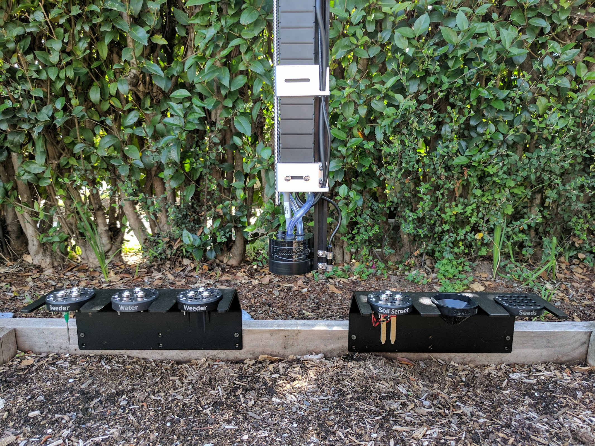

* toc
{:toc}

FarmBot Genesis kits come with four tools to cover the basics of food production, as well as two toolbays, seed bins, and seed trays. The following documentation pages explain how to assemble and install all of these tools and more.



# What's next?

 * [Seed Injector](../FarmBot-Genesis-V1.2/tools/seed-injector.md)
 * [Watering Nozzle](../FarmBot-Genesis-V1.2/tools/watering-nozzle.md)
 * [Weeder](../FarmBot-Genesis-V1.2/tools/weeder.md)
 * [Soil Sensor](../FarmBot-Genesis-V1.2/tools/soil-sensor.md)
 * [Camera](../FarmBot-Genesis-V1.2/tools/camera.md)
 * [Toolbays](../FarmBot-Genesis-V1.2/tools/toolbays.md)
