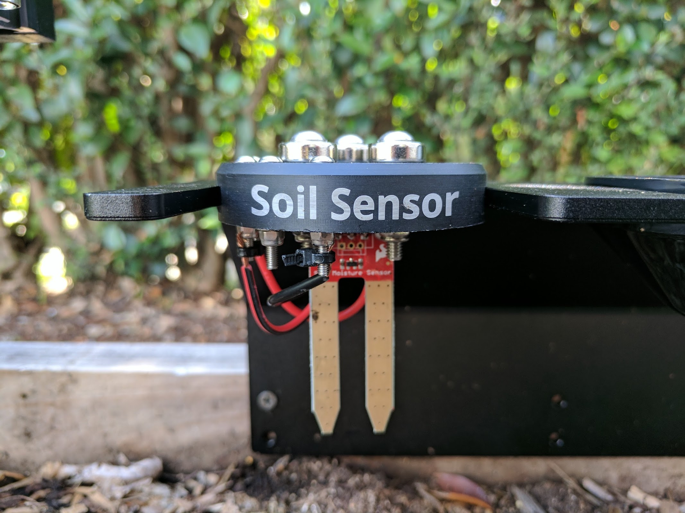
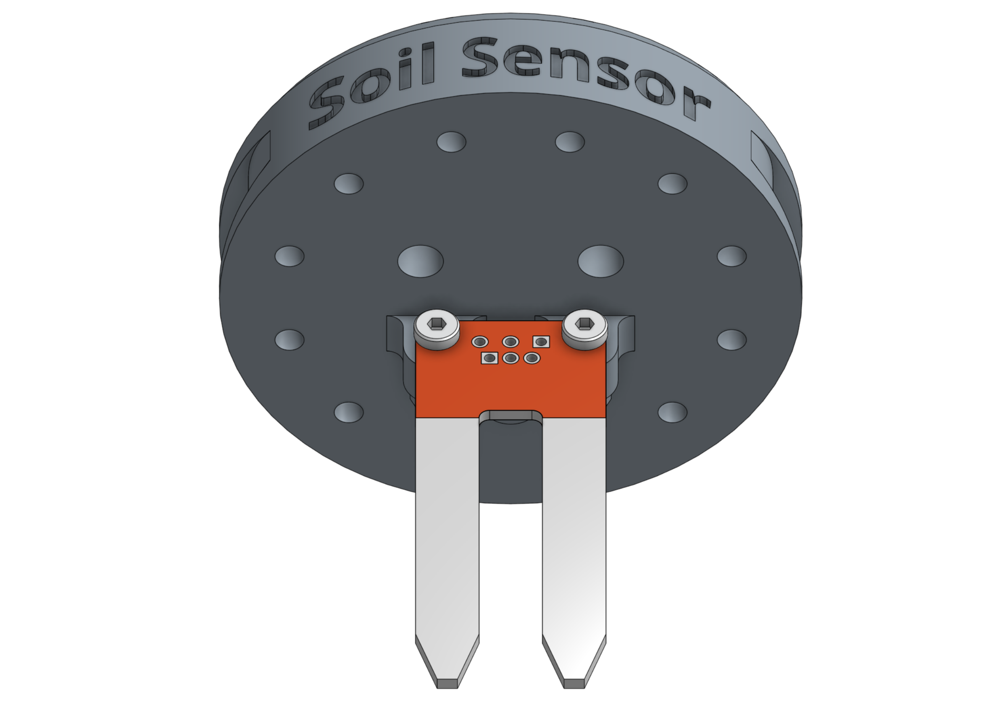
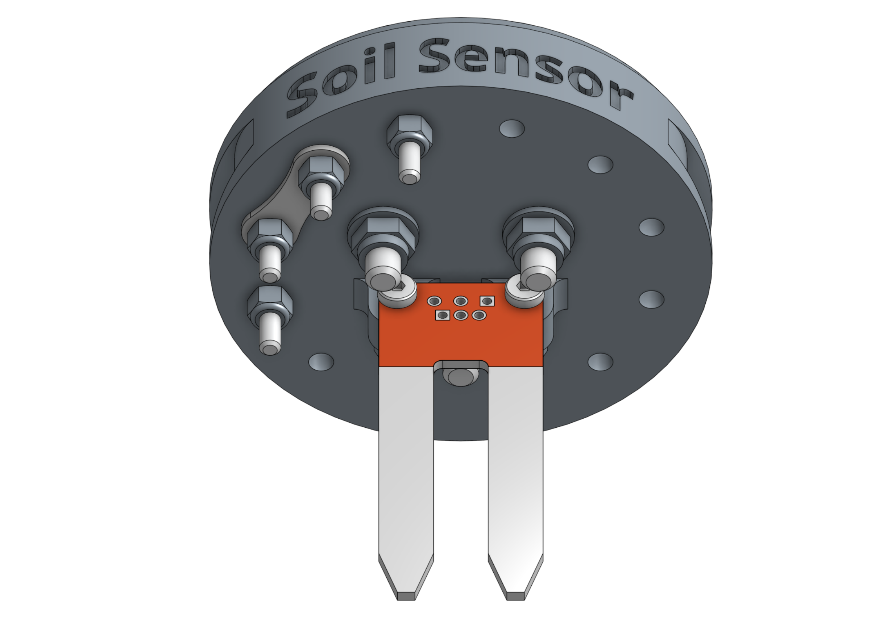
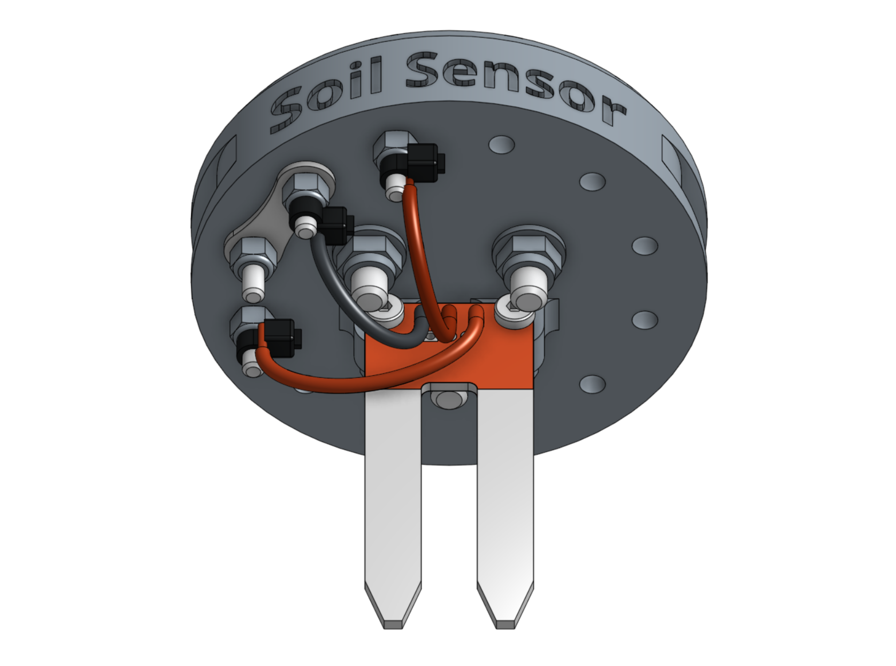

* toc
{:toc}

This single 3D printable component magnetically mounts onto FarmBot's UTM like any other tool. It works by driving the tool vertically into the soil so that the soil properties can be accurately read.

<iframe class="embedly-embed" src="//cdn.embedly.com/widgets/media.html?src=https%3A%2F%2Fwww.youtube.com%2Fembed%2Fp6CPnJoHf8E%3Ffeature%3Doembed&url=http%3A%2F%2Fwww.youtube.com%2Fwatch%3Fv%3Dp6CPnJoHf8E&image=https%3A%2F%2Fi.ytimg.com%2Fvi%2Fp6CPnJoHf8E%2Fhqdefault.jpg&key=02466f963b9b4bb8845a05b53d3235d7&type=text%2Fhtml&schema=youtube" width="854" height="480" scrolling="no" frameborder="0" allowfullscreen></iframe>



# Step 1: Gather the parts and tools

Gather all the soil sensor parts from the table below and lay them out in a logical manner. To complete the assembly, you will also need the following tools:

* [2mm hex driver](../../Extras/bom/miscellaneous.md#2mm-hex-driver)
* [3mm hex driver](../../Extras/bom/miscellaneous.md#3mm-hex-driver)
* [5.5mm box wrench](../../Extras/bom/miscellaneous.md#5-5mm-box-wrench)
* [8mm box wrench](../../Extras/bom/miscellaneous.md#8mm-box-wrench)

|Qty.                          |Component                     |
|------------------------------|------------------------------|
|1                             |[Soil Sensor](../../Extras/bom/plastic-parts.md#soil-sensor)
|1                             |[Moisture Sensor PCB](../../Extras/bom/electronics-and-wiring.md#soil-sensor)
|3                             |[Ring Magnets](../../Extras/bom/miscellaneous.md#ring-magnets)
|3                             |[M5 x 30mm Screws](../../Extras/bom/fasteners-and-hardware.md#m5-screws)
|3                             |[M5 Washers](../../Extras/bom/fasteners-and-hardware.md#m5-washers)
|3                             |[M5 Locknuts](../../Extras/bom/fasteners-and-hardware.md#m5-locknuts)
|2                             |[M3 x 12mm Screws](../../Extras/bom/fasteners-and-hardware.md#m3-screws)
|4                             |[M3 x 25mm Screws](../../Extras/bom/fasteners-and-hardware.md#m3-screws)
|6                             |[M3 Locknuts](../../Extras/bom/fasteners-and-hardware.md#m3-locknuts)
|1                             |[Jumper Link](../../Extras/bom/electronics-and-wiring.md#jumper-links)
|4                             |[Zipties](../../Extras/bom/miscellaneous.md#zip-ties)

# Step 2: Install the moisture sensor

Attach the **moisture sensor** to the **soil sensor base** using two **M3 x 12mm screws** and **M3 locknuts**. The sensor should be on the front side of the base's mounting tabs. The heads of the screws should be on the sensor (front) side while the locknuts should be on the mounting tabs (back) side. Do not overtighten the screws as this could damage the soil sensor circuit board.

# Step 3: Install the universal tool hardware

Install the **magnets** and tool verification **jumper link** using the instructions in the [universal tool hardware reference guide](../../FarmBot-Genesis-V1.2/reference/universal-tool-hardware.md).

# Step 4: Install the additional electronic screws

Use the **2mm hex driver** and **5.5mm wrench** to attach two **M3 x 25mm screws** and **M3 locknuts** into the holes labelled **A** and **D** on the **soil sensor base**. The screw heads should be on the same side of the base as the magnets.

# Step 5: Wire it up

Use **zip ties** to secure the bare ends of the wires from the **moisture sensor** to the corresponding **electronic screws**. The black wire (ground) should be connected to  **B**. The red (signal) wire should be connected to  **D**. And the red (5V) wire should be connected to  **A**.



