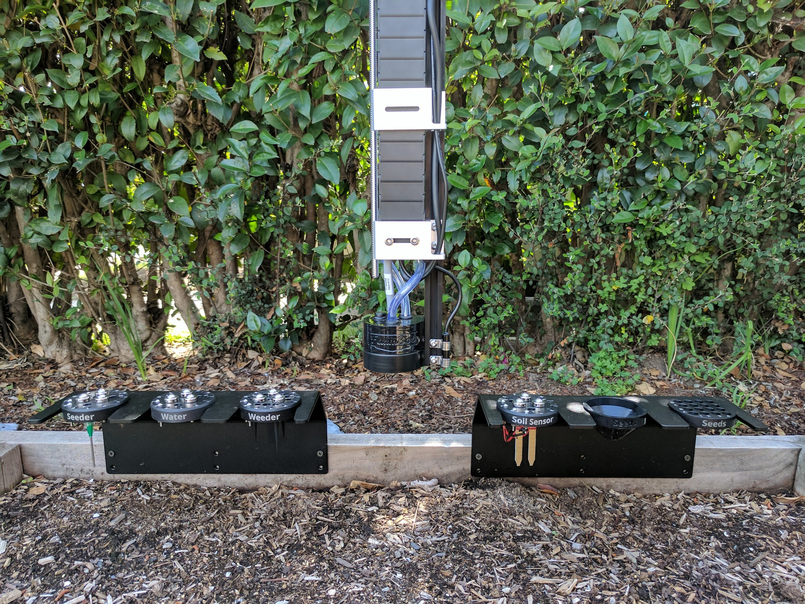
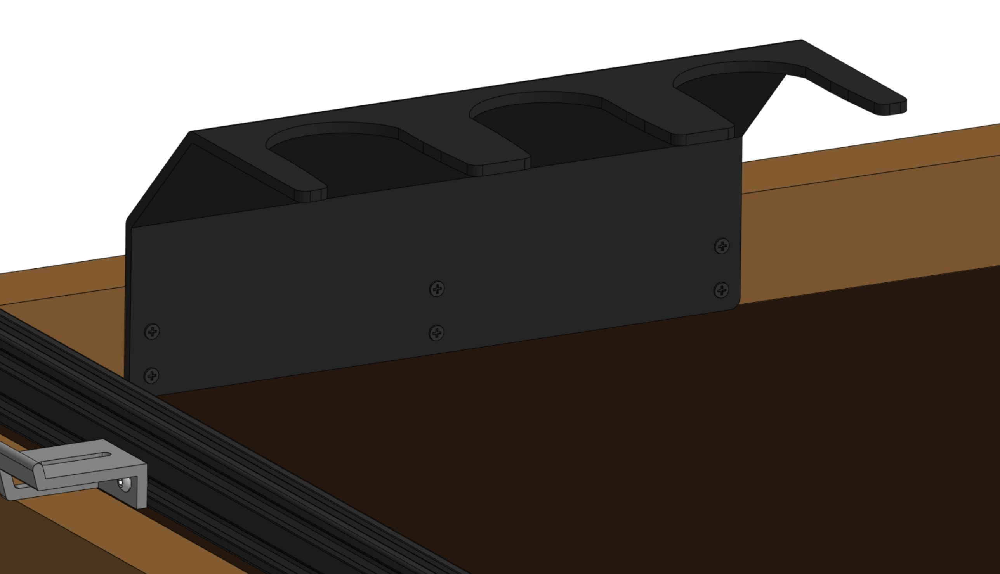
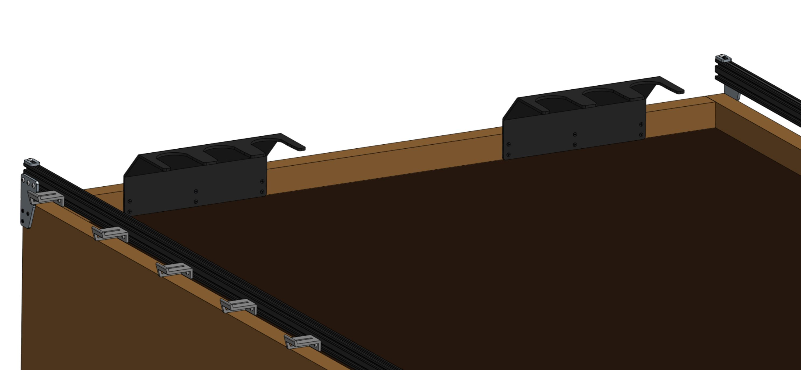

FarmBot Genesis comes with two toolbays that hold three tools, seed bins, or seed trays each. These simple hardware components act as holsters for your tools and are shaped in such a way that FarmBot can automatically mount and dismount tools for the task at hand.

<iframe class="embedly-embed" src="//cdn.embedly.com/widgets/media.html?src=https%3A%2F%2Fwww.youtube.com%2Fembed%2FvjvIB5wXmRo%3Ffeature%3Doembed&url=http%3A%2F%2Fwww.youtube.com%2Fwatch%3Fv%3DvjvIB5wXmRo&image=https%3A%2F%2Fi.ytimg.com%2Fvi%2FvjvIB5wXmRo%2Fhqdefault.jpg&key=02466f963b9b4bb8845a05b53d3235d7&type=text%2Fhtml&schema=youtube" width="854" height="480" scrolling="no" frameborder="0" allowfullscreen></iframe>





# Step 1: Gather the parts and tools

Gather necessary parts from the table below and lay them out in a logical manner. To complete the assembly, you will also need the following tools:

* [Phillips screwdriver](../../Extras/bom/miscellaneous.md#phillips-screwdriver)

|Qty.                          |Component                     |
|------------------------------|------------------------------|
|2                             |[Toolbays](../../Extras/bom/plates-and-brackets.md#toolbays)
|12                            |[25cm Wood Screws](../../Extras/bom/fasteners-and-hardware.md#wood-screws)

# Step 2: Attach the toolbays to the supporting infrastructure

Position and attach a **toolbay** to your **supporting infrastructure** using six **25cm wood screws**.

{%
include callout.html
type="warning"
title="Orientation matters"
content="Keep in mind that FarmBot's tools are designed to be mounted by the UTM in only one orientation so that the electrical pins and magnets match up. The text on the front of the tools should line up with the FarmBot logo on the front of the UTM cover. Because tools can only slot into the tool bay in two orientations, **you must orient your tool bay with the longer edge parallel to the gantry main beam**.

Note: It is possible to orient the long edge parallel with the tracks, though that would require changing the orientation of the UTM by 90 degrees as well."
%}

{%
include callout.html
type="success"
title="Within reach and squared up"
content="Ensure that you mount the tool bay in a location that FarmBot's UTM can get to. Keep in mind that the UTM needs to be able to slide tools **all the way into the bay**, **all the way out**, and be able to mount and dismount tools **from above**. Make sure you verify this for each of the tool bay's slots.

The toolbay must also be **square** with the rest of FarmBot (all three axes) in order for tools to be properly mounted and dismounted. Use shims or extra washers to make fine adjustments to the angle of your toolbays if needed.

Last, keep in mind the size of the tools and ensure that there is adequate room underneath and in front of your toolbays for proper mounting and dismounting."
%}

Repeat for the second toolbay.



# Step 3: Insert the tools

Place your tools, seed bins, and seed trays in any slot you want. Just remember that you will need to log in to the web app and let FarmBot know what tool is where!

