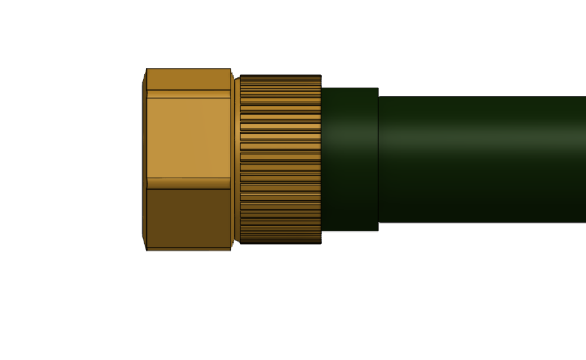

* toc
{:toc}

The watering nozzle is a single 3D printed component with a few extra parts for magnetic coupling and electronic verification with the UTM. It works as a simple diffuser nozzle by accepting a concentrated stream of water coming from the UTM and turning it into a gentle shower.

<iframe class="embedly-embed" src="//cdn.embedly.com/widgets/media.html?src=https%3A%2F%2Fwww.youtube.com%2Fembed%2Fxh7imhENpLQ%3Ffeature%3Doembed&url=http%3A%2F%2Fwww.youtube.com%2Fwatch%3Fv%3Dxh7imhENpLQ&image=https%3A%2F%2Fi.ytimg.com%2Fvi%2Fxh7imhENpLQ%2Fhqdefault.jpg&key=02466f963b9b4bb8845a05b53d3235d7&type=text%2Fhtml&schema=youtube" width="854" height="480" scrolling="no" frameborder="0" allowfullscreen></iframe>



# Step 1: Gather the parts and tools

Gather all the watering nozzle parts from the table below and lay them out in a logical manner. To complete the assembly, you will also need the following tools:

* [2mm hex driver](../../Extras/bom/miscellaneous.md#2mm-hex-driver)
* [3mm hex driver](../../Extras/bom/miscellaneous.md#3mm-hex-driver)
* [5.5mm box wrench](../../Extras/bom/miscellaneous.md#55mm-box-wrench)
* [8mm box wrench](../../Extras/bom/miscellaneous.md#8mm-box-wrench)

|Qty.                          |Component                     |
|------------------------------|------------------------------|
|1                             |[Watering Nozzle Bottom](../../Extras/bom/plastic-parts.md#watering-nozzle)
|1                             |[Watering Nozzle Top](../../Extras/bom/plastic-parts.md#watering-nozzle)
|2                             |[M3 x 25mm Screws](../../Extras/bom/fasteners-and-hardware.md#m3-screws)
|2                             |[M3 Locknuts](../../Extras/bom/fasteners-and-hardware.md#m3-locknuts)
|3                             |[M5 x 30mm Screws](../../Extras/bom/fasteners-and-hardware.md#m5-screws)
|3                             |[M5 Washers](../../Extras/bom/fasteners-and-hardware.md#m5-washers)
|3                             |[M5 Locknuts](../../Extras/bom/fasteners-and-hardware.md#m5-locknuts)
|3                             |[Ring Magnets](../../Extras/bom/miscellaneous.md#ring-magnets)
|1                             |[Jumper Link](../../Extras/bom/electronics-and-wiring.md#jumper-links)
|1                             |[Pressure Regulator](../../Extras/bom/tubing.md#pressure-regulator)
|1                             |Garden Hose (not supplied with FarmBot kits)
|1                             |[Garden Hose Adapter](../../Extras/bom/tubing.md#garden-hose-adapter)
|1                             |[Solenoid Valve](../../Extras/bom/electronics-and-wiring.md#solenoid-valve)
|1                             |[Barbed Adapter](../../Extras/bom/tubing.md#barbed-adapter)

# Step 2: Assemble the watering nozzle

Align the **watering nozzle bottom** with the **watering nozzle top** such that the M5 holes for the magnets are aligned. Note that there are a few small nozzle holes missing from the watering nozzle bottom. The missing holes should be located directly below the liquid/gas port labelled "3" on the watering nozzle top (where the water will come in from the UTM).



Press the **watering nozzle bottom** into the **watering nozzle top**. The two components will be secured in the next step.

# Step 3: Install the universal tool hardware

Install the **magnets** and tool verification **jumper link** using the instructions in the [universal tool hardware reference guide](../reference/universal-tool-hardware.md). The M5 screws will secure the **watering nozzle bottom** and the **watering nozzle top** together.

# Step 4: Connect FarmBot to the water source

Screw the **pressure regulator** onto the **faucet** you will be using to supply FarmBot with municipal water.

Screw the **garden hose** onto the **pressure regulator**. *Note that you will need to provide a hose of the appropriate length for your installation - one is not provided with FarmBot kits.*

Screw the **garden hose adapter** onto the other end of the **garden hose**.

Screw the **solenoid valve** onto the other end of the **garden hose adapter**.

Screw the **barbed adapter** onto the **solenoid valve**.

Push the **water tube** onto the **barbed adapter** and secure it with a **zip tie**.

# Step 5: Wire up the solenoid valve

Connect the **solenoid valve cable** to the **solenoid valve's** terminals.



