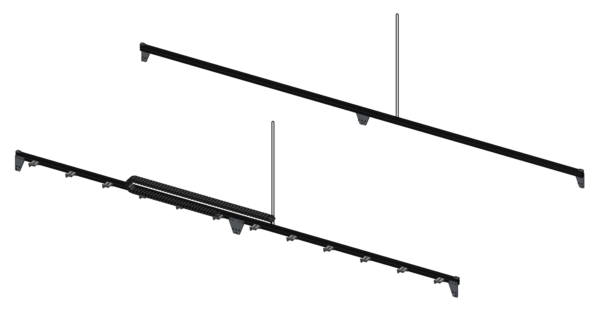

* toc
{:toc}

FarmBot's tracks allow the gantry to move precisely along the x-axis. They are designed to attach to a raised bed or similar supporting infrastructure.

# Configuration

Standard tracks are composed of two 1.5m long aluminum extrusions butted up against each other end-to-end for a total track length of 3m. The two tracks must be a parallel distance apart between 0.5m and 1.5m so that the standard gantry may span the distance between them. If you position your tracks close together you may consider cutting the gantry main beam so that it does not inconveniently extend beyond your tracks very far.
## Shortening the tracks
You can shorten your tracks to a minimum length of around 0.5m. The easiest way to shorten your tracks is to remove one of the extrusions from each track so your overall length is 1.5m. Should you want an overall track length different than 1.5 or 3m, you will need to use a hacksaw or horizontal bandsaw to cut the extrusions to your desired length.
## Lengthening the tracks
If you would like to extend your tracks, you will need additional extrusions, connecting plates, cable carrier supports, and hardware, as well as longer x-axis cable carrier, belt, wiring, and tubing.

{%
include callout.html
type="warning"
title="For serious hackers and DIYers only"
content="FarmBot.io does not currently sell extension hardware, offer kits with longer tracks, or provide support for kits that are modified in this way.

This type of modification has not ever been tested and may introduce significant unforeseen problems to your FarmBot. If you decide to extend your tracks you will need to purchase and/or make the additional components on your own and troubleshoot any problems you run into. You may seek support in the [community forum](http://forum.farmbot.org)."
%}

# Supporting infrastructure

FarmBot's tracks need to be attached to supporting infrastructure. Where you decide to install your FarmBot will determine how you setup your tracks and therefore what type of supporting infrastructure you need. You might attach your track plates to 2x4 wood posts, aluminum extrusion posts, a raised bed, or the walls of a greenhouse. The choice is up to you how you set this up. In the next sections we offer advice for two types of supporting infrastructure.



# What's next?

 * [Building a Raised Bed](../FarmBot-Genesis-V1.2/tracks/building-a-raised-bed.md)
 * [Setting up Wooden Posts Only](../FarmBot-Genesis-V1.2/tracks/setting-up-wooden-posts-only.md)
