* toc
{:toc}



# Step 1: Gather the parts and tools
Gather all the UTM parts from the table below and lay them out in a logical manner. To complete the assembly, you will also need the following tools:

* [2mm hex driver](../../Extras/bom/miscellaneous.md#2mm-hex-driver)
* [3mm hex driver](../../Extras/bom/miscellaneous.md#3mm-hex-driver)
* [5.5mm box wrench](../../Extras/bom/miscellaneous.md#55mm-box-wrench)
* [8mm box wrench](../../Extras/bom/miscellaneous.md#8mm-box-wrench)

|Qty.                          |Component                     |
|------------------------------|------------------------------|
|12                            |[M3 x 30mm Screws](../../Extras/bom/fasteners-and-hardware.md#m3-screws)
|12                            |[Compression Springs](../../Extras/bom/miscellaneous.md#compression-springs)
|12                            |[M3 Locknuts](../../Extras/bom/fasteners-and-hardware.md#m3-locknuts)
|7                             |[M5 x 16mm Screws](../../Extras/bom/fasteners-and-hardware.md#m5-screws)
|3                             |[M5 Washers](../../Extras/bom/fasteners-and-hardware.md#m5-washers)
|4                             |[M5 Tee Nuts](../../Extras/bom/fasteners-and-hardware.md#m5-tee-nuts)
|3                             |[M5 Locknuts](../../Extras/bom/fasteners-and-hardware.md#m5-locknuts)
|1                             |[Universal Tool Mount](../../Extras/bom/plastic-parts.md#universal-tool-mount)
|12                            |[Zipties](../../Extras/bom/miscellaneous.md#zip-ties)
|1                             |[UTM Cable](../../Extras/bom/electronics-and-wiring.md#universal-tool-mount-cable)
|3                             |[1/4" barbs](../../Extras/bom/tubing.md#barbs)
|3                             |[O-Rings](../../Extras/bom/tubing.md#o-rings)
|3                             |[Ring Magnets](../../Extras/bom/miscellaneous.md#ring-magnets)
|4                             |[Grommets](../../Extras/bom/tubing.md#grommets)

# Step 2: Install the magnets



{%
include callout.html
type="info"
title="Opposites attract"
content="For the UTM to correctly mount tools, all magnets on the UTM and all tools must have the same polar orientation. For example, all of the magnets could have the North pole/face of the magnet facing towards the ground. This way, the North pole/face of the *UTM* magnets (which face the ground) will be attracted to the South pole/face of the *tool* magnets (which face the sky).

Which side is North and which is South does not matter. The important part is that the orientation of all the magnets are the same."
%}

Insert an **M5 x 16mm screw** through one of the **ring magnets**. For the first magnet, the orientation of the magnet does not matter.

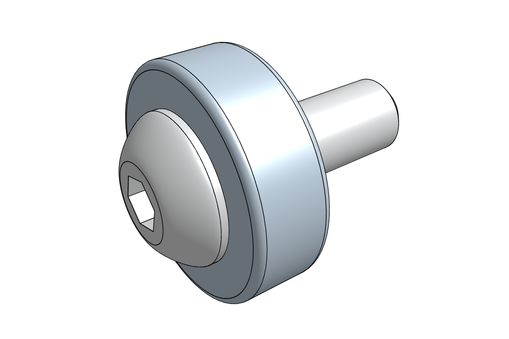

Insert the magnet and screw into the bottom of the UTM as shown.

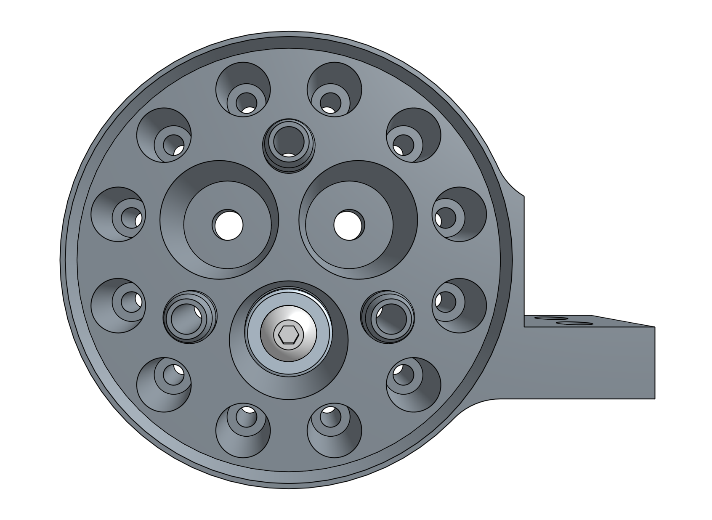

Use the **3mm hex driver** and the **8mm wrench** to tighten an **M5 locknut** onto the screw.

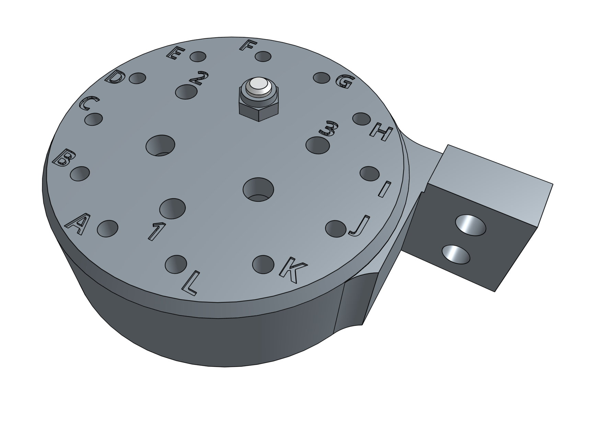

Repeat the process above for the two remaining UTM magnets.



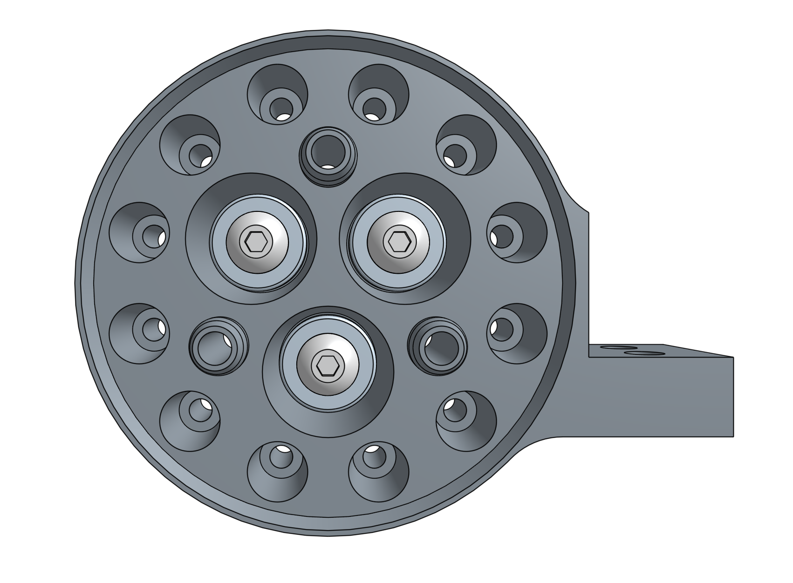

# Step 3: Install the barbs
Use the **8mm wrench** to screw in the three **barbs** into the top of the **UTM**. The barbs should be inserted in the holes labelled 1, 2, and 3.

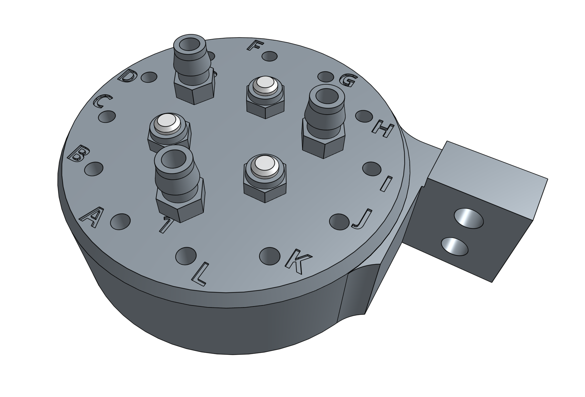

# Step 4: Install the o-rings
Slide three **o-rings** onto the **UTM** 1, 2, and 3 port cones. Each o-ring should be "seated" at the base of the port cone.

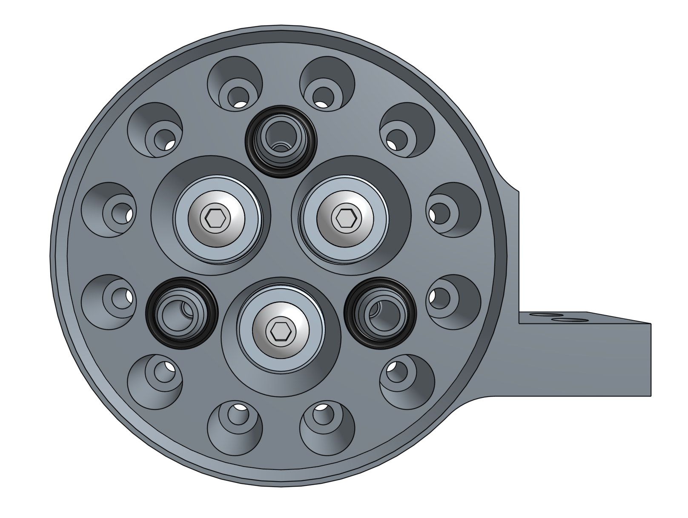

# Step 5: Install the electronic contact screws
Place a **spring** on an **M3 x 30mm screw** and then insert the screw into the **UTM**.

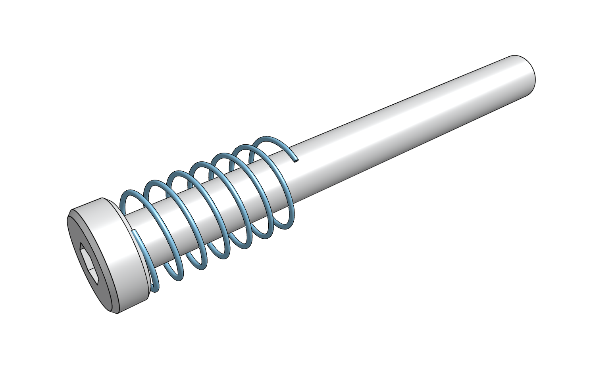

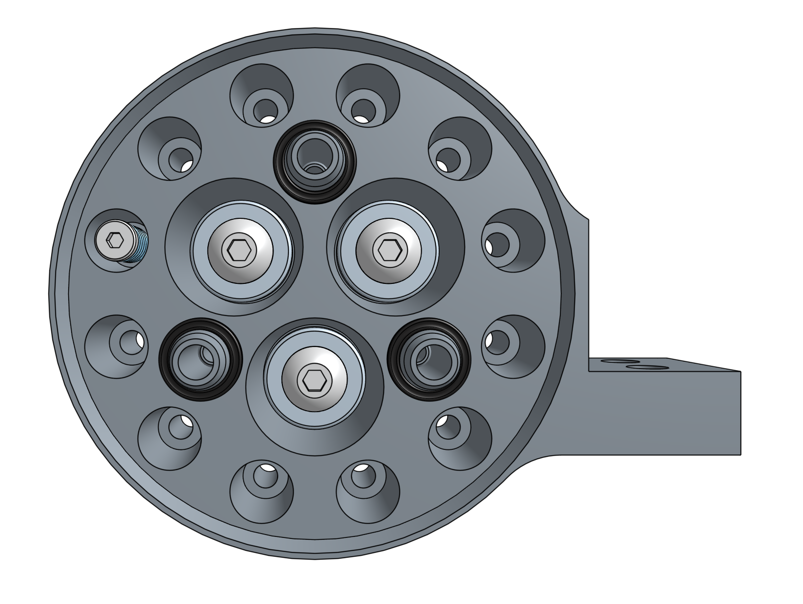

Using the **2mm hex driver** and the **5.5mm wrench**, attach an **M3 locknut** onto the screw. Tighten the locknut until the spring is slightly compressed.

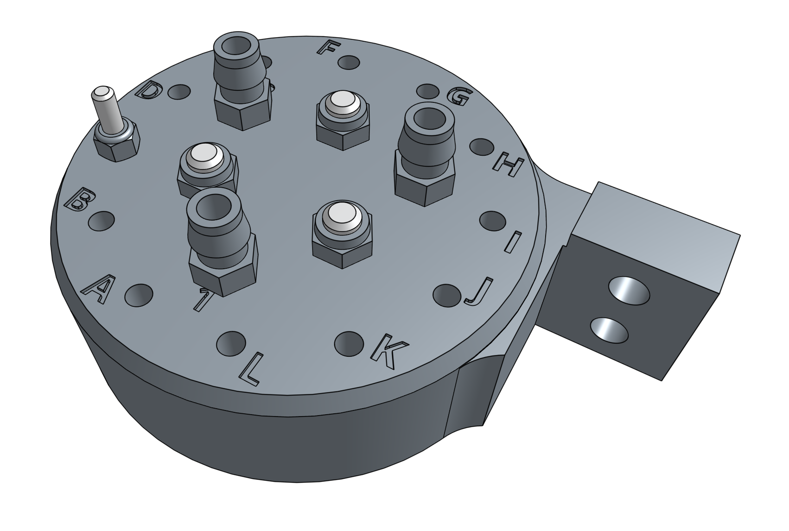

Repeat for all holes labelled **A** through **L**.

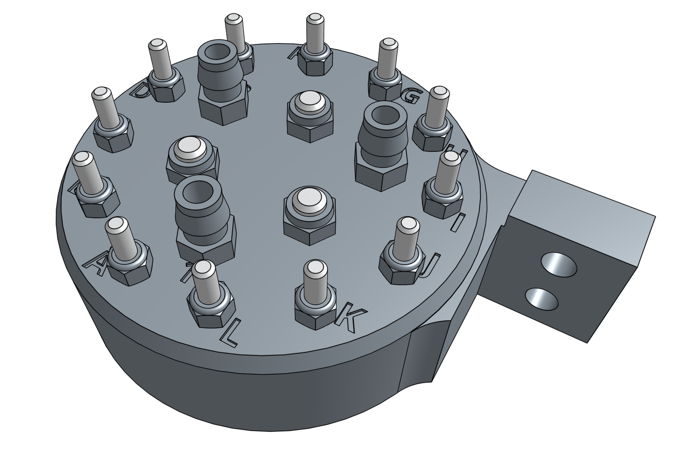

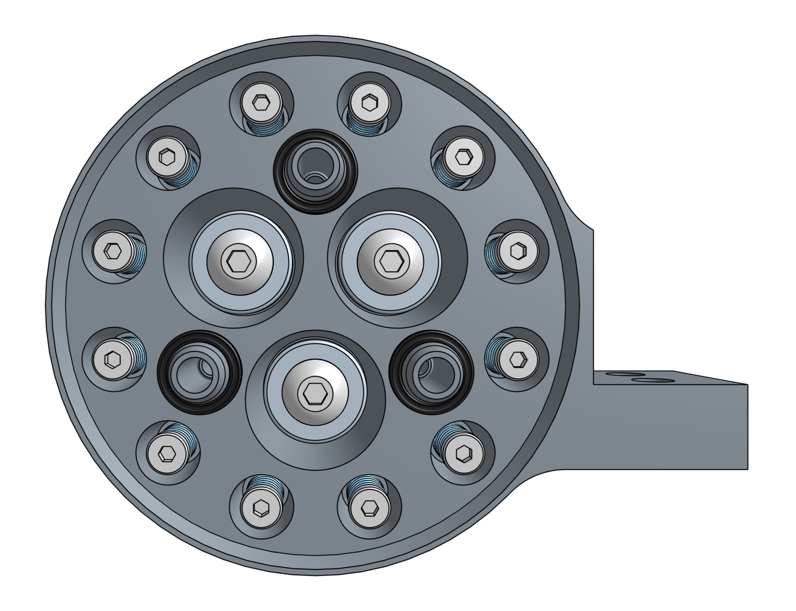

# Step 6: Add grommets to the UTM cover
Insert four **grommets** into the **UTM cover**, ensuring that the grommet flanges are not folded or caught under themselves.

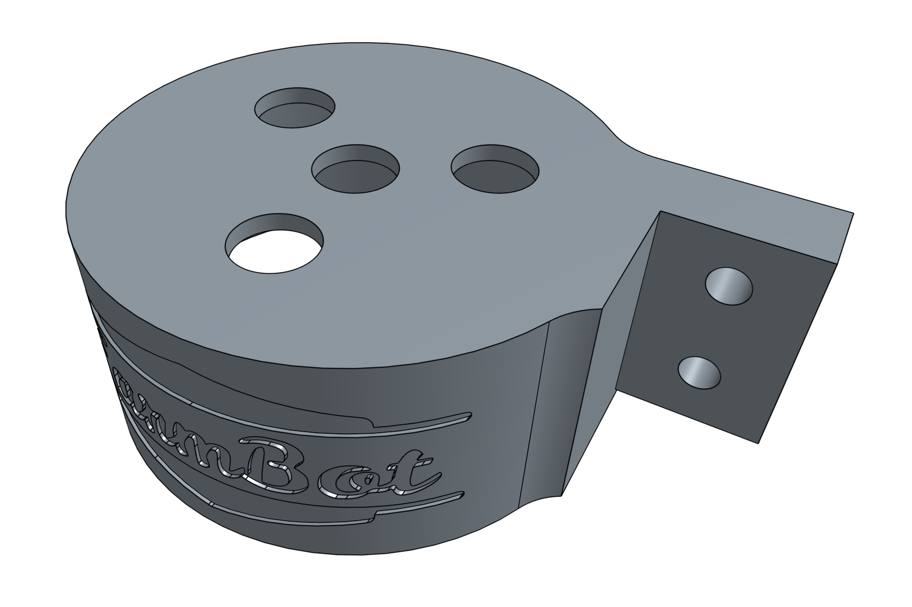

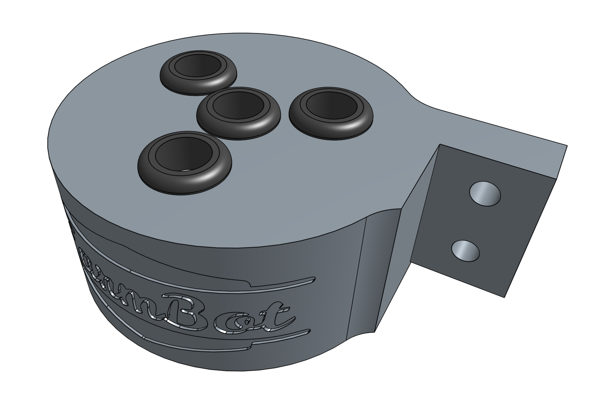

# Step 7: Add mounting hardware
Lightly screw together four **M5 x 16mm screws** and **M5 tee nuts** into the mounting flanges of both the **UTM** and **UTM cover**.

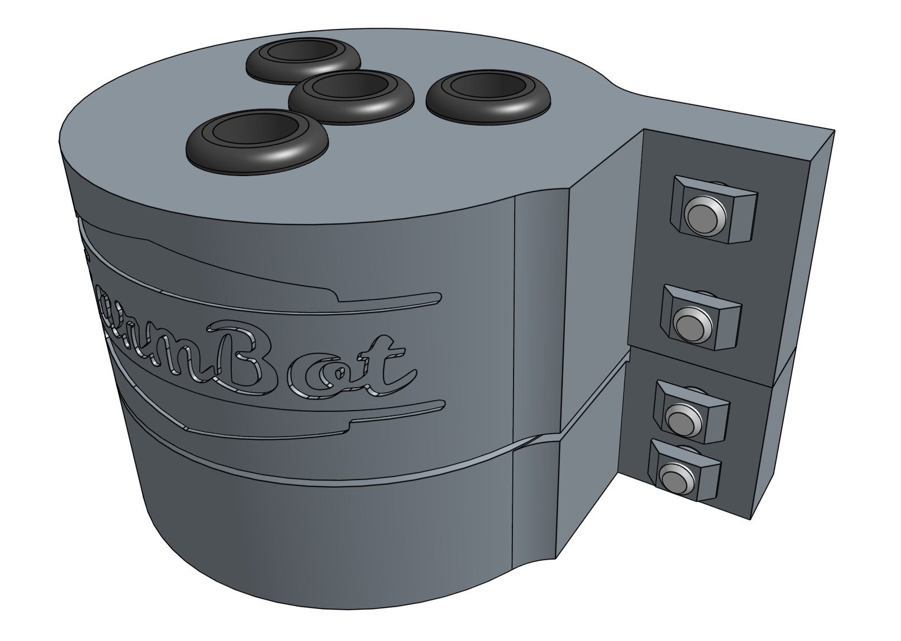

# What's next?

 * [Wire up the UTM](../utm/wire-up-the-utm.md)
