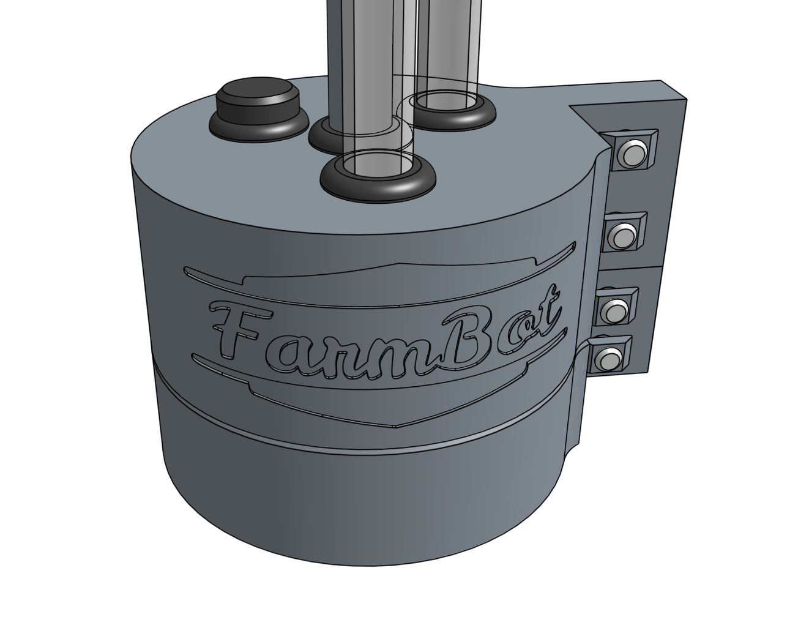

# Step 1: Feed the UTM cable through the UTM cover
Push the end of the **UTM cable** *without connectors* through the center **grommet** in the **UTM cover** so that the outer gray rubber of the cable extends about 5cm beneath the cover.



The 1st thru 11th small wires of the **UTM cable** are numbered with small white text, while the 12th wire is colored yellow/green. Fan out the wires and arrange them in order from 1 to 12.

# Step 2: Feed the tubing through the UTM cover
Push the **vacuum tube** through the **grommet** nearest the FarmBot logo on the **UTM cover** so that there is about 10cm of tubing beneath the cover.

Push the **water tube** through the **grommet** nearest the **UTM cover** mounting flange so that there is about 10cm of tubing beneath the cover.

Insert the **UTM cover plug** into the remaining **grommet** in the **UTM cover**. This port is available for you to expand the functionality of your FarmBot if you desire.

# Step 3: Attach the tubes
Slide the **vacuum tube** and **water tube** onto the corresponding **barbs** on the **UTM**.

# Step 4: Wire up the UTM
Use a **zip-tie** to secure each UTM cable wire to the **M3 screw** on top of the **UTM** according to the pin mapping table below. The copper wires must make good contact with the screw threads.

## Pin mapping



|UTM Pin/UTM Wire              |is connected to               |and used for                  |
|------------------------------|------------------------------|------------------------------|
|A/1                           |+5V on Arduino/RAMPS          |Soil sensor
|B/2                           |Ground (0V) on Arduino/RAMPS  |Ground
|C/3                           |Pin D63 on Arduino/RAMPS - Digital-In|Tool verification
|D/4                           |Pin D59 (A5) on Arduino/RAMPS - Analog-In|Soil sensor and other analog signal tools
|E/5                           |Your choice                   |Anything you want
|F/6                           |Your choice                   |Anything you want
|G/7                           |Your choice                   |Anything you want
|H/8                           |Your choice                   |Anything you want
|I/9                           |Your choice                   |Anything you want
|J/10                          |Your choice                   |Anything you want
|K/11                          |Your choice                   |Anything you want
|L/12 (yellow/green)           |Your choice                   |Anything you want



# Step 5: Slide down the UTM cover
Slide the **UTM cover** down the tubes and cable until it sits flush against the top of the **UTM**. Ensure that no wires or tubes become disconnected and that there is sealing between the cable and the grommet.

# Step 6: Install the UTM and cover onto the Z-axis
Position the **UTM cover** and **UTM** onto the **z-axis extrusion**. The mounting flanges should be positioned on the backside of the extrusion. The bottom of the UTM should be flush with the bottom of the extrusion, and the bottom of the UTM cover should be flush with the top of the UTM. Tighten all four **M5 screws** with the **3mm hex driver**.



# What's next?

 * [Electronics](../electronics.md)
