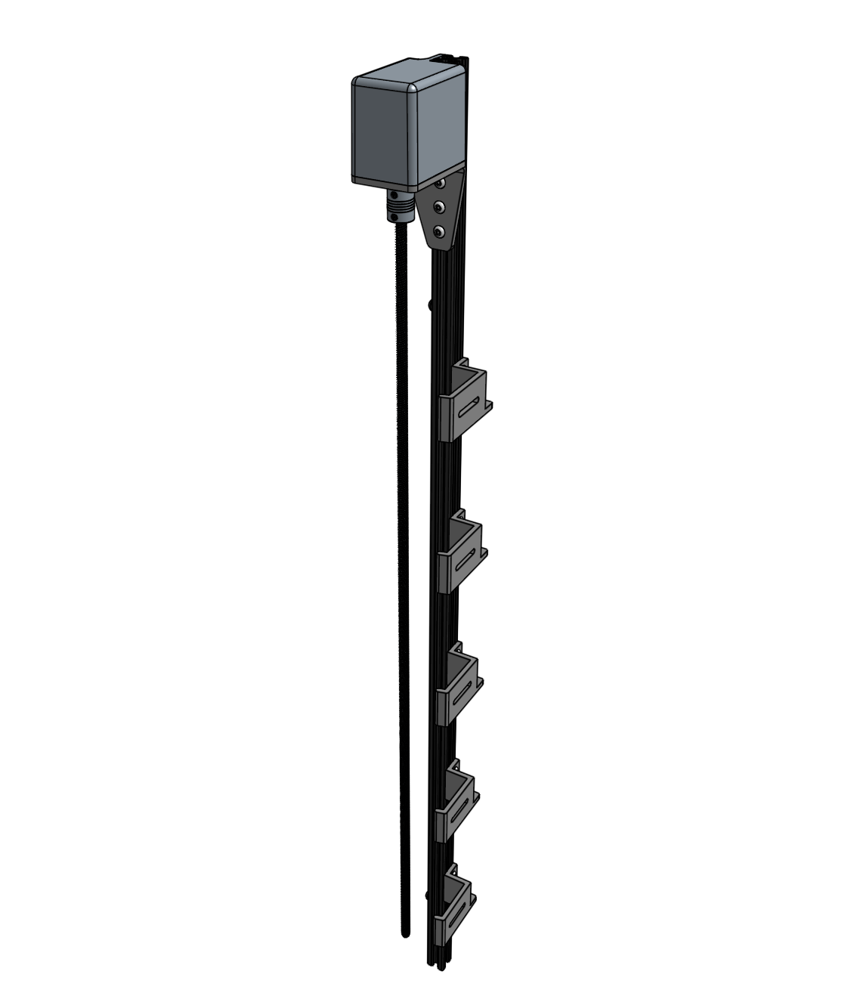

* toc
{:toc}

# Component List
Gather all the parts from the table below and lay them out in a logical manner. To complete the assembly, you will also need the following tools:

* [2mm hex driver](../Extras/bom/miscellaneous.md#2mm-hex-driver)
* [3mm hex driver](../Extras/bom/miscellaneous.md#3mm-hex-driver)

|Qty.                          |Component                     |
|------------------------------|------------------------------|
|1                             |[Z-Axis Extrusion](../Extras/bom/extrusions.md#z-axis-extrusion) (20 x 20 x 1000mm)
|4                             |[M3 x 10mm Screws](../Extras/bom/fasteners-and-hardware.md#m3-screws)
|10                            |[M5 x 10mm Screws](../Extras/bom/fasteners-and-hardware.md#m5-screws)
|12                            |[M5 Tee Nuts](../Extras/bom/fasteners-and-hardware.md#m5-tee-nuts)
|1                             |[Z-Axis Motor Mount](../Extras/bom/plates-and-brackets.md#z-axis-motor-mount)
|1                             |[Vertical Motor Housing](../Extras/bom/plastic-parts.md#vertical-motor-housing)
|5                             |[Vertical CC Supports](../Extras/bom/plates-and-brackets.md#vertical-cable-carrier-cc-supports)
|1                             |[NEMA 17 Stepper Motor with Rotary Encoder](../Extras/bom/electronics-and-wiring.md#nema-17-stepper-motors-with-rotary-encoders)
|1                             |[5mm to 8mm Flex Coupling](../Extras/bom/drivetrain.md#5mm-to-8mm-flex-coupling)
|1                             |[8 x 800mm Leadscrew](../Extras/bom/drivetrain.md#8mm-acme-leadscrew)

# What's next?

 * [Assemble the Z-Axis](z-axis/assemble-the-z-axis.md)
