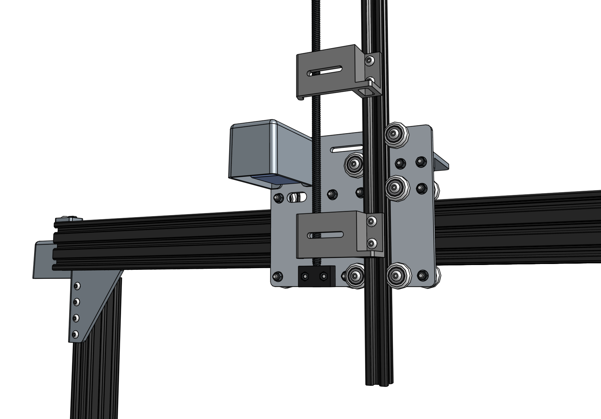

* toc
{:toc}

# Step 1: Attach the z-axis to the cross-slide

Slide the **z-axis extrusion** through the v-wheels on the **cross-slide** until the **leadscrew** is resting on the **leadscrew block**.



# Step 2: Screw the screw

Hand rotate the **leadscrew** clockwise so that it threads into the **leadscrew block**. Continue to hand rotate the leadscrew until the z-axis is halfway down.

# Step 3: Install the hard stops

Tighten an **M5 x 10mm screw** and **tee nut** onto the backside of the **z-axis extrusion** approximately 200mm from the top of the extrusion. This acts as a hard stop between the z-axis and the cross-slide plate, which you can quickly adjust to physically prevent FarmBot from ever moving too low within its working space, which could damage something.

_The hard stop is highlighted orange for clarity._

Tighten another **M5 x 10mm screw** and **tee nut** onto the backside of the **z-axis extrusion** approximately 100mm from the bottom of the extrusion. This hard stop prevents the z-axis from moving too high.

# What's next?

 * [Cables and Tubing](../../FarmBot-Genesis-V1.2/cables-and-tubing.md)
