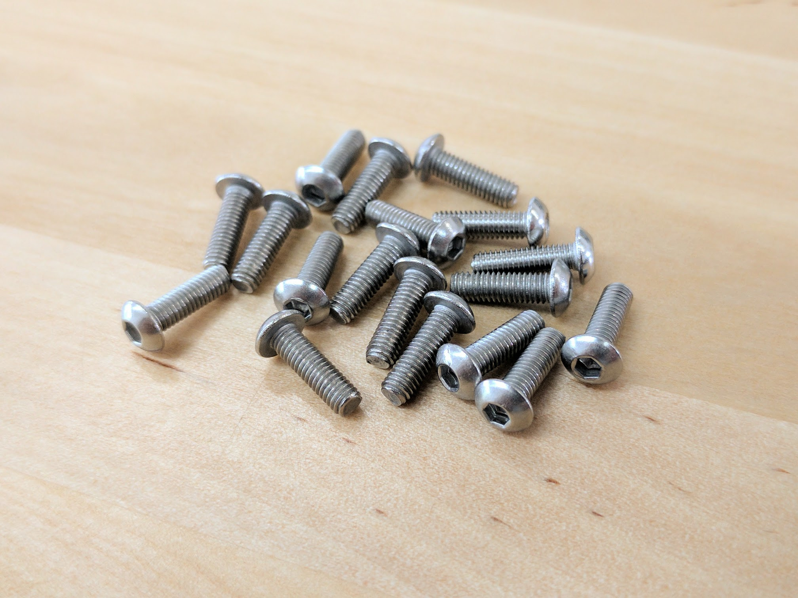
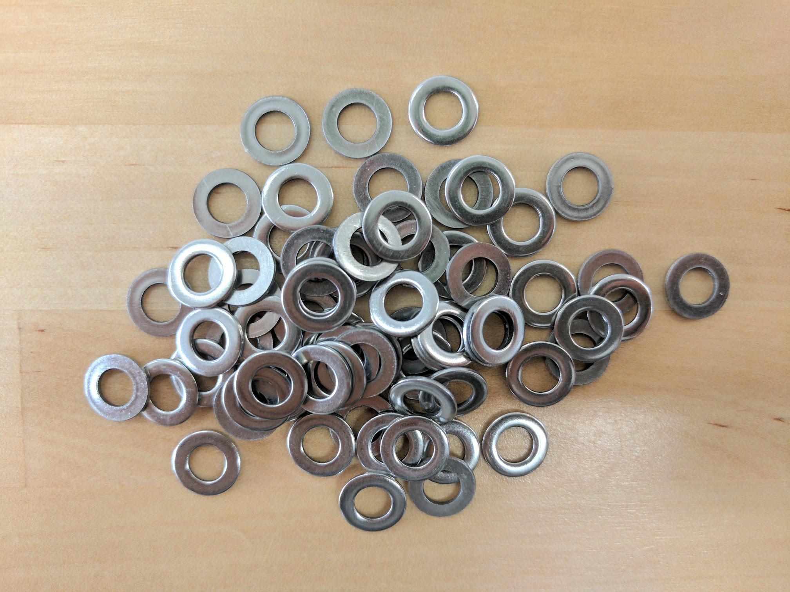

* toc
{:toc}

<iframe class="embedly-embed" src="//cdn.embedly.com/widgets/media.html?src=https%3A%2F%2Fwww.youtube.com%2Fembed%2FgKuVrxRZbPE%3Ffeature%3Doembed&url=http%3A%2F%2Fwww.youtube.com%2Fwatch%3Fv%3DgKuVrxRZbPE&image=https%3A%2F%2Fi.ytimg.com%2Fvi%2FgKuVrxRZbPE%2Fhqdefault.jpg&key=02466f963b9b4bb8845a05b53d3235d7&type=text%2Fhtml&schema=youtube" width="854" height="480" scrolling="no" frameborder="0" allowfullscreen></iframe>

|Qty.                          |Component                     |$/Unit                        |Subtotal                      |
|------------------------------|------------------------------|------------------------------|------------------------------|
|18                            |[M2.5 x 4mm Screws](#m2-5-x-4mm-screws)|$0.15                         |$2.70
|4                             |[M2.5 x 6mm Standoffs](#m2-5-x-6mm-standoffs)|$0.50                         |$2.00
|4                             |[M2.5 x 16mm Standoffs](#m2-5-x-16mm-standoffs)|$0.50                         |$2.00
|14                            |[M3 x 5mm Screws](#m3-x-5mm-screws)|$0.10                         |$1.40
|40                            |[M3 x 10mm Screws](#m3-x-10mm-screws)|$0.15                         |$6.00
|15                            |[M3 x 30mm Screws](#m3-x-30mm-screws)|$0.30                         |$4.50
|30                            |[M3 Locknuts](#m3-locknuts)|$0.10                         |$3.00
|175                           |[M5 x 10mm Screws](#m5-x-10mm-screws)|$0.15                         |$26.25
|40                            |[M5 x 16mm Screws](#m5-x-16mm-screws)|$0.20                         |$8.00
|45                            |[M5 x 30mm Screws](#m5-x-30mm-screws)|$0.30                         |$13.50
|70                            |[M5 Locknuts](#m5-locknuts)|$0.10                         |$7.00
|100                           |[M5 Washers](#m5-washers)|$0.05                         |$5.00
|30                            |[M5 x 6mm Spacers](#m5-x-6mm-spacers)|$0.20                         |$6.00
|15                            |[M5 x 6mm Eccentric Spacers](#m5-x-6mm-eccentric-spacers)|$2.00                         |$30.00
|175                           |[M5 Tee Nuts](#m5-tee-nuts)|$0.40                         |$70.00
|35                            |[25mm Wood Screws](#wood-screws)|$0.05                         |$1.75
|**810**                       |**TOTALS**                    |                              |**$189.10**

# M2.5 Screws
These screws are used to mount the electronics boards to the electronics mounting plate with the M2.5 standoffs as an intermediary component.

|                              |                              |
|------------------------------|------------------------------|
|**Length**                    |4mm
|**Threads**                   |M2.5
|**Drive Size**                |2mm
|**Price**                     |$0.15
|**Quantity**                  |18 (2 extra)

## M2.5 x 4mm Screws

# M3 Screws
M3 screws are used throughout FarmBot for mounting motors and other small electronic components on the tools.

|                              |                              |
|------------------------------|------------------------------|
|**Trade Name**                |M3 Low-Profile Socket Head Cap Screw
|**Material**                  |18-8 Stainless Steel
|**Lengths**                   |5mm, 10mm, 30mm, and 35mm
|**Threads**                   |M3 x 0.5mm
|**Head Height**               |2mm
|**Head Diameter**             |5.5mm
|**Socket Size**               |2mm Hex
|**Tensile Strength**          |70,000 psi
|**Price**                     |5mm - $0.10 10mm - $0.15 30mm - $0.30 35mm - $0.35
|**Quantity**                  |5mm - 14 10mm - 40 30mm - 15 (3 extra) 35mm - 5 (1 extra)

## M3 x 5mm Screws

## M3 x 10mm Screws

## M3 x 30mm Screws

# M5 Screws
M5 button-head screws of various lengths are used throughout FarmBot to attach plates and 3D printed parts to extrusions, V-wheels to plates, and other components together. They are usually used in combination with M5 washers, and terminated with an M5 tee nut or locknut. The button head provides a wide bearing surface, a low-profile head, and a finished appearance. Length is measured from under the head.

|                              |                              |
|------------------------------|------------------------------|
|**Trade Name**                |Button-Head Socket Cap Screw
|**Material**                  |18-8 Stainless Steel
|**Tensile Strength**          |70,000psi
|**Lengths**                   |10, 16, and 30mm
|**Threads**                   |M5, 0.8 pitch
|**Head Type**                 |3mm Hex
|**Head Height**               |2.75mm
|**Head Diameter**             |9.5mm
|**Price**                     |10mm - $0.15 16mm - $0.20 30mm - $0.30
|**Quantity**                  |10mm - 175 16mm - 40 30mm - 45

## M5 x 10mm Screws

## M5 x 16mm Screws

## M5 x 30mm Screws

# Locknuts
Locknuts are used throughout FarmBot to secure M3 and M5 screws in place. The nylon insert allows the locknut to resist loosening when subjected to vibration.

|                              |                              |
|------------------------------|------------------------------|
|**Trade Name**                |Nylon-Insert Locknut
|**Threads**                   |M3 x 0.5mm, M5 x 0.8mm
|**Height**                    |M3 - 4mm M5 - 5mm
|**Width**                     |M3 - 5.5mm M5 - 8mm
|**Material**                  |18-8 Stainless Steel
|**Price**                     |M3 - $0.10 M5 - $0.15
|**Quantity**                  |M3 - 30 M5 - 70

## M3 Locknuts

## M5 Locknuts

# Washers
Washers are used throughout FarmBot in combination with screws and locknuts. They allow nuts to be tightened on plastic components and plates while preventing damage and distributing load.

|                              |                              |
|------------------------------|------------------------------|
|**Material**                  |18-8 Stainless Steel
|**Outer Diameter**            |10mm
|**Inner Diameter**            |5.3mm
|**Thickness**                 |0.9 to 1.1mm
|**Price**                     |$0.05
|**Quantity**                  |100

## M5 Washers

# Spacers
These spacers are used to offset V-wheels from plates so that they may engage extrusions.

|                              |                              |
|------------------------------|------------------------------|
|**Material**                  |Aluminum
|**Outer Diameter**            |10mm
|**Inner Diameter**            |5.10mm
|**Length**                    |6mm
|**Price**                     |$0.20
|**Quantity**                  |30 (12 extra)

## M5 x 6mm Spacers

# Eccentric Spacers
When rotated, eccentric spacers accurately position V-wheels on a plate such that they can firmly engage V-slot aluminum extrusions. They are only used on wheels on one side of an extrusion. Adjustments are made by using a 8mm wrench on the spacer itself.

|                              |                              |
|------------------------------|------------------------------|
|**Material**                  |Stainless Steel
|**Height**                    |6mm (not including rim)
|**Bore**                      |5mm
|**Rim**                       |Fits into a 7.12mm hole
|**Hex Size**                  |8mm
|**Divot**                     |Indicates shortest distance from rim to bore
|**Price**                     |$2.00
|**Quantity**                  |15

## M5 x 6mm Eccentric Spacers

# Standoffs
Standoffs are used to offset the electronics boards from the electronics mounting plate.

|                              |                              |
|------------------------------|------------------------------|
|**Material**                  |Stainless steel
|**Lengths**                   |6mm, 16mm
|**For Screw Size**            |M2.5
|**Price**                     |$0.50
|**Quantity**                  |4 - 6mm length 4 - 16mm length

## M2.5 x 6mm Standoffs

## M2.5 x 16mm Standoffs

# Tee Nuts
Combined with screws, these drop-in style tee nuts allow components such as plates and 3D printed parts to be attached quickly and securely anywhere on a V-slot aluminum extrusion.

|                              |                              |
|------------------------------|------------------------------|
|**Trade Name**                |Drop-in Tee Nut
|**Material**                  |Stainless Steel
|**Threads**                   |M5 x 0.8mm pitch
|**Fits Slot Size**            |6
|**Price**                     |$0.40
|**Quantity**                  |175

## M5 Tee Nuts

# Wood Screws
These are used to attach the track end plates and track joining plates to supporting infrastructure such as a raised.

|                              |                              |
|------------------------------|------------------------------|
|**Material**                  |Steel
|**Finish**                    |Black Oxide
|**Length**                    |25mm
|**Head Diameter**             |12mm
|**Price**                     |$0.05
|**Quantity**                  |35



