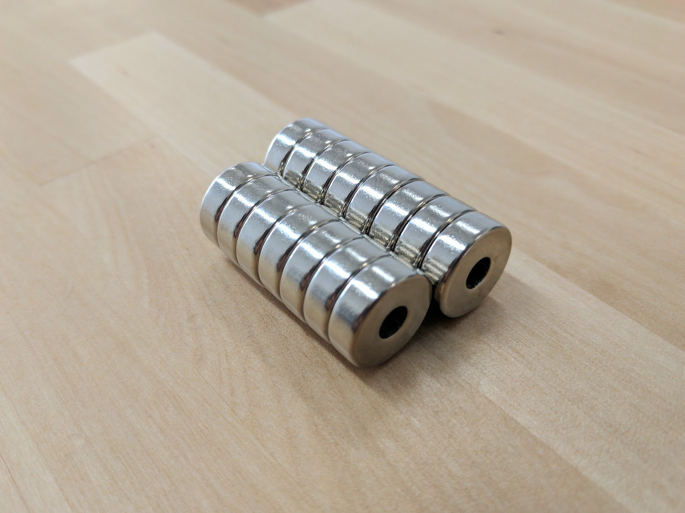
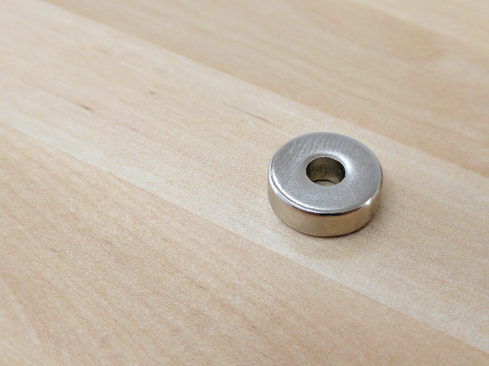
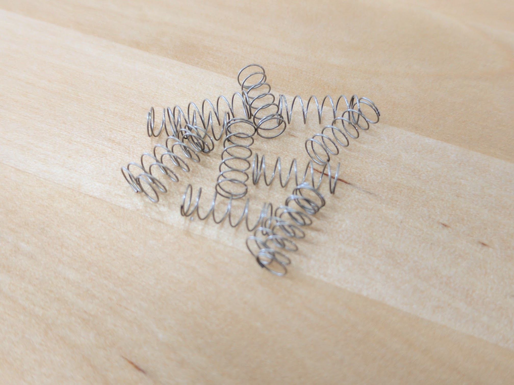
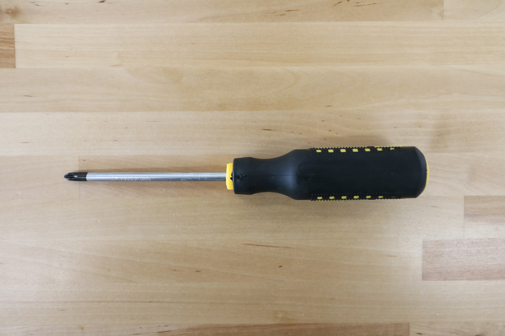

* toc
{:toc}

|Qty.                          |Component                     |$/unit                        |Subtotal                      |
|------------------------------|------------------------------|------------------------------|------------------------------|
|18                            |[15 x 5 x 5mm Ring Magnets](#ring-magnets)|$3.00                         |$54.00
|15                            |[Compression Springs](#compression-springs)|$0.50                         |$7.50
|50                            |[60mm Zip Ties](#60mm-zip-ties)|$0.05                         |$2.50
|25                            |[100mm Zip Ties](#100mm-zip-ties)|$0.07                         |$1.75
|5                             |[200mm Zip Ties](#200mm-zip-ties)|$0.10                         |$0.50
|2                             |[Red Markers](#red-markers)|$0.50                         |$1.00
|1                             |[3mm Hex Driver](#3mm-hex-driver)|$5.00                         |$5.00
|1                             |[2mm Hex Driver](#2mm-hex-driver)|$5.00                         |$5.00
|1                             |[8mm Box Wrench](#8mm-box-wrench)|$5.00                         |$5.00
|1                             |[5.5mm Box Wrench](#55mm-box-wrench)|$5.00                         |$5.00
|1                             |[8mm Wrench](#8mm-wrench)|$3.00                         |$3.00
|1                             |[Phillips Screwdriver](#phillips-screwdriver)|$5.00                         |$5.00
|**121**                       |**TOTALS**                    |                              |**$95.25**

# Ring Magnets
These magnets keep tools attached to the UTM.

|                              |                              |
|------------------------------|------------------------------|
|**Material**                  |Neodymium (NdFeB)
|**Coating**                   |Nickle (Ni)
|**Magnetization**             |Through ring
|**Outer Diameter**            |15mm
|**Inner Diameter**            |5mm
|**Thickness**                 |5mm
|**Price**                     |$3.00
|**Quantity**                  |18 (3 extras included)



# Compression Springs
These springs keep the screws in the UTM in contact with screws in the tools for electrical connections.

|                              |                              |
|------------------------------|------------------------------|
|**Material**                  |Stainless Steel
|**Free Length**               |10mm
|**Outer Diameter**            |4mm
|**Inner Diameter**            |3.5mm
|**Wire Diameter**             |0.25mm
|**Price**                     |$0.50
|**Quantity**                  |15 (3 extras included)

# Zip Ties
Zip ties are used to attach wires to the UTM electrical connection screws, to fasten the vacuum pump, and for cable management throughout FarmBot.

|                              |                              |
|------------------------------|------------------------------|
|**Material**                  |Nylon
|**Color**                     |Black
|**Length**                    |60mm, 100mm, and 200mm
|**Price**                     |60mm length - $0.05 100mm length - $0.07 200mm length - $0.10
|**Quantity**                  |60mm length - 50 100mm length - 25 200mm length - 5

## 60mm Zip Ties

## 100mm Zip Ties

## 200mm Zip Ties

# Red Markers
Used to calibrate FarmBot's camera for pixel to coordinate conversion software (used for [Weed Detection](https://software.farmbot.io/docs/farmware#weed-detector)).

|                              |                              |
|------------------------------|------------------------------|
|**Material**                  |Rubber
|**Color**                     |Red
|**Price**                     |$0.50
|**Quantity**                  |2

# 3mm Hex Driver
This hex (allen) driver is used to tighten all of the M5 screws on FarmBot.

|                              |                              |
|------------------------------|------------------------------|
|**Hex Size**                  |3mm
|**Bit Material**              |Hardened steel with a titanium nitride coating
|**Handle Material**           |Anodized aluminum
|**Price**                     |$5.00
|**Quantity**                  |1

<iframe class="embedly-embed" src="//cdn.embedly.com/widgets/media.html?src=https%3A%2F%2Fwww.youtube.com%2Fembed%2F-RoldWV-ut4%3Ffeature%3Doembed&url=http%3A%2F%2Fwww.youtube.com%2Fwatch%3Fv%3D-RoldWV-ut4&image=https%3A%2F%2Fi.ytimg.com%2Fvi%2F-RoldWV-ut4%2Fhqdefault.jpg&key=02466f963b9b4bb8845a05b53d3235d7&type=text%2Fhtml&schema=youtube" width="854" height="480" scrolling="no" frameborder="0" allowfullscreen></iframe>

# 2mm Hex Driver
This hex (allen) driver is used to tighten all of the M3 screws and setscrews on FarmBot.

|                              |                              |
|------------------------------|------------------------------|
|**Hex Size**                  |2mm
|**Bit Material**              |Hardened steel with a titanium nitride coating
|**Handle Material**           |Anodized aluminum
|**Price**                     |$5.00
|**Quantity**                  |1

# 8mm Box Wrench
This box wrench is used to tighten all of the M5 screws on FarmBot.

|                              |                              |
|------------------------------|------------------------------|
|**Box Size**                  |8mm
|**Handle Material**           |Anodized aluminum
|**Price**                     |$5.00
|**Quantity**                  |1

# 5.5mm Box Wrench
This box wrench is used to tighten all of the M3 locknuts on FarmBot.

|                              |                              |
|------------------------------|------------------------------|
|**Box Size**                  |5.5mm
|**Handle Material**           |Anodized aluminum
|**Price**                     |$5.00
|**Quantity**                  |1

# 8mm Wrench
The wrench is for tightening M5 locknuts and adjusting eccentric spacers throughout FarmBot.

|                              |                              |
|------------------------------|------------------------------|
|**Size**                      |8mm
|**Price**                     |$3.00
|**Quantity**                  |1

# Phillips Screwdriver
Use this screwdriver to mount your track end plates, track joining plates, and toolbays.

|                              |                              |
|------------------------------|------------------------------|
|**Bit Size**                  |6mm
|**Price**                     |$5.00
|**Quantity**                  |1

