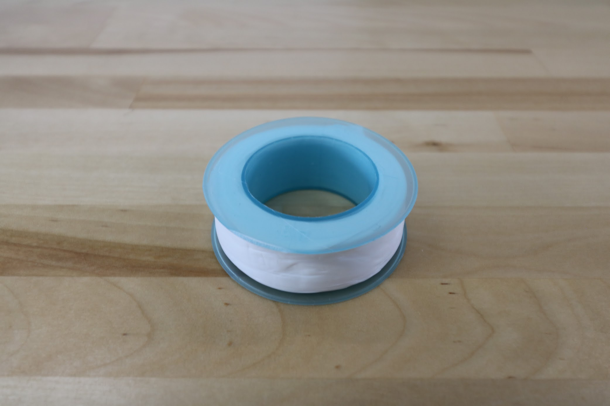

* toc
{:toc}

|Qty.                          |Component                     |$/Unit                        |Subtotal                      |
|------------------------------|------------------------------|------------------------------|------------------------------|
|1                             |[Water Tube](#liquidgas-tubes)|$15.00                        |$15.00
|1                             |[Vacuum Air Tube](#liquidgas-tubes)|$5.00                         |$5.00
|3                             |[Barbs](#barbs)       |$6.00                         |$18.00
|1                             |[Barbed Adapter](#barbed-adapter)|$2.00                         |$2.00
|1                             |[Coupler](#coupler)   |$2.00                         |$2.00
|1                             |[Garden Hose Adapter](#garden-hose-adapter)|$7.00                         |$7.00
|3                             |[O-rings](#o-rings)   |$0.50                         |$1.50
|4                             |[Grommets](#grommets) |$0.50                         |$2.00
|1                             |[Pressure Regulator](#pressure-regulator)|$8.00                         |$8.00
|1                             |[Luer Lock Adapter](#luer-lock-adapter)|$5.00                         |$5.00
|6                             |[Luer Lock Needles](#luer-lock-needles)|$3.00                         |$18.00
|1                             |[Teflon Tape](#teflon-tape)|$5.00                         |$5.00
|**24**                        |**TOTALS**                    |                              |**$88.50**

# Liquid/Gas Tubes
These ultra flexible tubes carry water to the UTM and suck vacuum air.

|                              |                              |
|------------------------------|------------------------------|
|**Length**                    |6m 0.4m
|**Material**                  |Masterkleer PVC
|**Color**                     |Clear
|**Flexibility**               |Very Flexible
|**Compatible Tube Fittings**  |Barbs
|**Inner Diameter**            |1/4"
|**Outer Diameter**            |3/8"
|**Wall Thickness**            |1/16"
|**Bend Radius**               |1" Minimum
|**Max Pressure**              |35 psi at 73° F
|**Temperature Range**         |-45° to 165° F
|**Price**                     |$15.00 - 6m $5.00 - 0.4m
|**Quantity**                  |1 of each length

<iframe class="embedly-embed" src="//cdn.embedly.com/widgets/media.html?src=https%3A%2F%2Fwww.youtube.com%2Fembed%2FWQltVvwRYfE%3Ffeature%3Doembed&url=http%3A%2F%2Fwww.youtube.com%2Fwatch%3Fv%3DWQltVvwRYfE&image=https%3A%2F%2Fi.ytimg.com%2Fvi%2FWQltVvwRYfE%2Fhqdefault.jpg&key=02466f963b9b4bb8845a05b53d3235d7&type=text%2Fhtml&schema=youtube" width="854" height="480" scrolling="no" frameborder="0" allowfullscreen></iframe>

# Barbs
These brass barbs screw into the UTM's three liquid/gas ports and accept the three liquid/gas lines coming from the z-axis cable carrier.

|                              |                              |
|------------------------------|------------------------------|
|**For Tube ID**               |1/4"
|**Threads**                   |10-32 UNF Straight Threads
|**Hex Size**                  |5/16"
|**Overall Length**            |25/32"
|**Temperature Range**         |–40° to 1200° F
|**Maximum Pressure**          |500 psi @ 72° F
|**RoHS**                      |Compliant
|**Gasket?**                   |Yes
|**Material**                  |Brass
|**Price**                     |$6.00
|**Quantity**                  |3



# Barbed Adapter
This adapter threads into the coupler and is connected to the water tube leading to the UTM.

|                              |                              |
|------------------------------|------------------------------|
|**Material**                  |Nylon
|**For Tube ID**               |1/4"
|**Threads**                   |3/4" NPT (National Pipe Thread)
|**Hex Size**                  |1.095"
|**Overall Length**            |1.785"
|**Price**                     |$2.00
|**Quantity**                  |1

# Coupler

|                              |                              |
|------------------------------|------------------------------|
|**Material**                  |PVC
|**Threads**                   |3/4" Female NPT (national pipe thread)
|**Price**                     |$2.00
|**Quantity**                  |1

# Garden Hose Adapter
This adapter connects standard US garden hoses to the solenoid valve.

|                              |                              |
|------------------------------|------------------------------|
|**Material**                  |Brass
|**Threads**                   |3/4" Female GHT (Garden Hose Thread) 3/4" Female NPT (National Pipe Thread)
|**Swivel Type**               |Swivels until tightened
|**Seal**                      |Rubber Gasket
|**Maximum Temperature**       |195° F
|**RoHS**                      |Not compliant
|**Price**                     |$7.00
|**Quantity**                  |1



# O-rings
These O-rings fit onto the UTM's liquid/gas ports and create a solid seal when tools are mounted.

|                              |                              |
|------------------------------|------------------------------|
|**Material**                  |Buna-N
|**Durometer**                 |A70 (Medium)
|**Outer Diameter**            |10.5mm
|**Inner Diameter**            |7.5mm
|**Thickness**                 |1.5mm
|**Temperature Range**         |-30° to 212° F
|**Color**                     |Black
|**Price**                     |$0.50
|**Quantity**                  |3

# Grommets
These grommets fit onto the UTM cover and allow the liquid/gas tubes and the UTM cable to pass into the UTM assembly while keeping water and dust out.

|                              |                              |
|------------------------------|------------------------------|
|**Material**                  |Rubber
|**Panel Hole Diameter**       |7/16"
|**Panel Thickness**           |3/32"
|**ID**                        |3/8"
|**OD**                        |5/8"
|**Overall Thickness**         |9/32"
|**Color**                     |Black
|**Price**                     |$0.50
|**Quantity**                  |4

# Pressure Regulator
This pressure regulator reduces the pressure from a municipal water supply down to 15 PSI (103 kpa, 1.03 bar) so that FarmBot can more easily control the amount of water it disperses.

|                              |                              |
|------------------------------|------------------------------|
|**Material**                  |UV resistant plastic
|**Inlet**                     |3/4 in. female pipe thread
|**Outlet**                    |3/4 in. male pipe thread
|**Color**                     |Black
|**Length**                    |6 inches (152.4mm)
|**Outer Diameter**            |1.25 inches (31.75mm)
|**Outlet Pressure**           |15 PSI (103 kpa, 1.02 bar)
|**Max Input Pressure**        |100 PSI (688 kpa, 6.88 bar)
|**Price**                     |$8.00
|**Quantity**                  |1



# Luer Lock Adapter

|                              |                              |
|------------------------------|------------------------------|
|**Price**                     |$5.00
|**Quantity**                  |1



# Luer Lock Needles

|                              |                              |
|------------------------------|------------------------------|
|**Gauges**                    |16, 19, and 22
|**Length**                    |40mm
|**Price**                     |$3.00
|**Quantity**                  |2 of each gauge



# Teflon Tape
This plumber's tape is used to seal the pipe thread connections in FarmBot's watering system.

|                              |                              |
|------------------------------|------------------------------|
|**Material**                  |PTFE
|**Length**                    |9m
|**Width**                     |1.5cm
|**Price**                     |$5.00
|**Quantity**                  |1

