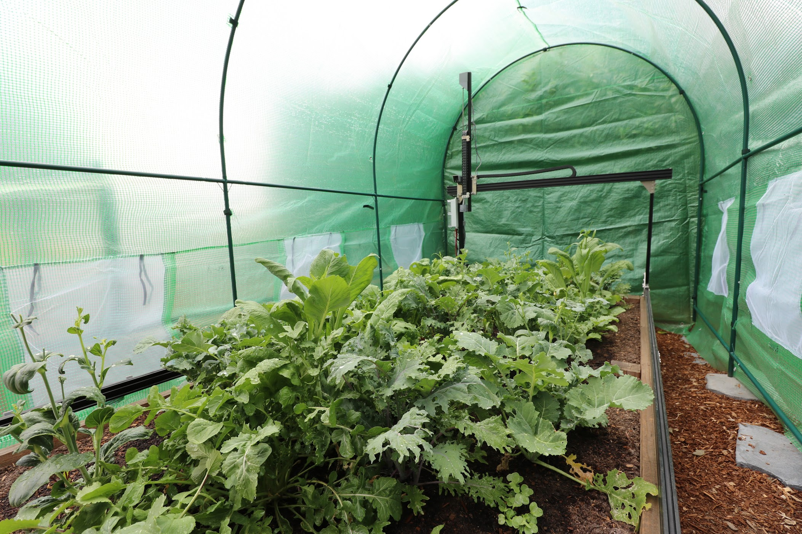
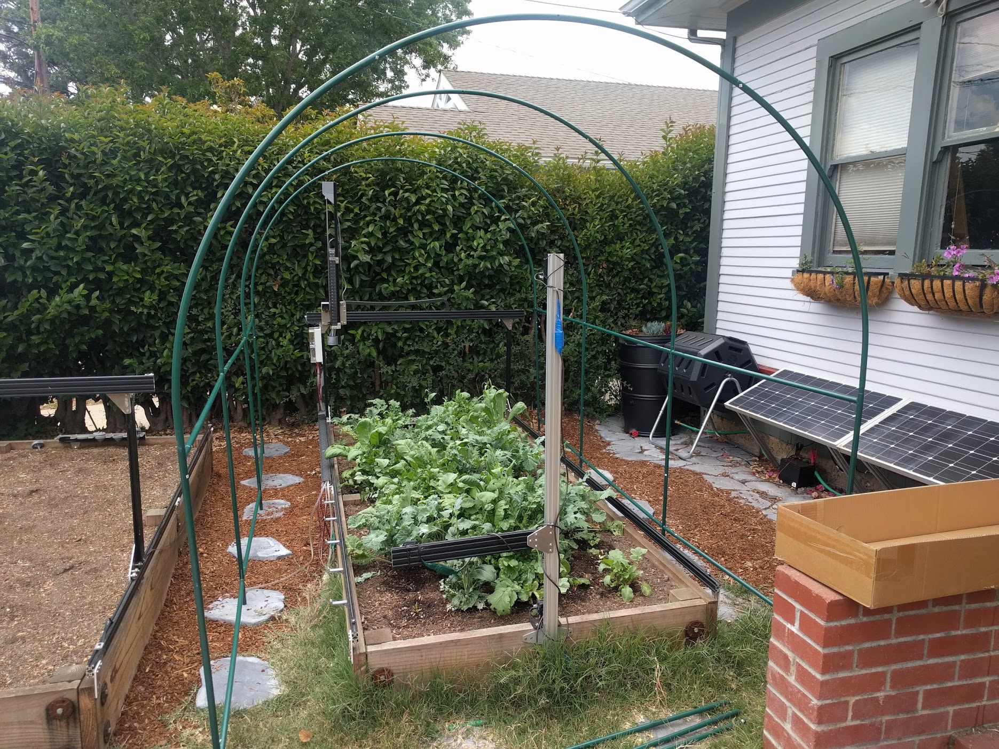
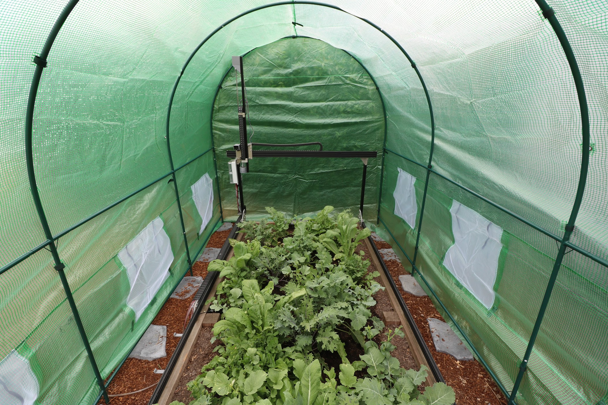

* toc
{:toc}

If you live somewhere that gets cold enough to prevent growing during certain times of the year then consider putting FarmBot in an inexpensive greenhouse to extend your growing season. We recommend purchasing a greenhouse that is at least 12' x 7' x 7' (3.65m x 2.15m x 2.15m) in size. [This greenhouse](https://smile.amazon.com/gp/product/B0098R8GES) from Amazon is only $100 and is shown in the photos below.



# Assembly instructions

Follow the greenhouse manufacturer's instructions to setup the greenhouse. In general, this will be a four step process:
1. Assemble the frame
2. Stake/secure the frame in place
3. Pull the plastic sheeting over the frame
4. Secure the sheeting to the frame

# Control the greenhouse environment with FarmBot

Its possible to control your greenhouse's environment with FarmBot by using fans, automated exhaust flaps, lights, and even heating elements. To do this, you'd simply need to hook up the peripherals to FarmBot's Arduino using a 110V relay such as the [Tails PowerSwitch 2](https://www.adafruit.com/product/268) (pictured below). Then you can use the web app's sequence builder and scheduler to specify when your fans and other peripherals turn on and off, etc.

