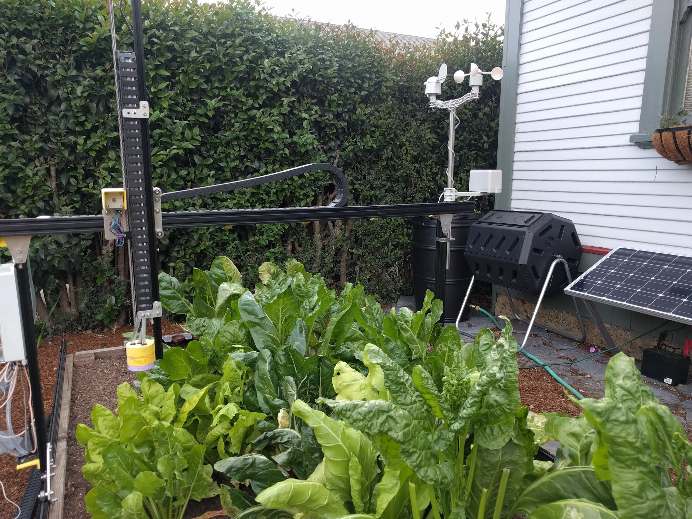
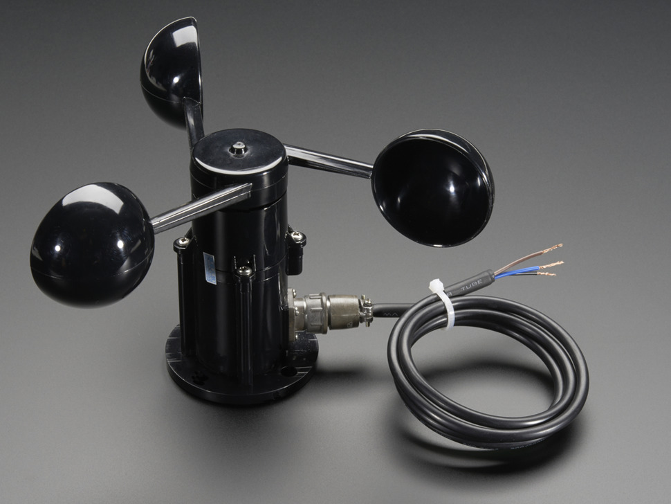
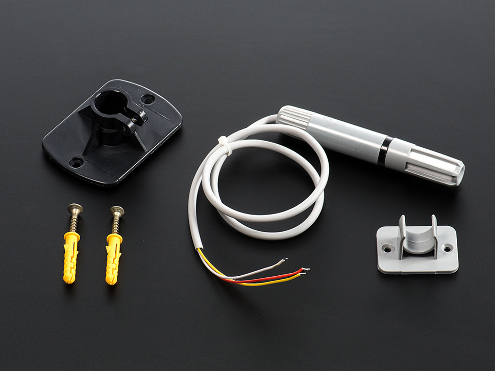
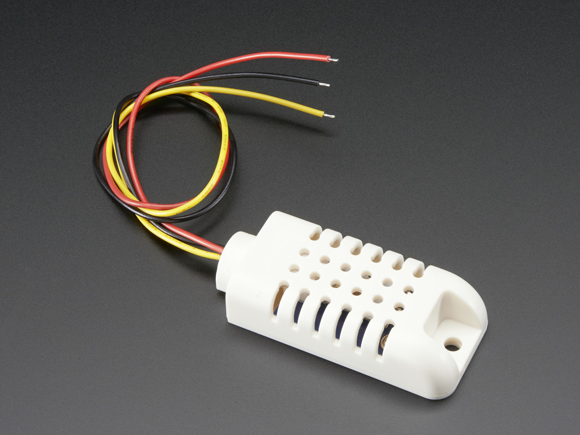
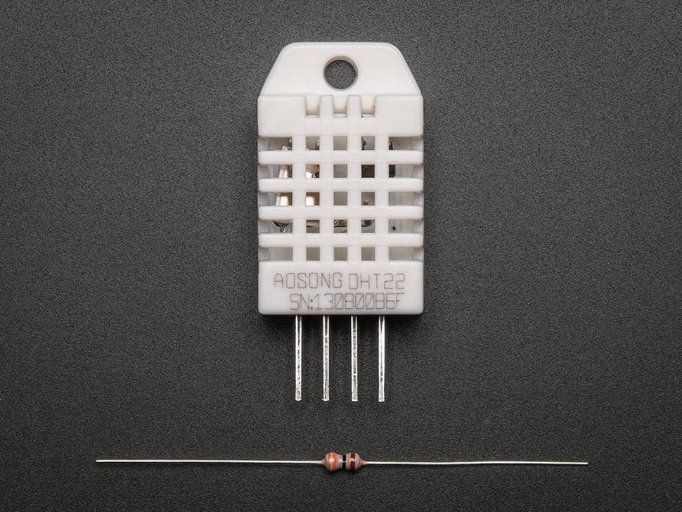
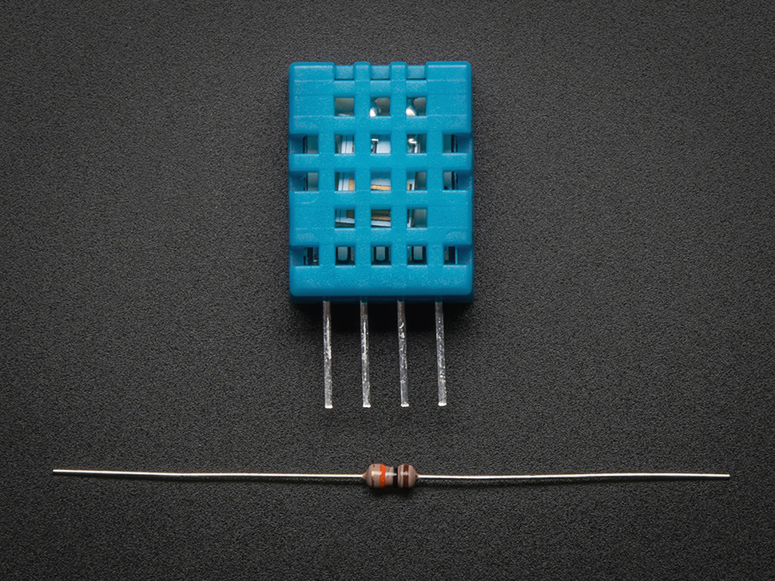
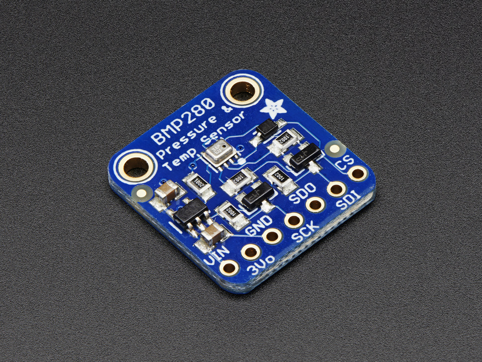

* toc
{:toc}

FarmBot and the web application are a great hardware and software foundation that can be extended into a local weather station. In a nutshell, you simply need to add whatever sensors you want, wire them up to FarmBot's Arduino or Raspberry Pi, and then pipe the data to the FarmBot web app and/or to a service such as [Weather Underground](https://www.wunderground.com/).



.jpg)

{%
include callout.html
type="success"
title="Use 'read pin' to collect anaolog sensor data"
content="Using the **sequence builder** and **event scheduler** of the web app, you can easily configure FarmBot to read **analog inputs** on the Arduino and then have that data synchronized and saved in the web app for later viewing. This functionality can be used with a wide variety of analog sensors including some of the ones listed below.

Note that our software is currently limited to raw data, so you will have to interpret it with any multiplication factors or lookup tables on your own. We're working hard on data manipulation features in the web app. Want to help out? Join us on [GitHub](http://github.com/farmbot)!"
%}

{%
include callout.html
type="warning"
title="Be prepared to hack if you want to use digital sensors"
content="Note that the FarmBot Web App, Raspberry Pi Controller, and Arduino Firmware do not currently support digital sensors such as those with I2C or PWM output. To read any digital sensors you will need to install additional software on your Pi and/or modify our codebases to properly read, record, synchronize, view, and make use of the data.

We're working hard on supporting digital sensors. Want to help out? Join us on [GitHub](http://github.com/farmbot)!"
%}

# Anemometer + Wind Vane + Rain Guage

For about $80 you can purchase a combination [anemometer, wind vane, and rain gauge mini weather station from SparkFun](https://www.sparkfun.com/products/8942). This lightweight device can be easily hoseclamped onto your FarmBot's gantry or installed in a stationary location nearby with an extension of the wires. You can then hook the device up to FarmBot's Arduino or directly to the Pi.



# Anemometer

You can purchase a small anemometer wind speed sensor with an analog output from [Adafruit](https://www.adafruit.com/products/1733). This can be plugged into an analog input on the Arduino (as well as a +5v and ground) and allow you to gather real-time wind speed data.

# Temperature

Purchase this [waterproof digital temperature sensor](https://www.adafruit.com/products/381) from Adafruit and connect it directly to your FarmBot's Arduino. This will then allow you to accurately read ambient air temperatures.

# Temperature + Humidity

This [I2C combo temperature/humidity sensor](https://www.adafruit.com/products/1293) from Adafruit can connect directly to your FarmBot's Arduino I2C port. This will then allow you to accurately read ambient air temperatures and humidity.



# Other temperature + humidty sensors

[AM2302 (wired DHT22) temperature-humidity sensor](https://www.adafruit.com/products/393) from Adafruit

[DHT22 temperature-humidity sensor + extras](https://www.adafruit.com/products/385) from Adafruit

[DHT11 basic temperature-humidity sensor + extras](https://www.adafruit.com/products/386) from Adafruit

# Barometric Pressure + Altitude

Check out the [Adafruit BMP280 I2C or SPI Barometric Pressure & Altitude Sensor](https://www.adafruit.com/products/2651)!

