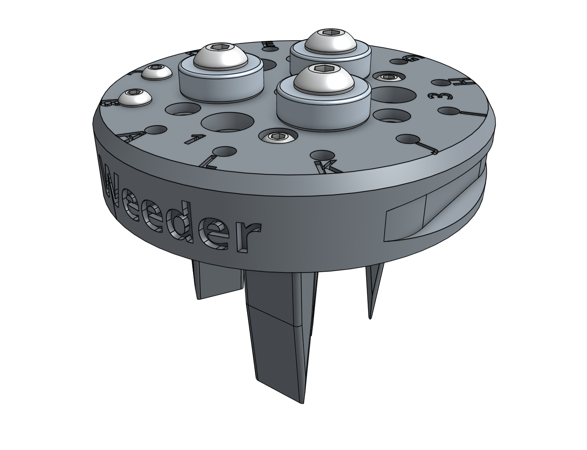
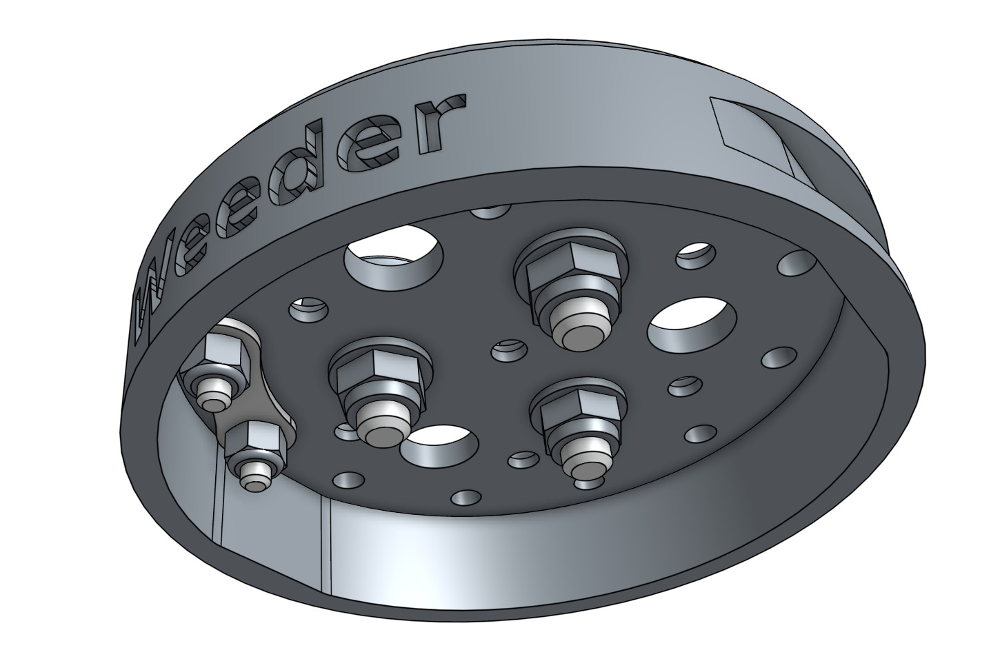
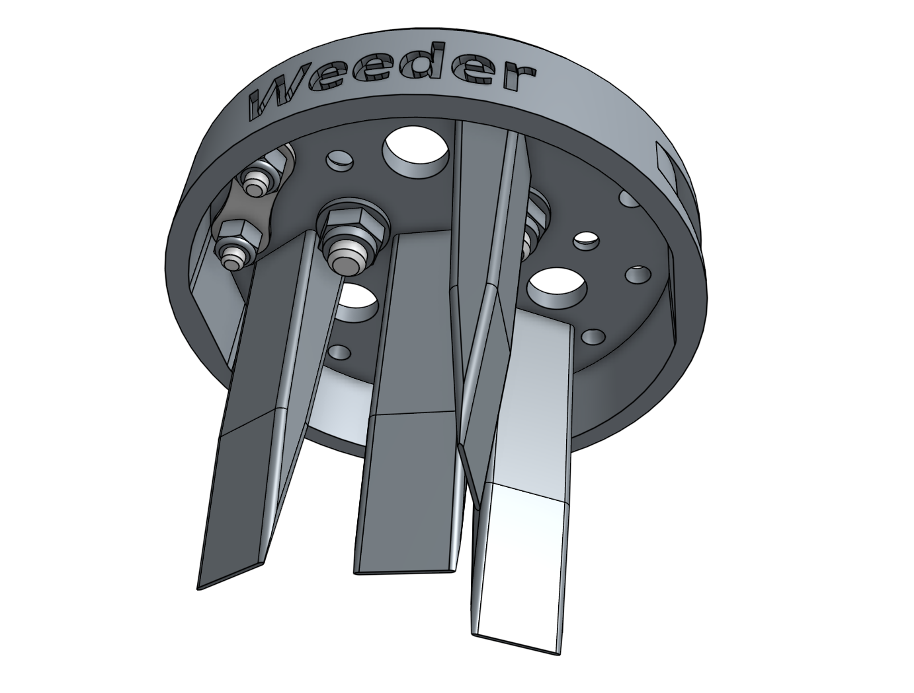

* toc
{:toc}

The weeding tool is a single 3D printable component magnetically mounts onto FarmBot's UTM like any other tool. It works by driving the tool vertically into the soil in order to push any small weeds under the soil, and disrupt their young fragile root systems.

<iframe class="embedly-embed" src="//cdn.embedly.com/widgets/media.html?src=https%3A%2F%2Fwww.youtube.com%2Fembed%2FNsEdALh3ZYY%3Ffeature%3Doembed&url=http%3A%2F%2Fwww.youtube.com%2Fwatch%3Fv%3DNsEdALh3ZYY&image=https%3A%2F%2Fi.ytimg.com%2Fvi%2FNsEdALh3ZYY%2Fhqdefault.jpg&key=02466f963b9b4bb8845a05b53d3235d7&type=text%2Fhtml&schema=youtube" width="854" height="480" scrolling="no" frameborder="0" allowfullscreen></iframe>

{%
include callout.html
type="success"
title="Weeding early and often"
content="This tool, and FarmBot in general, is designed for removing weeds early and often such that the weeds are always **small, young, and fragile**, and therefore easily removed.

What makes this possible is FarmBot's diligence. FarmBot has 24 hours a day to maintain your garden meticulously. It can be configured to remove weeds every single day that a human would never waste their time with. This prevents weeds from even having a chance at becoming a real problem.

If you configure FarmBot well, you will never even notice weeds in your garden because they will never have a chance to survive beyond germination. Over time, the number of weed seeds in your growing area will approach zero."
%}







# Step 1: Gather the parts and tools

Gather all the weeding tool parts from the table below and lay them out in a logical manner. To complete the assembly, you will also need the following tools:

* [2mm hex driver](../../Extras/bom/miscellaneous.md#2mm-hex-driver)
* [3mm hex driver](../../Extras/bom/miscellaneous.md#3mm-hex-driver)
* [5.5mm box wrench](../../Extras/bom/miscellaneous.md#5-5mm-box-wrench)
* [8mm box wrench](../../Extras/bom/miscellaneous.md#8mm-box-wrench)

|Qty.                          |Component                     |
|------------------------------|------------------------------|
|1                             |[Weeder](../../Extras/bom/plastic-parts.md#weeder)
|4                             |[Medium Weeder Blades](../../Extras/bom/plastic-parts.md#medium-weeder-blades)
|4                             |[M3 x 5mm Screws](../../Extras/bom/fasteners-and-hardware.md#m3-x-5mm-screws)
|2                             |[M3 x 10mm Screws](../../Extras/bom/fasteners-and-hardware.md#m3-x-10mm-screws)
|2                             |[M3 Locknuts](../../Extras/bom/fasteners-and-hardware.md#m3-locknuts)
|3                             |[M5 x 16mm Screws](../../Extras/bom/fasteners-and-hardware.md#m5-x-16mm-screws)
|3                             |[M5 Locknuts](../../Extras/bom/fasteners-and-hardware.md#m5-locknuts)
|3                             |[M5 Washers](../../Extras/bom/fasteners-and-hardware.md#m5-washers)
|3                             |[Ring Magnets](../../Extras/bom/miscellaneous.md#ring-magnets)
|1                             |[Jumper Link](../../Extras/bom/electronics-and-wiring.md#jumper-links)

# Step 2: Install the basic tool hardware

Install the **magnets** and tool verification **jumper link** using the instructions in the [basic tool hardware reference guide](../../FarmBot-Genesis-V1-3/reference/basic-tool-hardware.md).

# Step 3: Install the implements

Attach the four **medium weeder blades** to the **weeder** using **M3 x 5mm screws**.

{%
include callout.html
type="info"
title="Customizable"
content="The weeding tool is customizable so you can optimize it for your soil conditions, the types of weeds you are up against, and also how you configure your weeding sequences. Feel free to reconfigure the implements or just use some of them. You can also create new implements of your own design with a 3D printer or out of household materials such as woods screws or heavy duty paperclips.

Come up with something effective and easy to make? Share your creation in the [FarmBot forum](http://forum.farmbot.org)!"
%}

