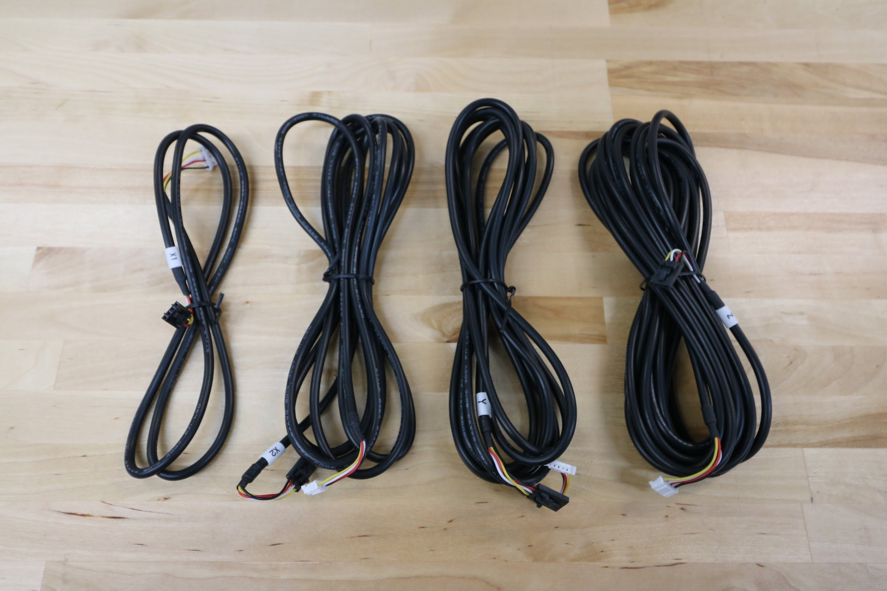

Installing the cables and tubing through FarmBot's cable carriers can be a tedious process. Take your time when installing the cables to ensure you complete this part of the assembly correct the first time, otherwise it might become frustrating if you need to re-do anything.

# Motor and Encoder Cable Reference

|Axis                          |Cable Length                  |
|------------------------------|------------------------------|
|X1                            |0.95m
|X2                            |2.6m
|Y                             |3.1m
|Z                             |4.8m



_Motor cables_

_Encoder cables_

# What's next?

 * [Z-Axis Cable Carrier](cables-and-tubing/z-axis-cable-carrier.md)
