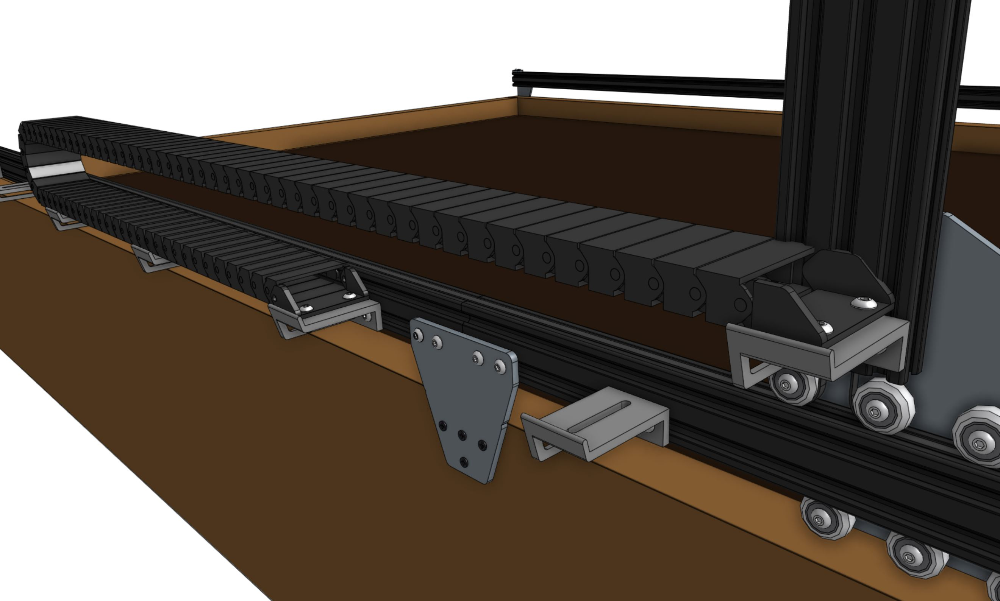

# Step 1: Prepare the cable carrier

Remove all of the snap-in **tabs** from the **x-axis cable carrier**. The x-axis cable carrier has 85 links (1700mm long) + end pieces.

# Step 2: Orient the cable carrier

There is only one orientation that the **x-axis cable carrier** mounts to the **gantry** and **tracks**, and it is determined by the orientation of the **end pieces**. Lay the cable carrier onto the track's **horizontal cable carrier supports** but do not attach it at this time.

# Step 3: Lay out the tubing and wiring

Lay the **water tube** and the **solenoid valve cable** into the open **x-axis cable carrier**. The extra length should extend beyond the track-mounted cable carrier end. Then lay the **two output cables of the power supply** into the cable carrier. The **power supply output connector** should extend beyond the gantry-mounted cable carrier end by about 50cm so that it can plug into the Farmduino.



# Step 4: Snap in some tabs

Snap in three **cable carrier tabs** at both ends of the cable carrier, and ten more spread throughout the middle of the cable carrier so that as you mount the assembly, the cables and tube will stay in place. You do not want to snap in all of the tabs at this time because that will make it difficult to adjust anything if needed.

# Step 5: Mount the cable carrier to the gantry

Carefully flip over the end of the **cable carrier** such that the end piece is positioned on the **horizontal cable carrier support** on the **gantry column**. Make sure you maintain organization of the cables and tube when doing this.

Reduce the amount of extra tubing between the end of the **x-axis cable carrier** and the **y-axis cable carrier** by gently pulling the extra length through the **x-axis cable carrier**. It can be difficult to coax the contents around the bend of the cable carrier, so take your time and ensure that you are not pulling anything too hard.

Attach the **x-axis cable carrier** to the **horizontal cable carrier mount** using two **M5 x 16mm screws**, **M5 washers**, and **M5 locknuts**.

_Not pictured: The cables and tube._

# Step 6: Mount the cable carrier to the tracks

Attach the other end of the **x-axis cable carrier** to the **horizontal cable carrier support** nearest the middle of the **tracks** using two **M5 x 16mm screws**, **M5 washers**, and **M5 locknuts**.

_Not pictured: The cables and tube._

# Step 7: Snap in the remaining tabs

Once everything is situated well, snap-in the remaining **cable carrier tabs**, ensuring that you maintain organization of the cables and tube.



# What's next?

 * [X-Axis Motors](x-axis-motors.md)
