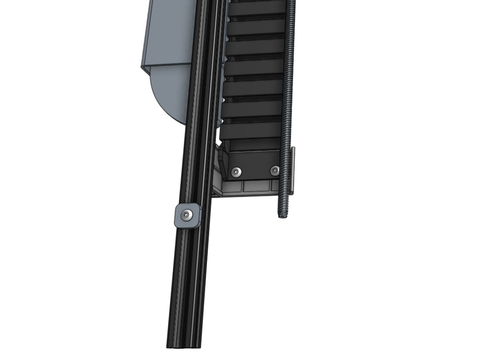
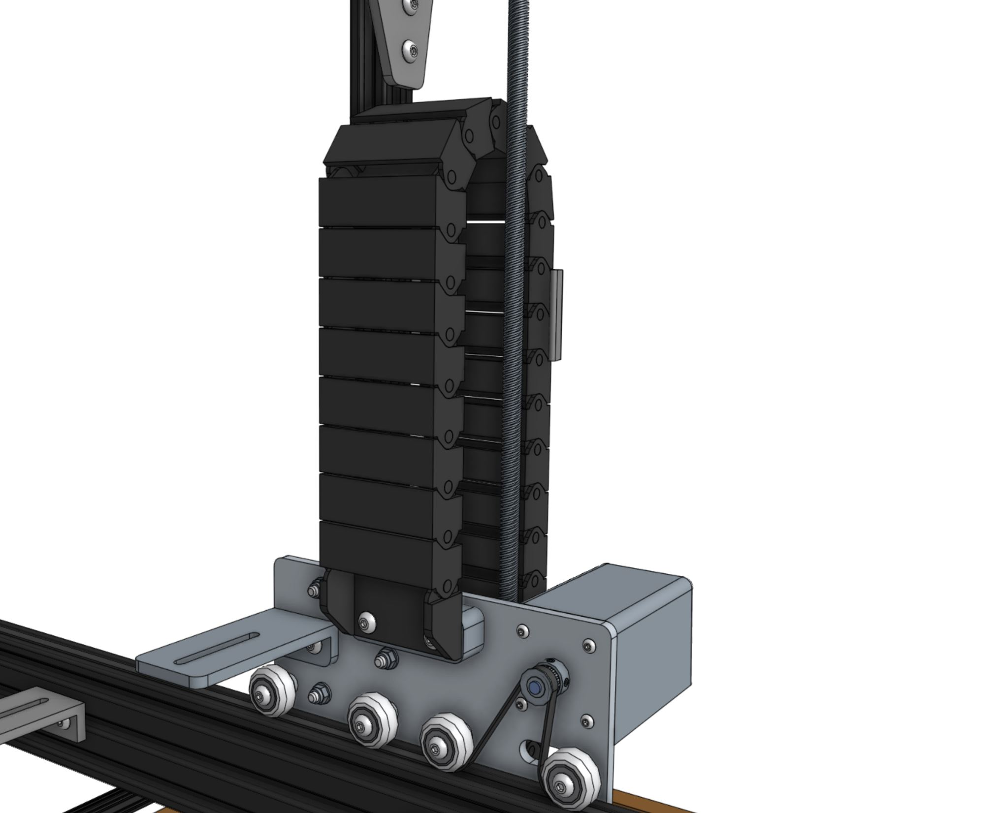
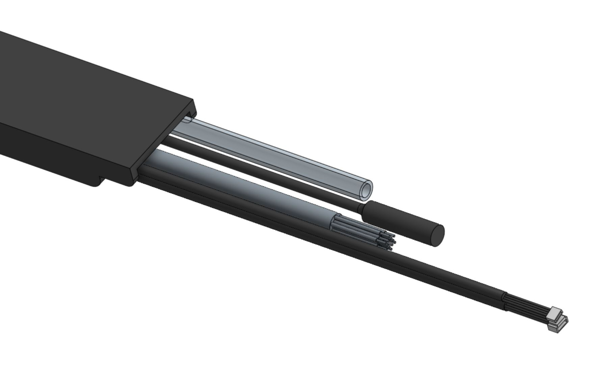
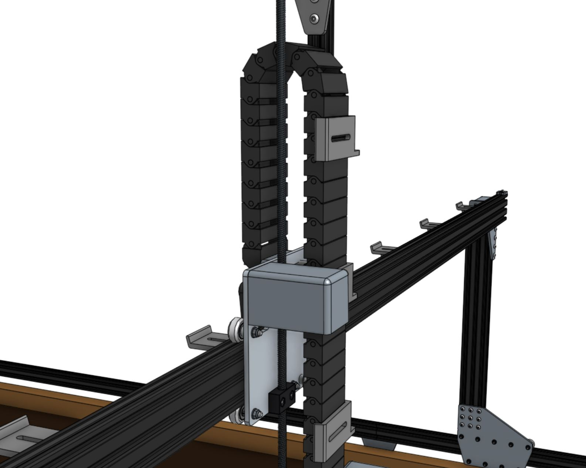
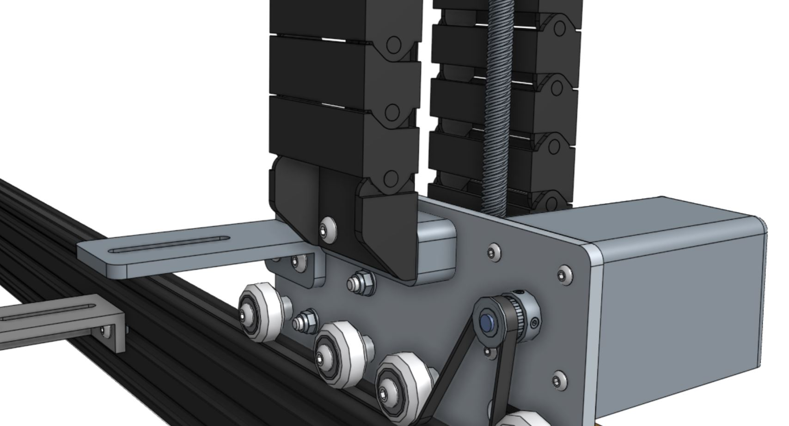
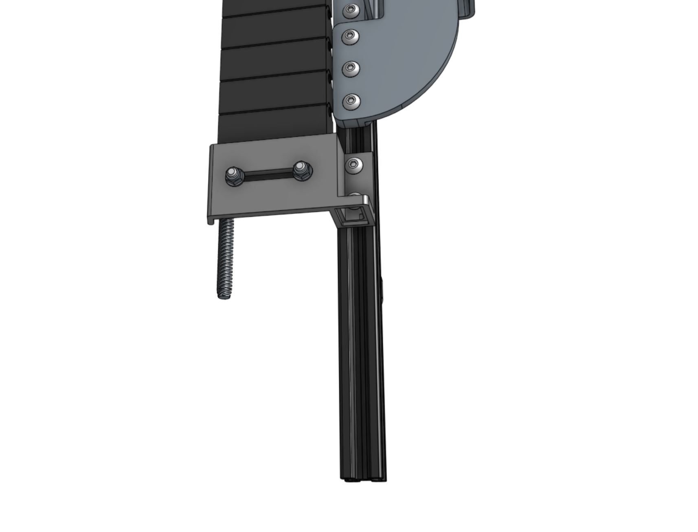
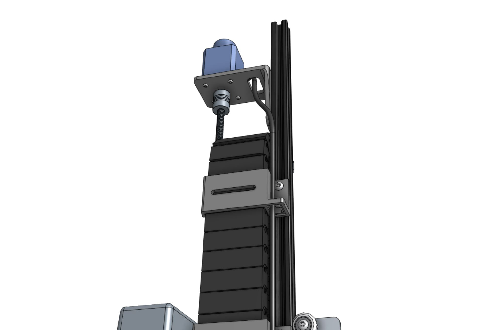
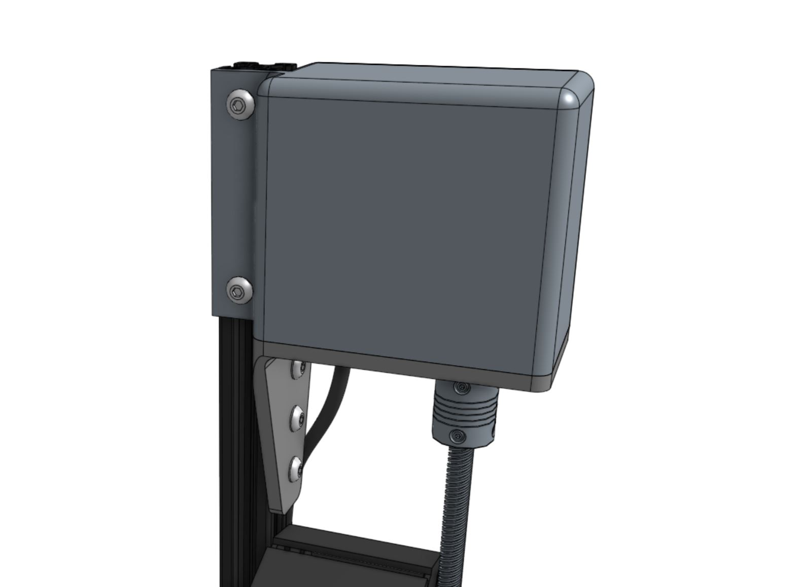

* toc
{:toc}

# Step 1: Prepare the cable carrier

Remove all of the snap-in **tabs** from the **z-axis cable carrier**. The z-axis cable carrier is the shortest cable carrier in the kit with 37 links in it (740mm) + end pieces.

# Step 2: Orient the cable carrier

There is only one orientation that the **z-axis cable carrier** mounts to the **cross-slide** and **z-axis**, and it is determined by the orientation of the **end pieces**. Inspect the images below to see how the cable carrier will be mounted, but do not attach it at this time.

# Step 3: Lay out the tube and wiring

Keeping the mounting orientation of the cable carrier in mind, lay the **UTM cable**, the **water tube**, the **vacuum pump cable**, the **camera cable**, and the **z-axis motor and encoder cables** into the open cable carrier. The ends of everything should be offset from the end of the cable carrier as follows:

  * The end of the water tube should extend 10cm beyond the end of the cable carrier.
  * The end of the UTM cable with bare wire ends (no connectors) should extend 10cm beyond the end of the cable carrier.
  * The end of the camera should extend 15cm beyond the end of the cable carrier.
  * The end of the vacuum pump cable should extend 30cm beyond the end of the cable carrier.
  * The end of the z-axis motor cable with the white plug that connects to the motor should extend 100cm beyond the end of the cable carrier.
  * The end of the z-axis encoder cable with the white plug that connects to the encoder should extend 100cm beyond the end of the cable carrier.

_Note: lengths not to scale._



# Step 4: Snap in some tabs

Snap in three **cable carrier tabs** at both ends of the cable carrier, and five more spread throughout the middle of the cable carrier so that as you mount the assembly, the cables and tubing will stay in place. You do not want to snap in all of the tabs at this time because that will make it difficult to adjust any of the tubes or cables if needed.

# Step 5: Mount the cable carrier to the cross-slide

Carefully lift the cable carrier assembly and drape it over the cross-slide.

Attach the **cable carrier** to the **cross-slide** using two **M5 x 30mm screws**, **M5 washers**, **M5 locknuts**, and the **cable carrier spacer block**. The screws should thread firmly through the cable carrier end pieces.

_Not pictured: The cables and tube coming from the z-axis cable carrier._

# Step 6: Mount the cable carrier to the z-axis

Attach the **cable carrier** to the lowest **vertical cable carrier support** using two **M5 x 16mm screws**, **M5 washers**, **M5 locknuts**. The screws should thread firmly through the cable carrier end pieces. The mount should be about 125mm from the bottom of the extrusion, but the location can be adjusted as necessary to aid cable installation.

_Not pictured: The cables and tube coming from the cable carrier._

# Step 7: Feed the z-axis motor and encoder cables

Feed the **z-axis motor and encoder cables** up through the slots in the **vertical cable carrier supports**, and then through the slot in the **z-axis motor mount**. Then connect the cables to the motor and encoder.

# Step 8: Add the vertical motor housing

Attach the **vertical motor housing** to the **z-axis extrusion** using two **M5 x 10mm screws** and **M5 tee nuts**.

# Step 9: Snap in the remaining tabs

Once everything is situated well, snap-in the remaining **cable carrier tabs**, ensuring that you maintain organization of the cables and tube.



# What's next?

 * [Y-Axis Cable Carrier](../cables-and-tubing/y-axis-cable-carrier.md)
