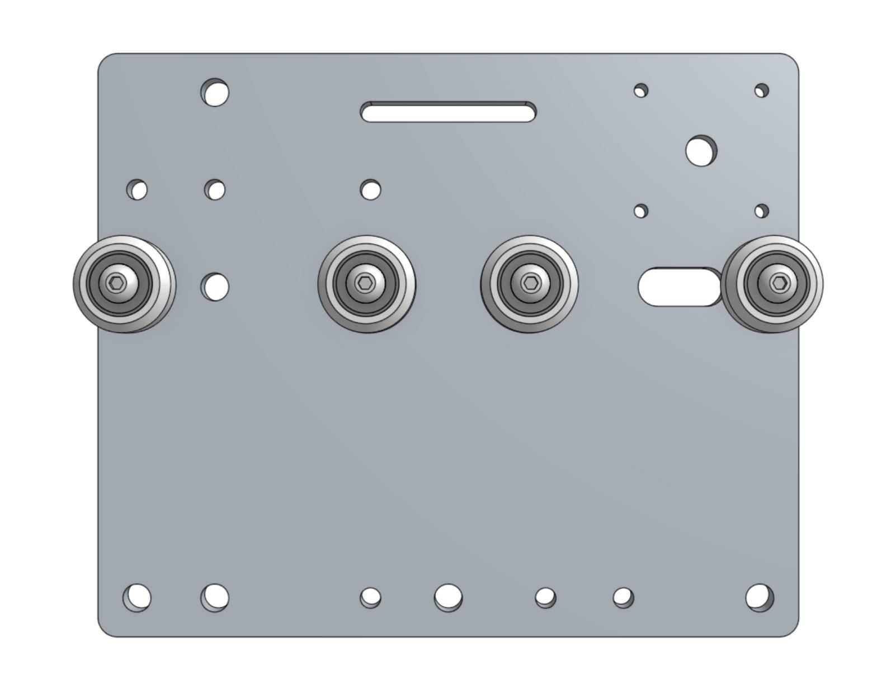
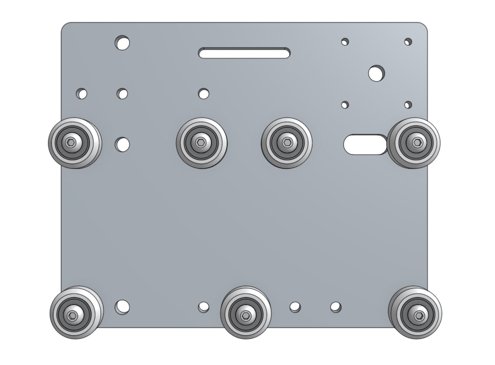



# Step 1: Attach the gantry V-wheels

Use four **M5 x 30mm screws**, **M5 washers**, and **M5 locknuts** to attach four **V-wheels** with **normal 6mm spacers** to the **cross-slide plate**.





_Wheels with normal spacers._

Use three **M5 x 30mm screws** to attach three **V-wheels** with **eccentric 6mm spacers** to the holes shown. The V-wheels should be secured with an **M5 washer** and an **M5 locknut** on the other side.

_Bottom three wheels with eccentric spacers._

# Step 2: Add the Z-axis V-wheels

Flip the cross-slide over so that all of the V-wheels you have added so far are facing away from you.

Use two **M5 x 30mm screws** to attach two **V-wheels** with **normal 6mm spacers** to the holes shown. Secure these wheels with an **M5 washer** and an **M5 locknut** on the other side of the plate.

_Wheels with normal spacers._

Use three **M5 x 30mm screws** to attach three **V-wheels** with **eccentric 6mm spacers** to the holes shown. The V-wheels should be secured with an **M5 washer** and an **M5 locknut** on the other side.

_Right three wheels with eccentric spacers._

# Step 3: Attach the delrin leadscrew block
Insert two **M5 locknuts** into the **delrin leadscrew block's** hexagonal counterbores. With the locknuts and delrin block facing you, attach it to the side of **cross-slide plate** as shown. Secure the block using two **M5 x 16mm screws** from the opposite side of the plate.



# Step 4: Attach the stepper motor

Insert the **stepper motor** into the **horizontal motor housing** such that the motor and encoder connectors are facing down, out the open face of the housing.

Use four **M3 x 10mm screws** to attach the **stepper motor** and **motor housing** to the **cross-slide plate**.



Slide a **GT2 pulley** onto the **stepper motor** shaft. Make sure that both setscrews are lined up with the flat spots of the motor shaft. Then tighten the setscrews with the **2mm driver**.

# Step 5: Add the long cable carrier support
Use two **M5 x 16mm screws**, **M5 washers**, and **M5 locknuts** to secure the **long cable carrier support** to the **cross-slide plate**. The bracket should be on the opposite side of the plate as the motor. The washers should be on the same side of the plate as the motor.



# What's next?

 * [Install the Cross-Slide on the Gantry](install-the-cross-slide-on-the-gantry.md)
