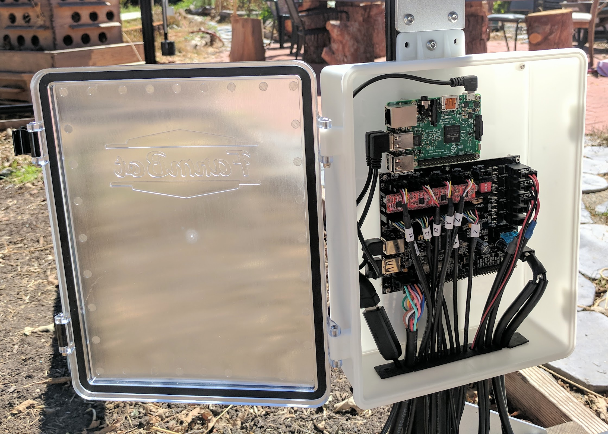

* toc
{:toc}

<iframe class="embedly-embed" src="//cdn.embedly.com/widgets/media.html?src=https%3A%2F%2Fwww.youtube.com%2Fembed%2FjF8q6WAS-rU%3Ffeature%3Doembed&url=http%3A%2F%2Fwww.youtube.com%2Fwatch%3Fv%3DjF8q6WAS-rU&image=https%3A%2F%2Fi.ytimg.com%2Fvi%2FjF8q6WAS-rU%2Fhqdefault.jpg&key=f2aa6fc3595946d0afc3d76cbbd25dc3&type=text%2Fhtml&schema=youtube" width="854" height="480" scrolling="no" frameborder="0" allowfullscreen></iframe>

# Component List
Gather all the parts from the table below and lay them out in a logical manner. To complete the assembly, you will also need the following tools:

* [2mm hex driver](../Extras/bom/miscellaneous.md#2mm-hex-driver)
* [3mm hex driver](../Extras/bom/miscellaneous.md#3mm-hex-driver)

|Qty.                          |Component                     |
|------------------------------|------------------------------|
|16                            |[M2.5 x 4mm Screws](../Extras/bom/fasteners-and-hardware.md#m2-5-screws)
|4                             |[M2.5 x 6mm Standoffs](../Extras/bom/fasteners-and-hardware.md#m2-5-x-6mm-standoffs)
|4                             |[M2.5 x 16mm Standoffs](../Extras/bom/fasteners-and-hardware.md#m2-5-x-6mm-standoffs)
|6                             |[M3 x 5mm Screws](../Extras/bom/fasteners-and-hardware.md#m3-screws)
|2                             |[M5 x 10mm Screws](../Extras/bom/fasteners-and-hardware.md#m5-screws)
|2                             |[M5 Tee Nuts](../Extras/bom/fasteners-and-hardware.md#m5-tee-nuts)
|1                             |[Electronics Box](../Extras/bom/electronics-and-wiring.md#electronics-box)
|1                             |[Electronics Mounting Plate](../Extras/bom/electronics-and-wiring.md#electronics-mounting-plate)
|1                             |[Raspberry Pi 3](../Extras/bom/electronics-and-wiring.md#raspberry-pi-3)
|1                             |[MicroSD Card](../Extras/bom/electronics-and-wiring.md#microsd-card)
|1                             |[Farmduino](../Extras/bom/electronics-and-wiring.md#farmduino)
|1                             |[Raspberry Pi Power Cable](../Extras/bom/electronics-and-wiring.md#raspberry-pi-power-cable)
|1                             |[Farmduino Data Cable](../Extras/bom/electronics-and-wiring.md#farmduino-data-cable)
|1                             |[USB Adapter Cable](../Extras/bom/electronics-and-wiring.md#usb-adapter-cable)

# What's next?

 * [Assemble the Electronics Box](../FarmBot-Genesis-V1.3/electronics/assemble-the-electronics-box.md)
