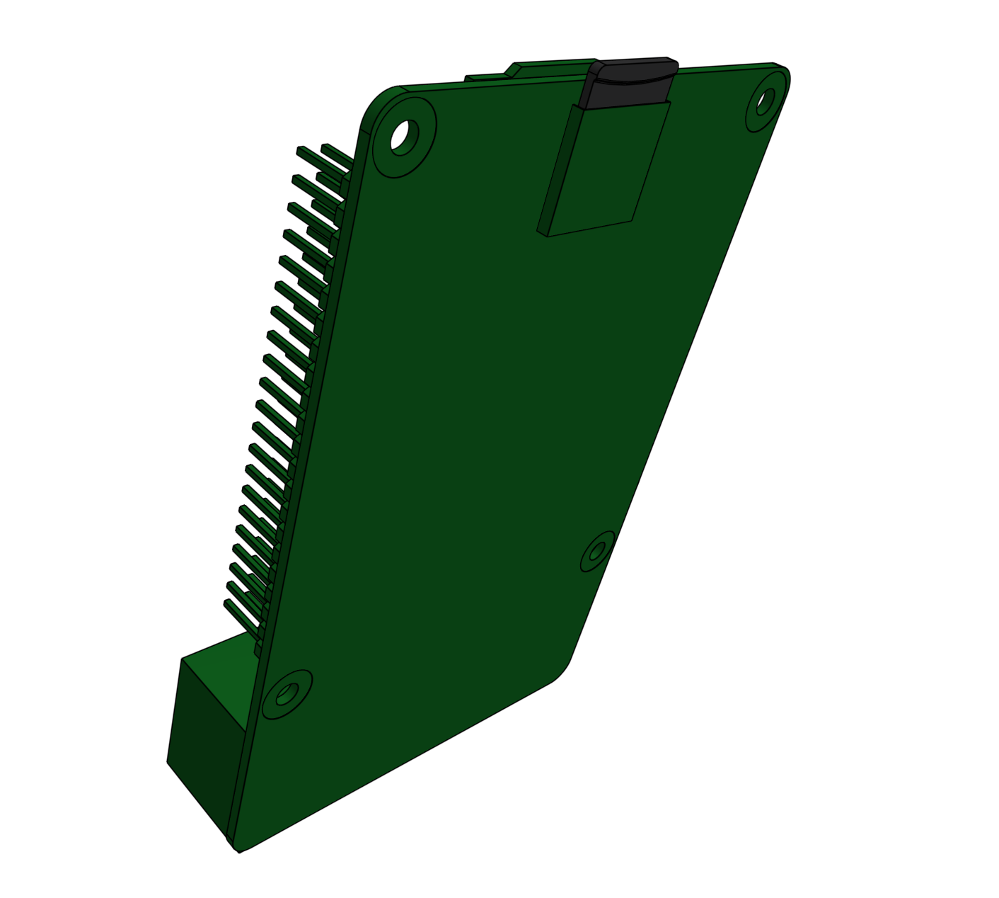

* toc
{:toc}



# Step 1: Install FarmBot OS
Follow the instructions on the [Raspberry Pi software](https://software.farm.bot) page to install FarmBot OS onto the **microSD card**. Then insert the microSD card into the slot in the backside of the **Raspberry Pi**.

# Step 2: Mount the Farmduino
Use four **M2.5 x 4mm screws** to attach four **M2.5 x 6mm standoffs** to the **electronics mounting plate**. The screws should be on the backside of the plate while the standoffs should be on the front.



Attach the **Farmduino** to the **standoffs** using four **M2.5 x 4mm screws**.

# Step 3: Mount the Raspberry Pi
Use four **M2.5 x 4mm screws** to attach four **M2.5 x 16mm standoffs** to the **electronics mounting plate**. The standoffs should be on the same side of the plate as the Farmduino.

Attach the **Raspberry Pi** to the **standoffs** using four **M2.5 x 4mm screws**.

# Step 4: Connect the Farmduino to the Raspberry Pi
Connect the **Raspberry Pi data cable** (shown in gray) to the **Raspberry Pi's** power input and the **Farmduino's** USB power output.

Connect the **Farmduino data cable** (shown in black) to the **Farmduino's** data input and one of the **Raspberry Pi's** USB ports. It does not matter which USB port you plug into on the Pi.

# Step 5: Connect the USB adapter cable
Connect the **USB Adapter Cable** (shown in blue) to one of the USB ports on the **Raspberry Pi**. It does not matter which USB port you plug into on the Pi.

# Step 6: Mount everything in the box
Mount the **electronics mounting plate** in the **electronics box** using six **M3 x 5mm screws**. The Farmduino should be nearest the slot in the bottom of the box.



# Step 7: Attach the stepper driver heatsinks
Peel off the protective paper on the bottom of the **stepper driver heatsinks** to expose the adhesive.

Press the **heatsinks** onto the **black chips** on the **stepper drivers**. Make sure the edges of the heatsinks are not touching any of the soldered components on the drivers.

# What's next?

 * [Attach the Electronics Box](../electronics/attach-the-electronics-box.md)
