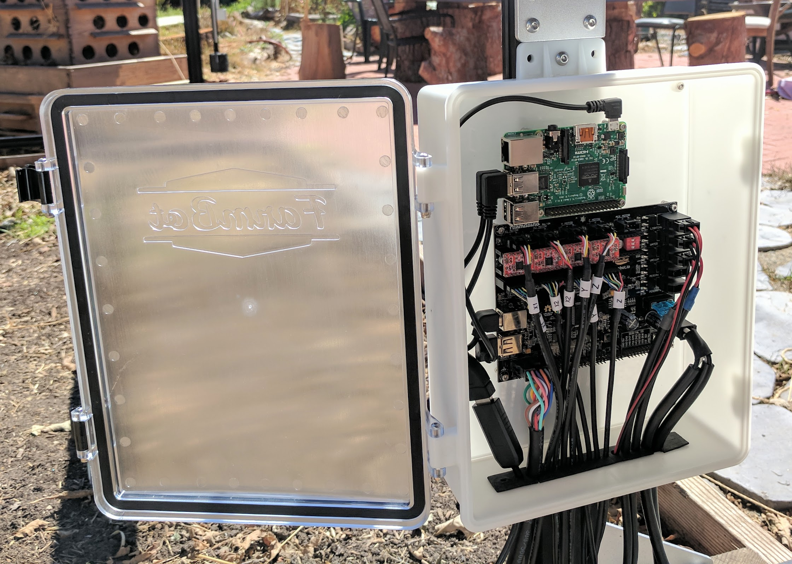

* toc
{:toc}

# Step 1: Gather the parts and tools

Gather all the parts from the table below and lay them out in a logical manner. To complete the assembly, you will also need the following tools:

* [3mm hex driver](../../Extras/bom/miscellaneous.md#3mm-hex-driver)

|Qty.                          |Component                     |
|------------------------------|------------------------------|
|1                             |[Electronics Box](../../Extras/bom/electronics-and-wiring.md#electronics-box)
|6                             |[M5 x 10mm Screws](../../Extras/bom/fasteners-and-hardware.md#m5-screws)
|6                             |[M5 Tee Nuts](../../Extras/bom/fasteners-and-hardware.md#m5-tee-nuts)
|2                             |[Cable Guides](../../Extras/bom/plastic-parts.md#cable-guides)

# Step 2: Attach the electronics box to the gantry

Attach the **electronics box** to the middle slot on the outside of the **left gantry column** using two **M5 x 10mm screws** and **tee nuts**. The screws should be placed in the middle holes on the top and bottom mounting flanges of the electronics box. The top flange of the box should be butted against the bottom edge of the **gantry corner bracket**.

# Step 3: Attach the cable guides

Attach both **cable guides** to the back side of the left **gantry column** using **M5 x 10mm screws** and **tee nuts** as shown. Adjust the guides so they secure the **motor and encoder cables**, **UTM cable**, **LED lights cable**, **vacuum pump cable**, **camera cable**, and the **water tube**. Ensure the water tube is not compressed.

_Note: the cables and tubing are not shown in this image._

# What's next?

 * [Plug Everything In](../electronics/plug-everything-in.md)
