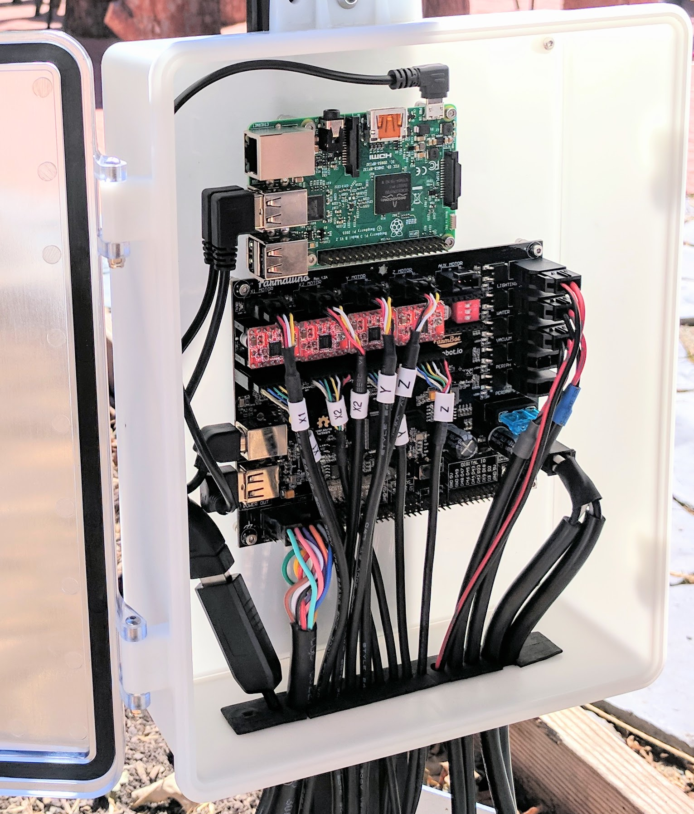
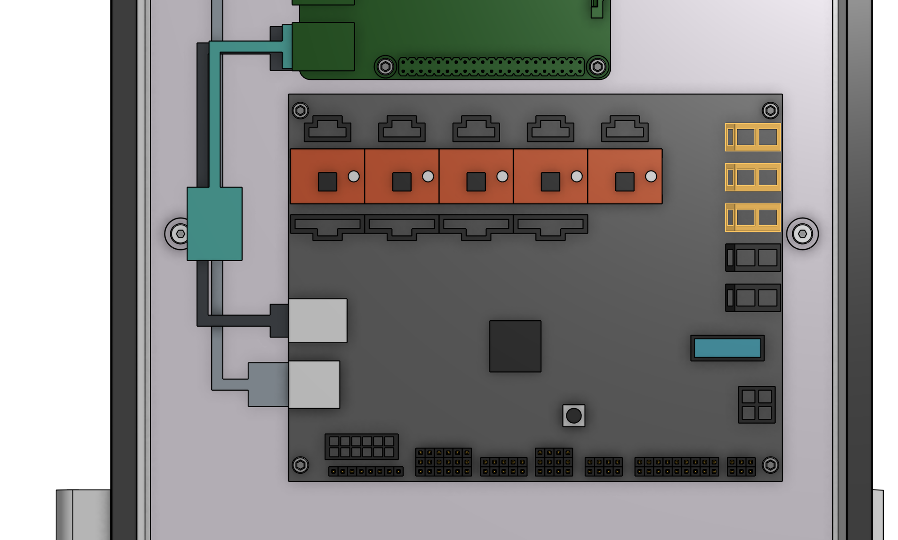
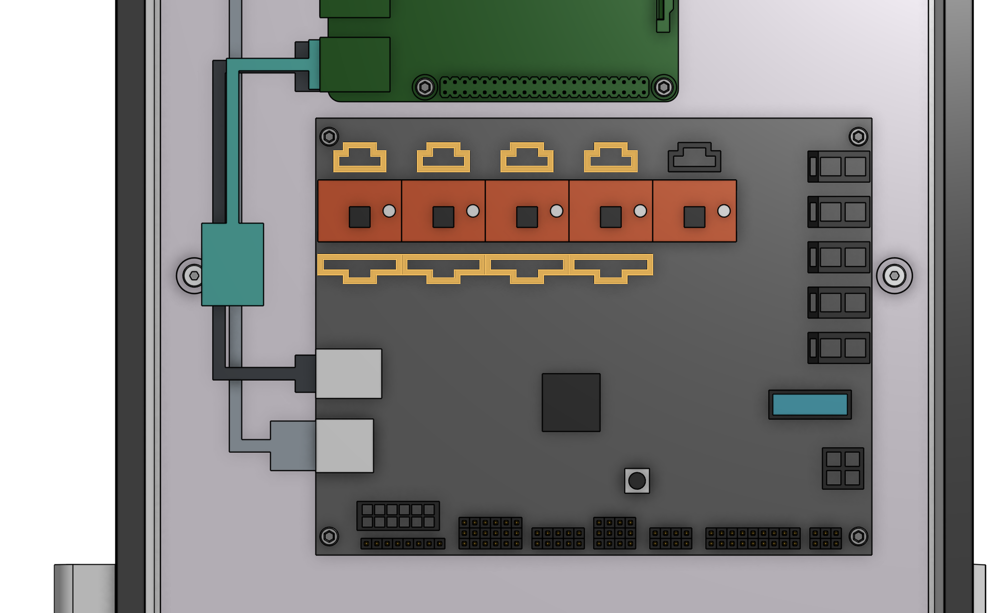
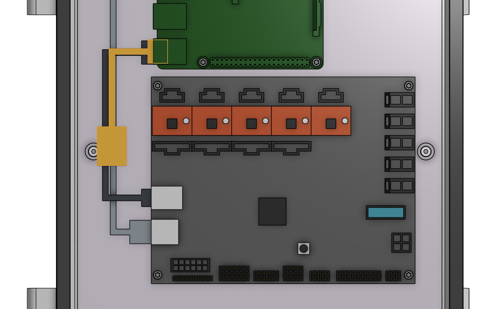
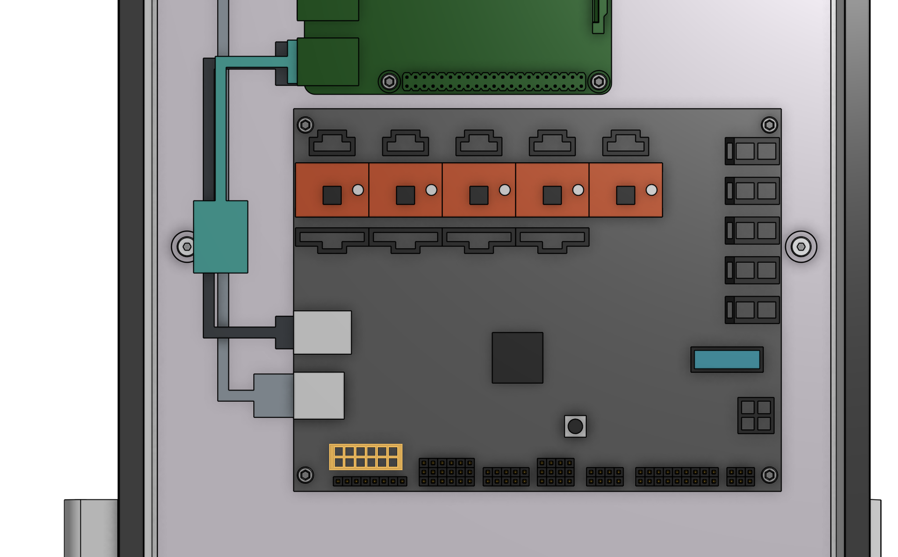
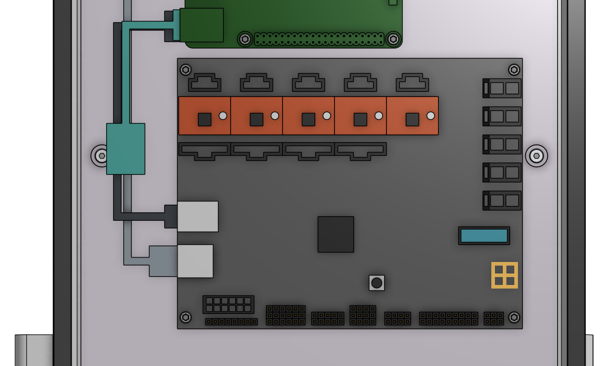

* toc
{:toc}



{%
include callout.html
type="info"
title="All cables go through the slot"
content="Before proceeding with plugging everything in, remove the black rubber **supergland** from the slot in the bottom of the **electronics box**.

When plugging in cables in the following steps, ensure that you pass **every cable** through the slot in the bottom of the electronics box. Once everything is connected to the electronics, you will organize all of the cables into the supergland, and then push the supergland back into the slot."
%}

Note: the electronics box will look like the following image when everything is completed.

# Step 1: Connect the peripherals
* Connect the **LED lights** to the **Farmduino** peripheral connector labelled `LIGHTING` (the top right connector on Farmduino). The connector will only fit in one direction.
* Connect the **solenoid valve cable** (with blue heat shrink) to the **Farmduino** peripheral connector labelled `WATER` (directly underneath the lighting connector). The connector will only fit in one direction.
* Connect the **vacuum pump cable** (with gray heat shrink) to the **Farmduino** peripheral connector labelled `VACUUM` (directly underneath the water connector). The connector will only fit in one direction.

_The peripheral connectors are highlighted in orange_



# Step 2: Plug in the stepper motors and rotary encoders
Plug in the **motor and encoder cables** to the **Farmduino**. Each cable is labelled with a white sleeve, which corresponds to the connectors on the Farmduino. From left to right, the connectors on Farmduino are `X1`, `X2`, `Y`, and `Z`. Each connector can only be inserted in one direction, and has a locking tab to prevent it from falling out.

_The motor and encoder connectors are highlighted in orange_



# Step 3: Plug in the camera
Plug in the **camera** to the **USB adapter cable**.

_The USB adapter cable is highlighted in orange_

# Step 4: Plug in the UTM cable
Plug in the **UTM cable** to the **Farmduino**. The connector will only fit in one direction.

_The UTM connector is highlighted in orange_

# Step 5: Plug the power supply into the Farmduino
Connect the **4-pin power supply connector** to the **Farmduino's power input**. The connector will only fit in one direction.

_The power input connector is highlighted in orange_

# Step 6: Insert the supergland
Organize and insert all of the **cables** into the **supergland** by bending the supergland so the small cuts are opened up and you can insert a cable. You should organize and insert the cables outside of the electronics box but as close as possible to the slot, so that you can scoot the supergland up the cables and into the slot once all cables are inserted.

From left to right, the cables should be organized in the following order: camera, UTM, motors, encoders, peripherals, power supply. Note that both of the power supply cables must be inserted into a single hole in the supergland. The rubber is soft and flexible enough to accommodate this.

Once the cables are all inserted into the supergland, gently scoot the supergland up the cables and push it into the slot in the electronics box. Ensure that the flanges of the supergland are on either side of the electronics box wall.



# Step 7: Mount the power supply
Mount the **power supply** to your **supporting infrastructure** using four **25mm wood screws**. The power supply is IP67 rated, so it can withstand rain and the elements.

# Step 8: Plug the power supply into the wall
Plug the power supply plug into a waterproof GFCI outlet. If an appropriate outlet is not close enough to plug in directly, use an extension cord and a waterproof connection box such as the [Sockit Box](http://www.sockitbox.com/size-option/size-200/).





If everything looks good, and you understand the precautions needed around powered electronics, go ahead and plug the power supply into the wall.







