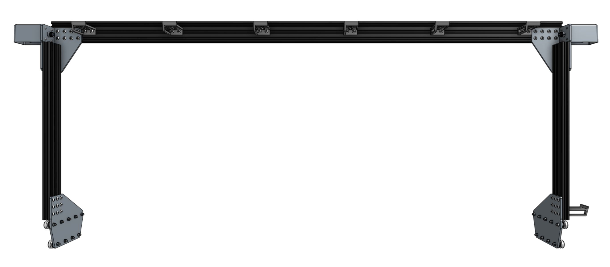

* toc
{:toc}

_Note: This image is of the back side of the gantry._

# Component list

To prepare for assembly, gather all the components from the table below and lay them out in a logical manner. To complete the assembly in the next pages, you will also need the following tools:
* [3mm hex driver](../Extras/bom/miscellaneous.md#3mm-hex-driver)
* [2mm hex driver](../Extras/bom/miscellaneous.md#2mm-hex-driver)
* [8mm wrench](../Extras/bom/miscellaneous.md#8mm-wrench)
* [8mm box wrench](../Extras/bom/miscellaneous.md#8mm-box-wrench)



|Qty.                          |Component                     |
|------------------------------|------------------------------|
|1                             |[Gantry Main Beam](../Extras/bom/extrusions.md#gantry-main-beam) (20 x 60 x 1500mm extrusion)
|2                             |[Gantry Columns](../Extras/bom/extrusions.md#gantry-columns) (20 x 60 x 500mm extrusion)
|2                             |[Gantry Wheel Plates](../Extras/bom/plates-and-brackets.md#gantry-wheel-plates)
|2                             |[Gantry Corner Brackets](../Extras/bom/plates-and-brackets.md#gantry-corner-brackets) (left-hand and right-hand versions)
|4                             |[Belt Clips](../Extras/bom/plates-and-brackets.md#belt-clips)
|8                             |[M3 x 10mm Screws](../Extras/bom/fasteners-and-hardware.md#m3-x-10mm-screws)
|72                            |[M5 x 10mm Screws](../Extras/bom/fasteners-and-hardware.md#m5-x-10mm-screws)
|18                            |[M5 x 30mm Screws](../Extras/bom/fasteners-and-hardware.md#m5-x-30mm-screws)
|10                            |[M5 x 6mm Spacers](../Extras/bom/fasteners-and-hardware.md#m5-x-6mm-spacers)
|8                             |[M5 x 6mm Eccentric Spacers](../Extras/bom/fasteners-and-hardware.md#m5-x-6mm-eccentric-spacers)
|18                            |[M5 Washers](../Extras/bom/fasteners-and-hardware.md#m5-washers)
|72                            |[M5 Tee Nuts](../Extras/bom/fasteners-and-hardware.md#m5-tee-nuts)
|18                            |[M5 Locknuts](../Extras/bom/fasteners-and-hardware.md#m5-locknuts)
|2                             |[Horizontal Motor Housings](../Extras/bom/plastic-parts.md#horizontal-motor-housings)
|7                             |[Horizontal Cable Carrier Supports](../Extras/bom/plastic-parts.md#horizontal-cable-carrier-supports)
|18                            |Complete V-Wheels (one [v-wheel](../Extras/bom/drivetrain.md#v-wheels), two [bearings](../Extras/bom/drivetrain.md#bearings), and one [M5 shim](../Extras/bom/drivetrain.md#m5-shims))
|2                             |[NEMA 17 Stepper Motor with Rotary Encoders](../Extras/bom/electronics-and-wiring.md#nema-17-stepper-motors-with-rotary-encoders)
|2                             |[20 tooth GT2 Pulleys with setscrews](../Extras/bom/drivetrain.md#gt2-pulleys)
|2                             |X-Axis [GT2 Timing Belts](../Extras/bom/drivetrain.md#gt2-timing-belt)

# What's next?

 * [Assemble the Gantry Wheel Plates](gantry/assemble-the-gantry-wheel-plates.md)
