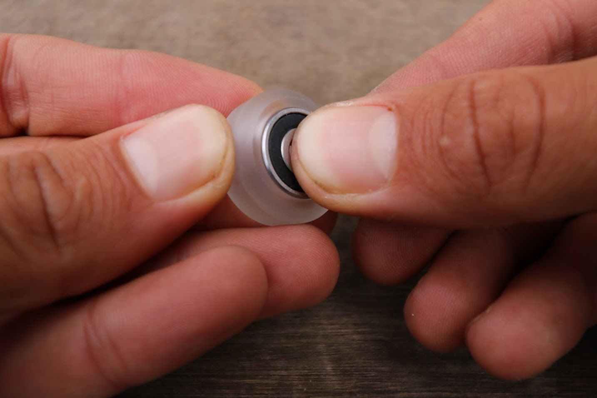

* toc
{:toc}

Each V-Wheel actually consists of four components:
* One [V-wheel](../../Extras/bom/drivetrain.md#v-wheels)
* Two [bearings](../../Extras/bom/drivetrain.md#bearings)
* One [M5 shim](../../Extras/bom/drivetrain.md#m5-shims)

Pre-assembling all your v-wheels at once will save you assembly time later on. To do so, first press one bearing into the polycarbonate wheel.





Then insert the precision shim such that it is resting on the first bearing on the inside of the wheel. Try to position the shim in the center of the wheel.

 Then press in the second bearing.



