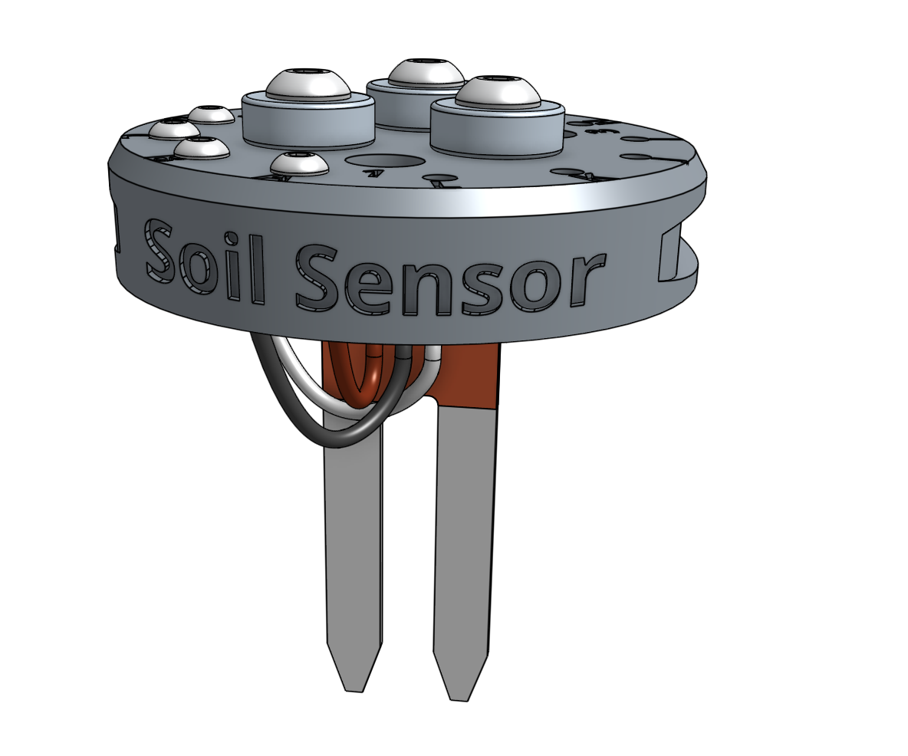
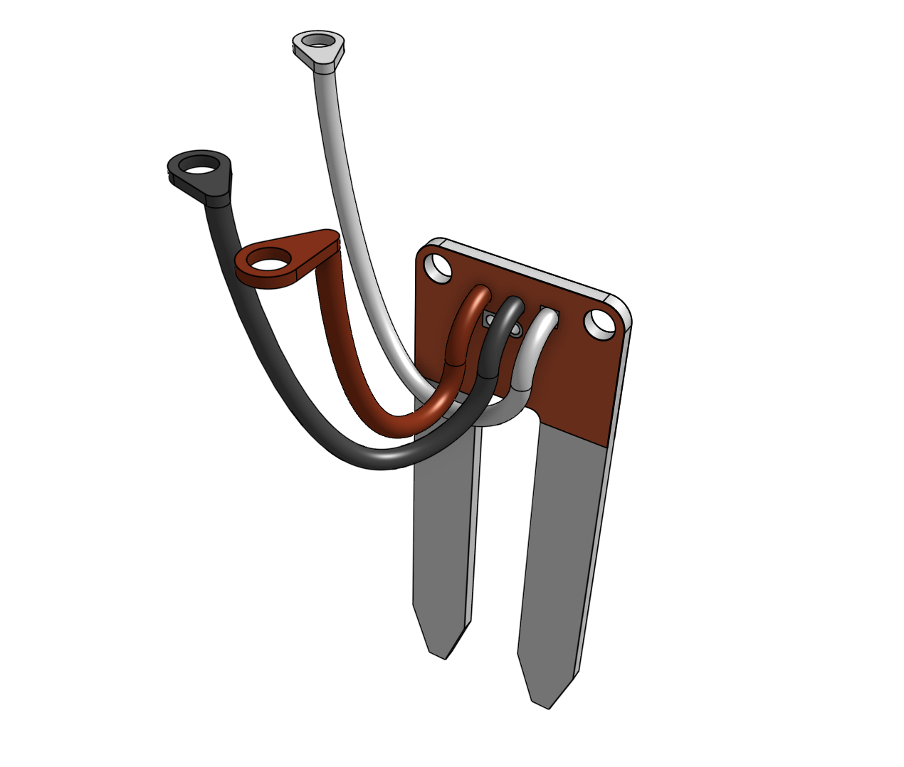
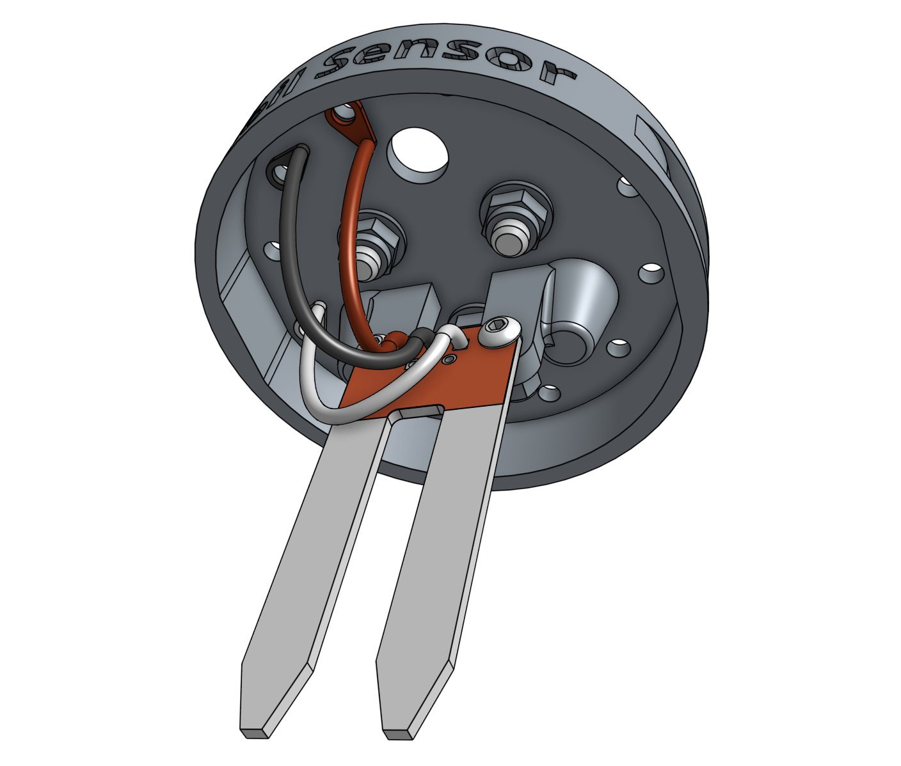
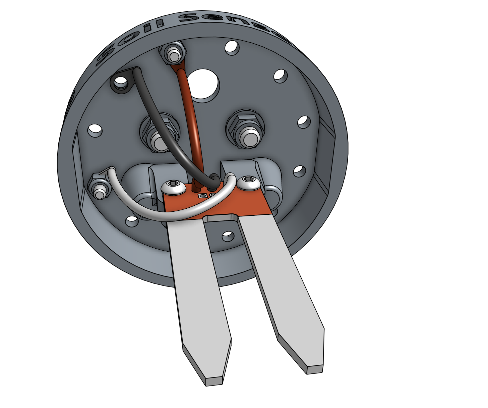
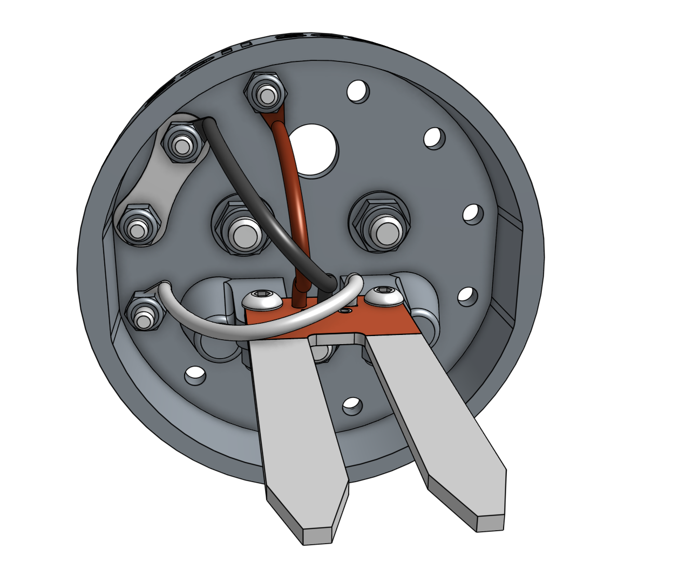

* toc
{:toc}

This single 3D printable component magnetically mounts onto FarmBot's UTM like any other tool. It works by driving the tool vertically into the soil so that the soil properties can be accurately read.

<iframe class="embedly-embed" src="//cdn.embedly.com/widgets/media.html?src=https%3A%2F%2Fwww.youtube.com%2Fembed%2Fp6CPnJoHf8E%3Ffeature%3Doembed&url=http%3A%2F%2Fwww.youtube.com%2Fwatch%3Fv%3Dp6CPnJoHf8E&image=https%3A%2F%2Fi.ytimg.com%2Fvi%2Fp6CPnJoHf8E%2Fhqdefault.jpg&key=02466f963b9b4bb8845a05b53d3235d7&type=text%2Fhtml&schema=youtube" width="854" height="480" scrolling="no" frameborder="0" allowfullscreen></iframe>



# Step 1: Gather the parts and tools

Gather all the soil sensor parts from the table below and lay them out in a logical manner. To complete the assembly, you will also need the following tools:

* [2mm hex driver](../../Extras/bom/miscellaneous.md#2mm-hex-driver)
* [3mm hex driver](../../Extras/bom/miscellaneous.md#3mm-hex-driver)
* [5.5mm box wrench](../../Extras/bom/miscellaneous.md#5-5mm-box-wrench)
* [8mm box wrench](../../Extras/bom/miscellaneous.md#8mm-box-wrench)

|Qty.                          |Component                     |
|------------------------------|------------------------------|
|1                             |[Soil Sensor](../../Extras/bom/plastic-parts.md#soil-sensor)
|3                             |[Soil Sensor Jumpers](../../Extras/bom/electronics-and-wiring.md#soil-sensor-jumpers)
|1                             |[Soil Sensor PCB](../../Extras/bom/electronics-and-wiring.md#soil-sensor)
|3                             |[Ring Magnets](../../Extras/bom/miscellaneous.md#ring-magnets)
|3                             |[M5 x 16mm Screws](../../Extras/bom/fasteners-and-hardware.md#m5-x-16mm-screws)
|3                             |[M5 Washers](../../Extras/bom/fasteners-and-hardware.md#m5-washers)
|3                             |[M5 Locknuts](../../Extras/bom/fasteners-and-hardware.md#m5-locknuts)
|6                             |[M3 x 10mm Screws](../../Extras/bom/fasteners-and-hardware.md#m3-x-10mm-screws)
|6                             |[M3 Locknuts](../../Extras/bom/fasteners-and-hardware.md#m3-locknuts)
|1                             |[Jumper Link](../../Extras/bom/electronics-and-wiring.md#jumper-links)

# Step 2: Install the magnets
Install *only* the **magnets** using the instructions in the [basic tool hardware reference guide](../../FarmBot-Genesis-V1.3/reference/basic-tool-hardware.md).

# Step 3: Install the moisture sensor
Use the small bladed screwdriver to secure the white, black, and red **soil sensor jumpers** to the **soil sensor PCB**. White should be connected to `SIG`, black to `GND`, and red to `VCC`.

_Note: the black screw terminal on the soil sensor PCB is not shown in this image._

Attach the **soil sensor PCB** to the **soil sensor** using two **M3 x 10mm screws** and **M3 locknuts**. The sensor should be on the front side of the base's mounting tabs. The heads of the screws should be on the sensor (front) side while the locknuts should be on the mounting tabs (back) side. Do not overtighten the screws as this could damage the soil sensor circuit board.

# Step 4: Install the electronic screws
Use the **2mm hex driver** and **5.5mm box wrench** to attach two **M3 x 10mm screws** and **M3 locknuts** into the holes labelled **A** and **D** on the **soil sensor**. The screw heads should be on the same side as the magnets. The screw in the **A** position should hold the ring terminal of the **red soil sensor jumper**. The screw in the **D** position should hold the ring terminal of the **white soil sensor jumper**.

# Step 5: Install the jumper link

Attach the jumper link to positions **B** and **C** using two **M3 x 10mm screws** and **M3 locknuts**. The screw in the **B** position should hold the ring terminal of the **black soil sensor jumper**.

