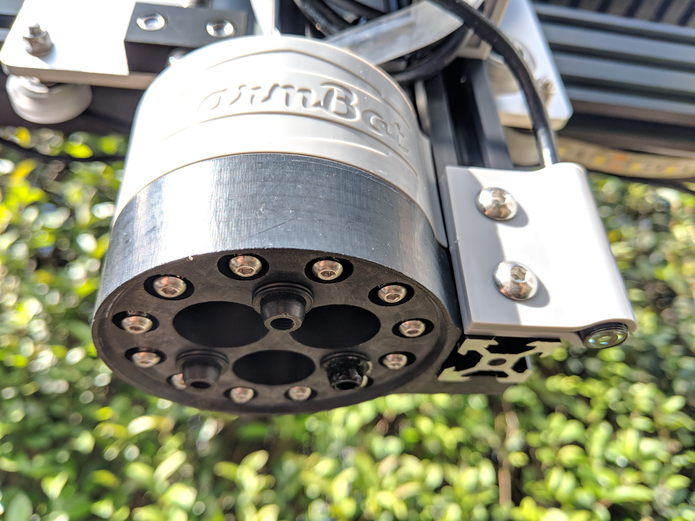

* toc
{:toc}

The Universal Tool Mount (UTM) allows FarmBot Genesis to automatically switch tools in order to perform different operations. The UTM is necessary because it is not feasible to have all tools mounted on the z-axis at one time for several reasons:

  * This would be very heavy and increase stresses on all components, as well as necessitate a larger z-axis motor.
  * Most tools need to be the “lowest” thing on the z-axis in order to work. Having multiple tools competing for the lowest position (ex: a temperature probe and a seed injector) would not be ideal and may not work at all. The use of individual tool raising and lowering mechanisms, or a turret style mechanism would be complex, heavy, bulky, and limited in the number of tools it could support.
  * The z-axis size must be kept to a minimum in order for it to have minimal impact on the plants, especially when there is not very much space between them.

<iframe class="embedly-embed" src="//cdn.embedly.com/widgets/media.html?src=https%3A%2F%2Fwww.youtube.com%2Fembed%2Fq8xjCBq32C8%3Ffeature%3Doembed&url=http%3A%2F%2Fwww.youtube.com%2Fwatch%3Fv%3Dq8xjCBq32C8&image=https%3A%2F%2Fi.ytimg.com%2Fvi%2Fq8xjCBq32C8%2Fhqdefault.jpg&key=02466f963b9b4bb8845a05b53d3235d7&type=text%2Fhtml&schema=youtube" width="854" height="480" scrolling="no" frameborder="0" allowfullscreen></iframe>

The UTM is a plastic component that mounts to the z-axis aluminum extrusion using two M5 screws and tee nuts.
It features:
* 3 strong neodymium ring magnets to magnetically hold tools in place via other magnets placed in the same configuration on the tool.
* Passageways for water, liquid amendments (eg: fertilizer), and vacuum or compressed air to pass through from the UTM (and the rest of FarmBot) to the tool.
* 12 spring loaded screws that make electrical connections with tools. (See: [Pin Mapping](wire-up-the-utm#pin-mapping))



# What's next?

 * [Assemble the UTM](../FarmBot-Genesis-V1.3/utm/assemble-the-utm.md)
