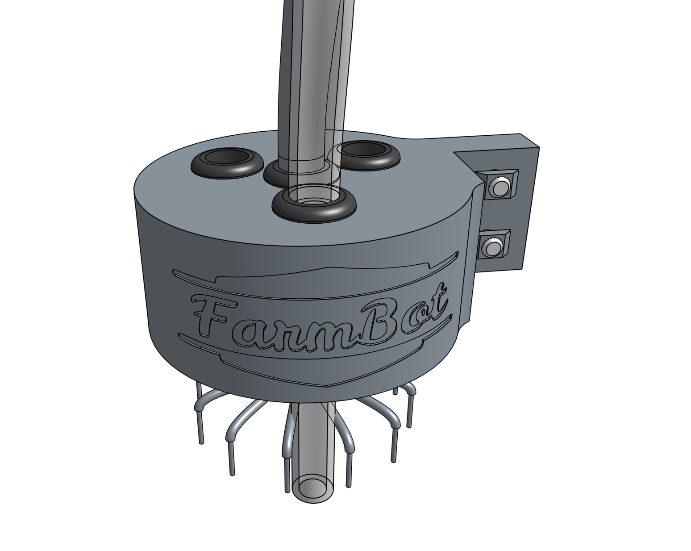
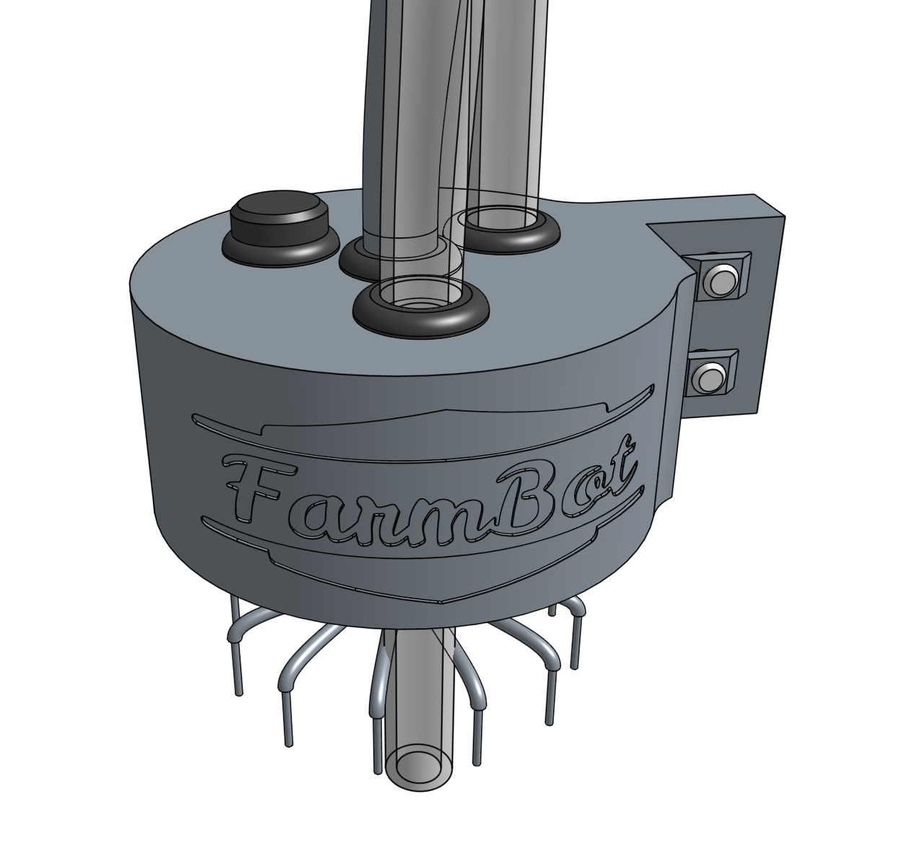

* toc
{:toc}

# Step 1: Feed the UTM cable through the UTM cover
Push the end of the **UTM cable** *without a connector* through the center **grommet** in the **UTM cover** so that the outer black rubber of the cable extends about 5cm beneath the cover.



The individual wires of the **UTM cable** are color coded. Fan out the wires in preparation for connection.

# Step 2: Feed the tubing through the UTM cover
Push the **vacuum tube** (the short tube) through the **grommet** nearest the FarmBot logo on the **UTM cover** so that there is about 10cm of tubing beneath the cover.

Push the **water tube** (the long tube) through the **grommet** nearest the **UTM cover** mounting flange so that there is about 10cm of tubing beneath the cover.

Insert the **UTM cover plug** into the remaining **grommet** in the **UTM cover**. This port is available for you to expand the functionality of your FarmBot if you desire.

# Step 3: Attach the tubes
Slide the **vacuum tube** and **water tube** onto the corresponding **barbs** on the **UTM**.

# Step 4: Wire up the UTM
Use a **63.7mm zip-tie** to secure each UTM cable wire to the **M3 screw** on top of the **UTM** according to the pin mapping table below. The wire strands must make good contact with the screw threads.

## Pin mapping



|UTM Pin/UTM Wire              |is connected to               |and used for                  |
|------------------------------|------------------------------|------------------------------|
|**A** /red|+5V                           |Soil sensor
|**B** /yellow|Ground (0V)                   |Ground
|**C** /green|Pin D63 - Digital-In          |Tool verification
|**D** /black|Pin D59 (A5) - Analog-In      |Soil sensor and other analog signal tools
|**E** /white|Your choice                   |Anything you want
|**F** /brown|Your choice                   |Anything you want
|**G** /blue|Your choice                   |Anything you want
|**H** /grey|Your choice                   |Anything you want
|**I** /orange|Your choice                   |Anything you want
|**J** /purple|Your choice                   |Anything you want
|**K** /pink|Your choice                   |Anything you want
|**L** /cyan|Your choice                   |Anything you want

# Step 5: Slide down the UTM cover
Slide the **UTM cover** down the tubes and cable until it sits flush against the top of the **UTM**. Ensure that no wires or tubes become disconnected and that there is sealing between the cable and the grommet.

# Step 6: Install the UTM and cover onto the Z-axis
Position the **UTM cover** and **UTM** onto the **z-axis extrusion**. The mounting flanges should be positioned on the backside of the extrusion. The bottom of the UTM should be flush with the bottom of the extrusion, and the bottom of the UTM cover should be flush with the top of the UTM. Tighten all four **M5 screws** with the **3mm hex driver**.



# What's next?

 * [Electronics](../../FarmBot-Genesis-V1.3/electronics.md)
