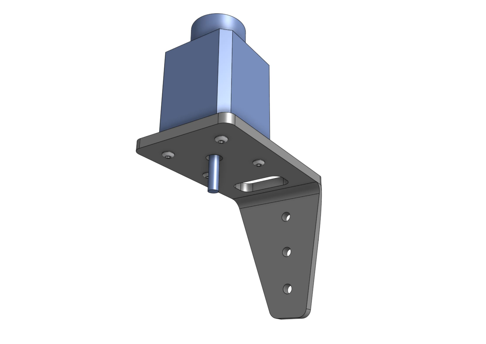
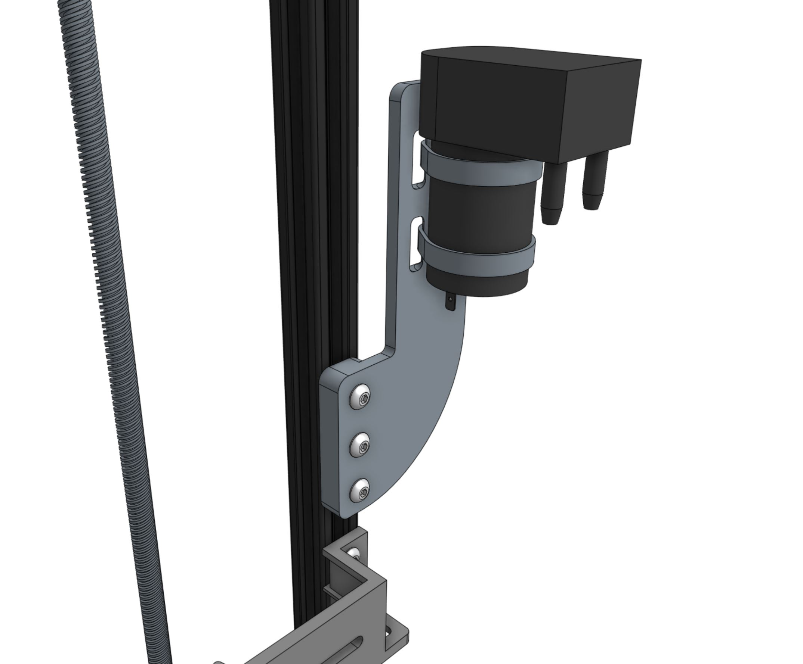
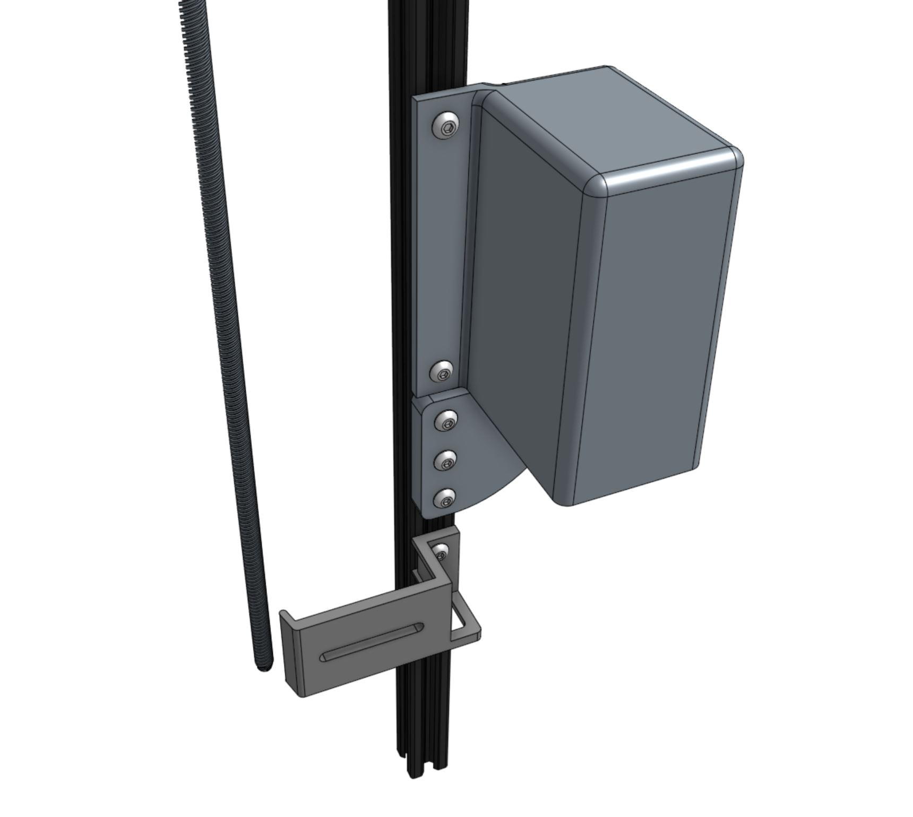

* toc
{:toc}



# Step 1: Attach the stepper motor to the Z-axis motor mount
Attach the **stepper motor** to the **z-axis motor mount** using four **M3 x 10mm screws**. The motor and encoder connectors should be facing the back flange of the mount.

# Step 2: Attach the motor mount to the Z-axis extrusion
Partially screw three **M5 x 10mm screws** and **M5 tee nuts** into the **z-axis motor mount**. Position the motor mount onto the **z-axis extrusion** as shown and tighten. Note that you will need to adjust the position of the motor mount once the cables have been connected and it is time to put the vertical motor housing on.

# Step 3: Attach the flex coupling
Slide the **5mm to 8mm flex coupling** onto the **motor shaft** and tighten the two setscrews with the **2mm hex driver**. Ensure that the setscrews are positioned onto the flat parts of the motor shaft.

# Step 4: Attach the leadscrew
Slide the **leadscrew** into the **flex coupling** and tighten the two setscrews.



# Step 5: Attach the vertical cable carrier supports
Use two **M5 x 10mm screws** and **M5 tee nuts** to attach each of the four **vertical cable carrier supports** to the **z-axis extrusion**. Space the supports along the extrusion as shown.

# Step 6: Attach the vacuum pump
Use three **M5 x 16mm screws** and **M5 tee nuts** to attach the **vacuum pump mount** to the **z-axis extrusion**.

Fasten the **vacuum pump** to the **vacuum pump mount** using two **200mm zip ties**.

Attach the **vacuum pump housing** to the **z-axis extrusion** using two **M5 x 10mm screws** and **M5 tee nuts**.

# What's next?

 * [Install the Z-Axis](../z-axis/install-the-z-axis.md)
