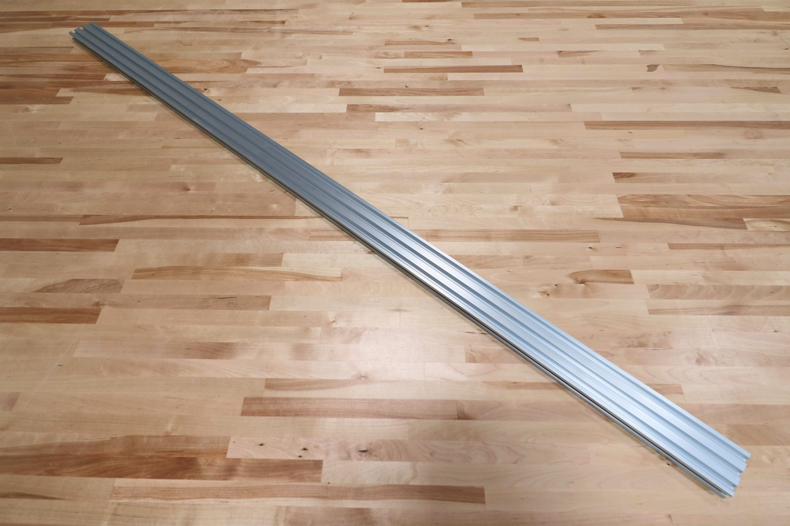

* toc
{:toc}

|Component                     |$/Unit                        |Genesis Qty                   |Genesis Subtotal              |XL Qty                        |XL Subtotal                   |
|------------------------------|------------------------------|------------------------------|------------------------------|------------------------------|------------------------------|
|[Track Extrusions](#track-extrusions)|$30.00                        |4                             |$120.00                       |8                             |$240.00
|[Gantry Columns](#gantry-columns)|$15.00                        |2                             |$30.00                        |2                             |$30.00
|[Gantry Main Beam](#gantry-main-beam)|$35.00                        |1                             |$35.00                        |2                             |$70.00
|[Z-Axis Extrusion](#z-axis-extrusion)|$20.00                        |1                             |$20.00                        |1                             |$20.00
|**TOTALS**                    |                              |**8**                         |**$205.00**                   |**13**                        |**$360.00**



<iframe class="embedly-embed" src="//cdn.embedly.com/widgets/media.html?src=https%3A%2F%2Fwww.youtube.com%2Fembed%2FLWvoSmqNwyA%3Ffeature%3Doembed&url=http%3A%2F%2Fwww.youtube.com%2Fwatch%3Fv%3DLWvoSmqNwyA&image=https%3A%2F%2Fi.ytimg.com%2Fvi%2FLWvoSmqNwyA%2Fhqdefault.jpg&key=f2aa6fc3595946d0afc3d76cbbd25dc3&type=text%2Fhtml&schema=youtube" width="854" height="480" scrolling="no" frameborder="0" allow="autoplay; fullscreen" allowfullscreen="true"></iframe>

# Track Extrusions

Track extrusions are the primary structural component of the tracks sub-assembly. They can be combined end-to-end in order to create longer tracks. The gantry v-wheels roll along the track extrusions, allowing FarmBot to move in the x-direction.

|                              |                              |
|------------------------------|------------------------------|
|**Length**                    |1500mm
|**Profile**                   |20mm x 40mm V-Slot
|**Material**                  |6063-T5 Aluminum
|**Surface Treatment**         |Clear anodized
|**Mass**                      |1.103kg
|**Volume**                    |405.5cm3
|**Price**                     |$30.00
|**Genesis Quantity**          |4
|**XL Quantity**               |8
|**Recommended Supplier**      |[The FarmBot Shop](http://shop.farm.bot)

# Gantry Columns

The gantry columns are made from aluminum extrusions. They can be scaled to be taller or shorter to satisfy your needs. The two large spaces inside the columns are used to conceal and protect the GT2 timing belts that run along the tracks and up to the gantry pulleys.

|                              |                              |
|------------------------------|------------------------------|
|**Length**                    |500mm
|**Profile**                   |20mm x 60mm V-Slot
|**Material**                  |6063-T5 Aluminum
|**Surface Treatment**         |Clear anodized
|**Mass**                      |0.571kg
|**Volume**                    |209.7cm3
|**Price**                     |$15.00
|**Quantity**                  |2
|**Recommended Supplier**      |[The FarmBot Shop](http://shop.farm.bot)

# Gantry Main Beam

This aluminum extrusion serves as the gantry's primary structural element. The cross-slide's v-wheels move across this extrusion, allowing FarmBot to move in the y-direction. It is possible to make this extrusion longer or shorter to suit your needs.

|                              |                              |
|------------------------------|------------------------------|
|**Length**                    |1500mm
|**Profile**                   |20mm x 60mm V-Slot
|**Material**                  |6063-T5 Aluminum
|**Surface Treatment**         |Clear anodized
|**Mass**                      |1.711kg
|**Volume**                    |629.2cm3
|**Price**                     |$35.00
|**Genesis Quantity**          |1
|**XL Quantity**               |2
|**Recommended Supplier**      |[The FarmBot Shop](http://shop.farm.bot)

# Z-Axis Extrusion

This aluminum extrusion allows FarmBot to accurately position the UTM and tools in the z-direction. It slides through the vertically aligned wheels on the front of the cross-slide.

|                              |                              |
|------------------------------|------------------------------|
|**Length**                    |1000mm
|**Profile**                   |20mm x 20mm V-Slot
|**Material**                  |6063-T5 Aluminum
|**Surface Treatment**         |Clear anodized
|**Mass**                      |0.417kg
|**Volume**                    |153.5cm3
|**Price**                     |$20.00
|**Quantity**                  |1
|**Recommended Supplier**      |[The FarmBot Shop](http://shop.farm.bot)



