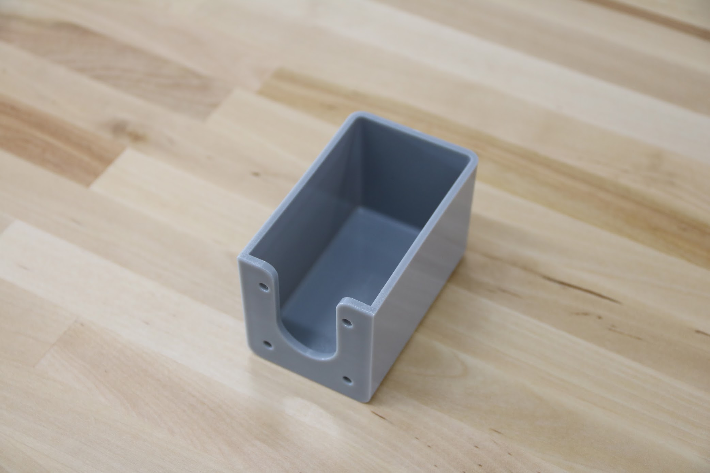
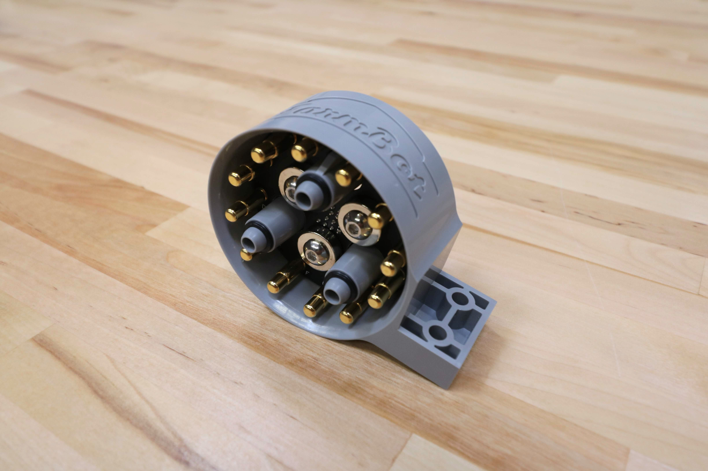
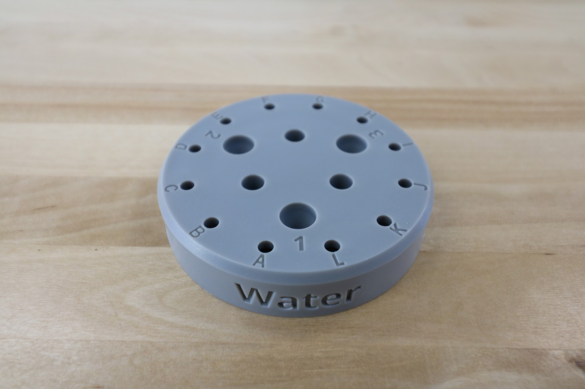
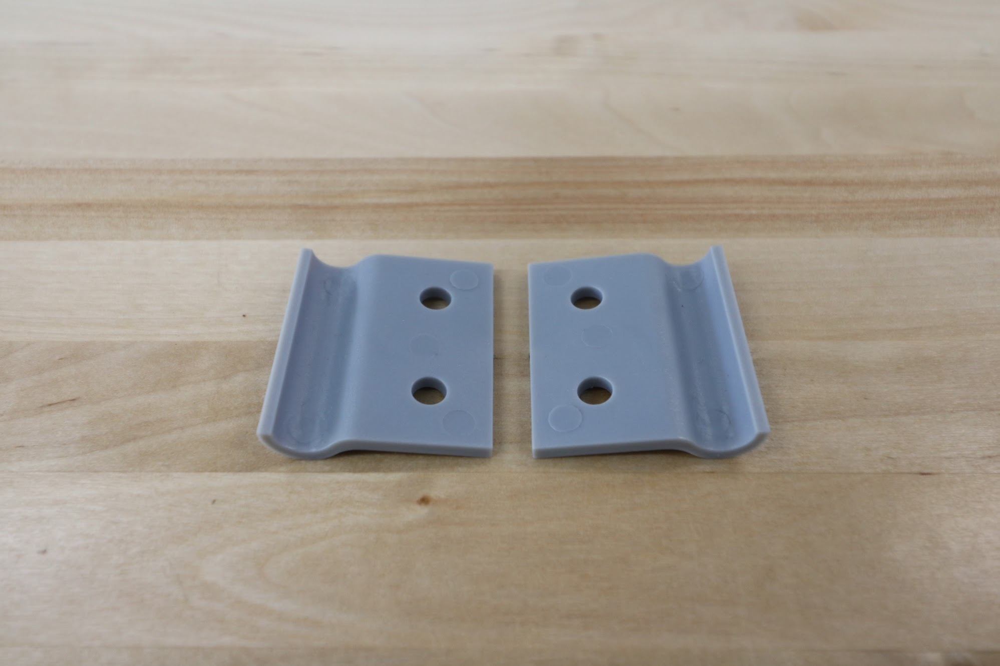

* toc
{:toc}

|Component                     |$/Unit                        |Genesis Qty                   |Genesis Subtotal              |XL Qty                        |XL Subtotal                   |
|------------------------------|------------------------------|------------------------------|------------------------------|------------------------------|------------------------------|
|[Horizontal Cable Carrier Supports](#horizontal-cable-carrier-supports)|$3.00                         |18                            |$54.00                        |36                            |$108.00
|[Vertical Cable Carrier Supports](#vertical-cable-carrier-supports)|$3.00                         |4                             |$12.00                        |4                             |$12.00
|[Cable Carrier Spacer Block](#cable-carrier-spacer-block)|$3.00                         |1                             |$3.00                         |1                             |$3.00
|[Cable Guides](#cable-guides)|$3.00                         |2                             |$6.00                         |2                             |$6.00
|[Horizontal Motor Housings](#horizontal-motor-housings)|$10.00                        |3                             |$30.00                        |3                             |$30.00
|[Vertical Motor Housing](#vertical-motor-housing)|$12.00                        |1                             |$12.00                        |1                             |$12.00
|[Vacuum Pump Housing](#vacuum-pump-housing)|$15.00                        |1                             |$15.00                        |1                             |$15.00
|[Universal Tool Mount](#universal-tool-mount)|$30.00                        |1                             |$30.00                        |1                             |$30.00
|[Seeder](#seeder)     |$7.00                         |1                             |$7.00                         |1                             |$7.00
|[Watering Nozzle Top](#watering-nozzle-top)|$7.00                         |1                             |$7.00                         |1                             |$7.00
|[Watering Nozzle Bottom](#watering-nozzle-bottom)|$5.00                         |1                             |$5.00                         |1                             |$5.00
|[Weeder](#weeder)     |$7.00                         |1                             |$7.00                         |1                             |$7.00
|[Wide Weeder Blades](#wide-weeder-blades)|$2.00                         |4                             |$8.00                         |4                             |$8.00
|[Medium Weeder Blades](#medium-weeder-blades)|$2.00                         |4                             |$8.00                         |4                             |$8.00
|[Narrow Weeder Blades](#narrow-weeder-blades)|$2.00                         |4                             |$8.00                         |4                             |$8.00
|[Soil Sensor](#soil-sensor)|$7.00                         |1                             |$7.00                         |1                             |$7.00
|[Seed Bin](#seed-bin) |$7.00                         |1                             |$7.00                         |1                             |$7.00
|[Seed Trays](#seed-trays)|$7.00                         |2                             |$14.00                        |2                             |$14.00
|[Camera Mounts](#camera-mounts)|$3.00                         |2                             |$6.00                         |2                             |$6.00
|**TOTALS**                    |                              |**53**                        |**$246.00**                   |**71**                        |**$300.00**

<iframe class="embedly-embed" src="//cdn.embedly.com/widgets/media.html?src=https%3A%2F%2Fwww.youtube.com%2Fembed%2FODUmjM1LhTA%3Ffeature%3Doembed&url=http%3A%2F%2Fwww.youtube.com%2Fwatch%3Fv%3DODUmjM1LhTA&image=https%3A%2F%2Fi.ytimg.com%2Fvi%2FODUmjM1LhTA%2Fhqdefault.jpg&key=f2aa6fc3595946d0afc3d76cbbd25dc3&type=text%2Fhtml&schema=youtube" width="854" height="480" scrolling="no" frameborder="0" allow="autoplay; fullscreen" allowfullscreen="true"></iframe>

# Horizontal Cable Carrier Supports
These parts are used to mount and support both the x-axis and y-axis cable carriers. The gusset also functions as an area for cables, tubes, and LED light strips to be routed through.

|                              |                              |
|------------------------------|------------------------------|
|**Material**                  |UV stabilized ABS
|**Color**                     |Gray
|**Mass**                      |
|**Volume**                    |
|**3D Printable?**             |Yes
|**Price**                     |$3.00
|**Genesis Quantity**          |18
|**XL Quantity**               |36

# Vertical Cable Carrier Supports
These parts are used to guide and support the z-axis cable carrier. The gusset also functions as an area for the z-axis motor's cables to be routed through.

|                              |                              |
|------------------------------|------------------------------|
|**Material**                  |UV stabilized ABS
|**Color**                     |Gray
|**Mass**                      |
|**Volume**                    |
|**3D Printable?**             |Yes
|**Price**                     |$3.00
|**Quantity**                  |4

# Cable Carrier Spacer Block
This component offsets the z-axis cable carrier from the cross-slide plate.

|                              |                              |
|------------------------------|------------------------------|
|**Material**                  |UV stabilized ABS
|**Color**                     |Gray
|**Mass**                      |
|**Volume**                    |
|**3D Printable?**             |Yes
|**Price**                     |$3.00
|**Quantity**                  |1

# Cable Guides
These simple components help organize and route the cables and tubes coming from the y-axis cable carrier.

|                              |                              |
|------------------------------|------------------------------|
|**Material**                  |UV stabilized ABS
|**Color**                     |Gray
|**Mass**                      |
|**Volume**                    |
|**3D Printable?**             |Yes
|**Price**                     |$3.00
|**Quantity**                  |2

# Horizontal Motor Housings
These housings protect the gantry and cross-slide motors and encoders from rain.

|                              |                              |
|------------------------------|------------------------------|
|**Material**                  |UV stabilized ABS
|**Color**                     |Gray
|**Mass**                      |
|**Volume**                    |
|**3D Printable?**             |Yes
|**Price**                     |$10.00
|**Quantity**                  |3

<iframe class="embedly-embed" src="//cdn.embedly.com/widgets/media.html?src=https%3A%2F%2Fwww.youtube.com%2Fembed%2FCQfkuFBVsek%3Ffeature%3Doembed&url=http%3A%2F%2Fwww.youtube.com%2Fwatch%3Fv%3DCQfkuFBVsek&image=https%3A%2F%2Fi.ytimg.com%2Fvi%2FCQfkuFBVsek%2Fhqdefault.jpg&key=02466f963b9b4bb8845a05b53d3235d7&type=text%2Fhtml&schema=youtube" width="854" height="480" scrolling="no" frameborder="0" allowfullscreen></iframe>

# Vertical Motor Housing
This component protects the z-axis motor from rain.

|                              |                              |
|------------------------------|------------------------------|
|**Material**                  |UV stabilized ABS
|**Color**                     |Gray
|**Mass**                      |
|**Volume**                    |
|**3D printable?**             |Yes
|**Price**                     |$12.00
|**Quantity**                  |1

# Vacuum Pump Housing
This housing protects the vacuum pump from rain. It is mounted on the z-axis extrusion.

|                              |                              |
|------------------------------|------------------------------|
|**Material**                  |UV stabilized ABS
|**Color**                     |Gray
|**Mass**                      |
|**Volume**                    |
|**3D Printable?**             |Yes
|**Price**                     |$15.00
|**Quantity**                  |1

# Universal Tool Mount
The UTM allows FarmBot to automatically switch tools for the task at hand. It features 12 electrical connections, three liquid/gas lines, and magnetic coupling.



|                              |                              |
|------------------------------|------------------------------|
|**Material**                  |UV stabilized ABS
|**Color**                     |Gray
|**Mass**                      |
|**Volume**                    |
|**3D Printable?**             |Yes
|**Price**                     |$30.00
|**Quantity**                  |1

<iframe class="embedly-embed" src="//cdn.embedly.com/widgets/media.html?src=https%3A%2F%2Fwww.youtube.com%2Fembed%2Fq8xjCBq32C8%3Ffeature%3Doembed&url=http%3A%2F%2Fwww.youtube.com%2Fwatch%3Fv%3Dq8xjCBq32C8&image=https%3A%2F%2Fi.ytimg.com%2Fvi%2Fq8xjCBq32C8%2Fhqdefault.jpg&key=02466f963b9b4bb8845a05b53d3235d7&type=text%2Fhtml&schema=youtube" width="854" height="480" scrolling="no" frameborder="0" allowfullscreen></iframe>

# Seeder
The seeder, combined with the vacuum pump, allows FarmBot to pick up seeds and deposit them precisely in the ground.

|                              |                              |
|------------------------------|------------------------------|
|**Material**                  |UV stabilized ABS
|**Color**                     |Gray
|**Mass**                      |
|**Volume**                    |
|**Brass Insert**              |1/4"-28 UNF threads
|**3D Printable?**             |Yes
|**Price**                     |$7.00
|**Quantity**                  |1

<iframe class="embedly-embed" src="//cdn.embedly.com/widgets/media.html?src=https%3A%2F%2Fwww.youtube.com%2Fembed%2FnXFdJIQaQB4%3Ffeature%3Doembed&url=http%3A%2F%2Fwww.youtube.com%2Fwatch%3Fv%3DnXFdJIQaQB4&image=https%3A%2F%2Fi.ytimg.com%2Fvi%2FnXFdJIQaQB4%2Fhqdefault.jpg&key=02466f963b9b4bb8845a05b53d3235d7&type=text%2Fhtml&schema=youtube" width="854" height="480" scrolling="no" frameborder="0" allowfullscreen></iframe>

# Watering Nozzle
This two-part tool distributes the stream of water coming from the UTM into a gentle shower for your plants.

|                              |                              |
|------------------------------|------------------------------|
|**Material**                  |UV stabilized ABS
|**Color**                     |Gray
|**Mass**                      |Top -  Bottom -
|**Volume**                    |Top -  Bottom -
|**3D Printable?**             |Yes
|**Price**                     |Top - $7.00 Bottom - $5.00
|**Quantity**                  |Top - 1 Bottom - 1

<iframe class="embedly-embed" src="//cdn.embedly.com/widgets/media.html?src=https%3A%2F%2Fwww.youtube.com%2Fembed%2Fxh7imhENpLQ%3Ffeature%3Doembed&url=http%3A%2F%2Fwww.youtube.com%2Fwatch%3Fv%3Dxh7imhENpLQ&image=https%3A%2F%2Fi.ytimg.com%2Fvi%2Fxh7imhENpLQ%2Fhqdefault.jpg&key=f2aa6fc3595946d0afc3d76cbbd25dc3&type=text%2Fhtml&schema=youtube" width="854" height="480" scrolling="no" frameborder="0" allowfullscreen></iframe>

## Watering Nozzle Top

## Watering Nozzle Bottom

# Weeder
The weeding tool allows FarmBot to smash weeds into the ground, thereby killing them via mechanical disruption. The tool consists of a base component and interchangeable implements that allow you to customize the tool for your soil conditions and types of weeds.

|                              |                              |
|------------------------------|------------------------------|
|**Material**                  |UV stabilized ABS
|**Color**                     |Gray
|**Mass**                      |Weeder -  Wide Blades -  Medium Blades -  Narrow Blades -
|**Volume**                    |Weeder -  Wide Blades -  Medium Blades -  Narrow Blades -
|**Brass Inserts**             |M3 inserts on all blades
|**3D Printable?**             |Yes
|**Price**                     |Weeder - $7.00 Wide Blades - $2.00 Medium Blades - $2.00 Narrow Blades - $2.00
|**Quantity**                  |Weeder - 1 Wide Blades - 4 Medium Blades - 4 Narrow Blades - 4

<iframe class="embedly-embed" src="//cdn.embedly.com/widgets/media.html?src=https%3A%2F%2Fwww.youtube.com%2Fembed%2FNsEdALh3ZYY%3Ffeature%3Doembed&url=http%3A%2F%2Fwww.youtube.com%2Fwatch%3Fv%3DNsEdALh3ZYY&image=https%3A%2F%2Fi.ytimg.com%2Fvi%2FNsEdALh3ZYY%2Fhqdefault.jpg&key=02466f963b9b4bb8845a05b53d3235d7&type=text%2Fhtml&schema=youtube" width="854" height="480" scrolling="no" frameborder="0" allowfullscreen></iframe>

## Weeder

## Wide Weeder Blades

## Medium Weeder Blades

## Narrow Weeder Blades

# Soil Sensor
This tool acts as a mount for the soil sensor circuit board.

|                              |                              |
|------------------------------|------------------------------|
|**Material**                  |UV stabilized ABS
|**Color**                     |Gray
|**Mass**                      |
|**Volume**                    |
|**3D Printable?**             |Yes
|**Price**                     |$7.00
|**Quantity**                  |1

<iframe class="embedly-embed" src="//cdn.embedly.com/widgets/media.html?src=https%3A%2F%2Fwww.youtube.com%2Fembed%2Fp6CPnJoHf8E%3Ffeature%3Doembed&url=http%3A%2F%2Fwww.youtube.com%2Fwatch%3Fv%3Dp6CPnJoHf8E&image=https%3A%2F%2Fi.ytimg.com%2Fvi%2Fp6CPnJoHf8E%2Fhqdefault.jpg&key=02466f963b9b4bb8845a05b53d3235d7&type=text%2Fhtml&schema=youtube" width="854" height="480" scrolling="no" frameborder="0" allowfullscreen></iframe>

# Seed Bin
This plastic bin allows you to load many seeds of the same type into your FarmBot.

|                              |                              |
|------------------------------|------------------------------|
|**Material**                  |UV stabilized ABS
|**Color**                     |Gray
|**Mass**                      |
|**Volume**                    |
|**3D Printable?**             |Yes
|**Price**                     |$7.00
|**Quantity**                  |1

<iframe class="embedly-embed" src="//cdn.embedly.com/widgets/media.html?src=https%3A%2F%2Fwww.youtube.com%2Fembed%2FguJK9498ZA4%3Ffeature%3Doembed&url=http%3A%2F%2Fwww.youtube.com%2Fwatch%3Fv%3DguJK9498ZA4&image=https%3A%2F%2Fi.ytimg.com%2Fvi%2FguJK9498ZA4%2Fhqdefault.jpg&key=02466f963b9b4bb8845a05b53d3235d7&type=text%2Fhtml&schema=youtube" width="854" height="480" scrolling="no" frameborder="0" allowfullscreen></iframe>

# Seed Trays
The seed trays feature 16 small bins allowing you to load 16 precise quantities/types of seeds into your FarmBot.

|                              |                              |
|------------------------------|------------------------------|
|**Material**                  |UV stabilized ABS
|**Color**                     |Gray
|**Mass**                      |
|**Volume**                    |
|**3D Printable?**             |Yes
|**Price**                     |$7.00
|**Quantity**                  |2

# Camera Mounts
These small plastic components fasten the borescope camera to the z-axis extrusion.

|                              |                              |
|------------------------------|------------------------------|
|**Material**                  |UV stabilized ABS
|**Color**                     |Gray
|**Mass**                      |
|**Volume**                    |
|**3D Printable?**             |Yes
|**Price**                     |$3.00
|**Quantity**                  |2

{%
include callout.html
type="info"
title="Looking for an alternative supplier of plastic parts?"
content="We've had good experiences getting prototype plastic parts made with the 3D printing vendor [Shapeways](https://www.shapeways.com/). They have fast turnaround times and can make you parts in a variety of colors and materials.

However, most parts from Shapeways will end up more expensive than the prices we offer. Furthermore, while Shapeways does use very high quality 3D printers, the part quality will still not be as good as the quality of our injection molded parts.

We recommend using Shapeways only for custom plastic parts that you can't already get from [our shop](http://shop.farm.bot)."
%}

