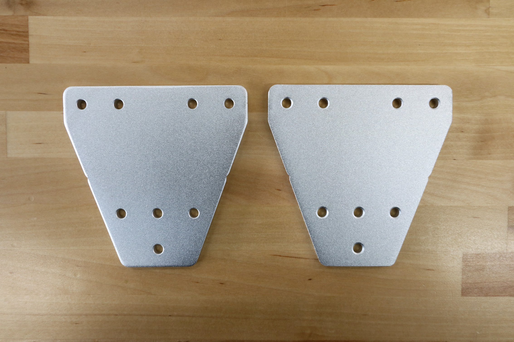
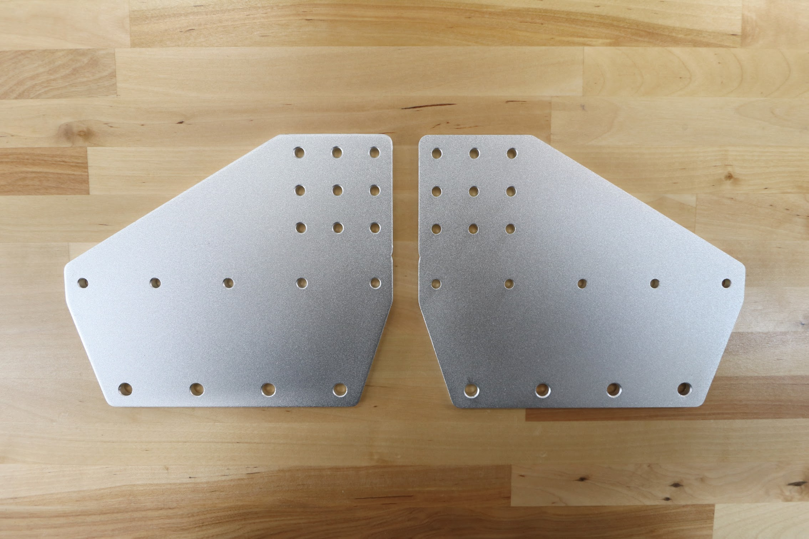
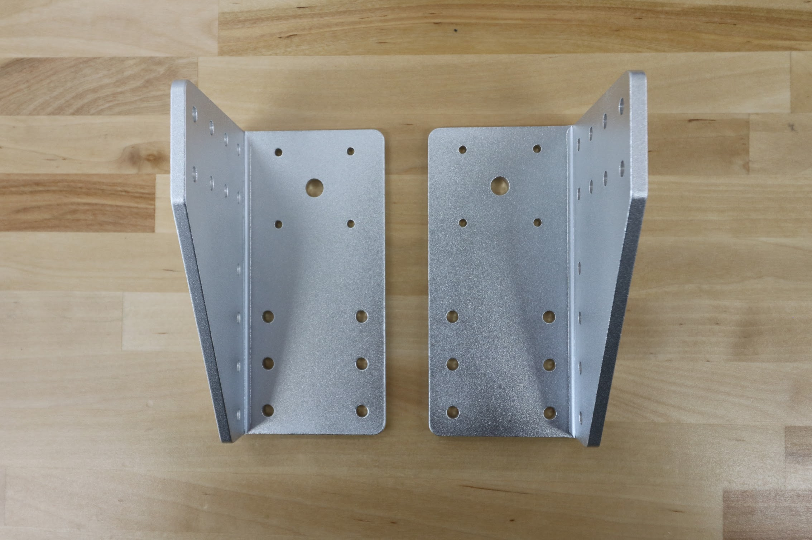

|Component                     |$/Unit                        |Genesis Qty                   |Genesis Subtotal              |XL Qty                        |XL Subtotal                   |
|------------------------------|------------------------------|------------------------------|------------------------------|------------------------------|------------------------------|
|[Track End Plates](#track-end-plates)|$12.00                        |4                             |$48.00                        |4                             |$48.00
|[Track Joining Plates](#track-joining-plates)|$15.00                        |2                             |$30.00                        |6                             |$90.00
|[Gantry Wheel Plates](#gantry-wheel-plates)|$25.00                        |2                             |$50.00                        |2                             |$50.00
|[Gantry Corner Brackets](#gantry-corner-brackets)|$30.00                        |2                             |$60.00                        |2                             |$60.00
|[Gantry Joining Bracket](#gantry-joining-bracket)|$35.00                        |-                             |-                             |1                             |$35.00
|[Cross-Slide Plate](#cross-slide-plate)|$25.00                        |1                             |$25.00                        |1                             |$25.00
|[Z-Axis Motor Mount](#z-axis-motor-mount)|$20.00                        |1                             |$20.00                        |1                             |$20.00
|[3-Slot Toolbays](#toolbays)|$40.00                        |2                             |$80.00                        |2                             |$80.00
|[1-Slot Toolbays](#toolbays)|$25.00                        |-                             |-                             |3                             |$75.00
|[Long Cable Carrier Mount](#long-cable-carrier-mount)|$10.00                        |1                             |$10.00                        |1                             |$10.00
|[Peripheral Mount](#peripheral-mount)|$20.00                        |2                             |$40.00                        |2                             |$40.00
|[Belt Clips](#belt-clips)|$3.00                         |6                             |$18.00                        |6                             |$18.00
|[Z-Axis Hardstops](#z-axis-hardstops)|$3.00                         |2                             |$6.00                         |2                             |$6.00
|**TOTALS**                    |                              |**25**                        |**$387.00**                   |**33**                        |**$557.00**

<iframe class="embedly-embed" src="//cdn.embedly.com/widgets/media.html?src=https%3A%2F%2Fwww.youtube.com%2Fembed%2FpoZNFG8F3Jo%3Ffeature%3Doembed&url=http%3A%2F%2Fwww.youtube.com%2Fwatch%3Fv%3DpoZNFG8F3Jo&image=https%3A%2F%2Fi.ytimg.com%2Fvi%2FpoZNFG8F3Jo%2Fhqdefault.jpg&key=f2aa6fc3595946d0afc3d76cbbd25dc3&type=text%2Fhtml&schema=youtube" width="854" height="480" scrolling="no" frameborder="0" allow="autoplay; fullscreen" allowfullscreen="true"></iframe>

# Track End Plates

|                              |                              |
|------------------------------|------------------------------|
|**Thickness**                 |5mm
|**Material**                  |6061 Aluminum
|**Surface Treatments**        |Tumble polished Sand blasted Clear anodized
|**Mass**                      |0.063kg
|**Volume**                    |23.2cm3
|**Price**                     |$12.00
|**Quantity**                  |4
|**Recommended Supplier**      |[The FarmBot Shop](http://shop.farm.bot)



# Track Joining Plates

|                              |                              |
|------------------------------|------------------------------|
|**Thickness**                 |5mm
|**Material**                  |6061 Aluminum
|**Surface Treatments**        |Tumble polished Sand blasted Clear anodized
|**Mass**                      |0.101kg
|**Volume**                    |37.0cm3
|**Price**                     |$15.00
|**Quantity**                  |2
|**Recommended Supplier**      |[The FarmBot Shop](http://shop.farm.bot)



# Gantry Wheel Plates

|                              |                              |
|------------------------------|------------------------------|
|**Thickness**                 |5mm
|**Material**                  |6061 Aluminum
|**Surface Treatments**        |Tumble polished Sand blasted Clear anodized
|**Mass**                      |0.287kg
|**Volume**                    |105.5cm3
|**Price**                     |$25.00
|**Quantity**                  |2
|**Recommended Supplier**      |[The FarmBot Shop](http://shop.farm.bot)



# Gantry Corner Brackets

|                              |                              |
|------------------------------|------------------------------|
|**Thickness**                 |5mm
|**Material**                  |5052 Aluminum
|**Surface Treatments**        |Tumble polished Sand blasted Clear anodized
|**Mass**                      |0.211kg
|**Volume**                    |77.6cm3
|**Price**                     |$30.00
|**Quantity**                  |2 (1 left-hand and 1 right-hand version)
|**Recommended Supplier**      |[The FarmBot Shop](http://shop.farm.bot)



# Gantry Joining Bracket

|                              |                              |
|------------------------------|------------------------------|
|**Thickness**                 |5mm
|**Material**                  |6061 Aluminum
|**Surface Treatments**        |Tumble polished Sand blasted Clear anodized
|**Mass**                      |
|**Volume                      |
|**Price**                     |$35.00
|**Quantity**                  |1 (Genesis XL only)
|**Recommended Supplier**      |[The FarmBot Shop](http://shop.farm.bot)



# Cross-Slide Plate

|                              |                              |
|------------------------------|------------------------------|
|**Thickness**                 |5mm
|**Material**                  |6061 Aluminum
|**Surface Treatments**        |Tumble polished Sand blasted Clear anodized
|**Mass**                      |0.334kg
|**Volume**                    |122.7cm3
|**Price**                     |$25.00
|**Quantity**                  |1
|**Recommended Supplier**      |[The FarmBot Shop](http://shop.farm.bot)



# Z-Axis Motor Mount
This component securely attached the z-axis motor to the z-axis extrusion.

|                              |                              |
|------------------------------|------------------------------|
|**Material**                  |Machined 6061 Aluminum
|**Surface Treatments**        |Tumble polished Sandblasted Clear anodized
|**Color**                     |Silver
|**Mass**                      |
|**Volume**                    |
|**3D Printable?**             |Yes
|**Price**                     |$20.00
|**Quantity**                  |1
|**Recommended Supplier**      |[The FarmBot Shop](http://shop.farm.bot)

# Toolbays

Toolbays are available in both 1-slot and 3-slot versions.

|                              |                              |
|------------------------------|------------------------------|
|**Thickness**                 |5mm
|**Material**                  |5052 Aluminum
|**Surface Treatments**        |Tumble polished Sand blasted Black anodized Laser engraved logo
|**Mass**                      |1-slot:  3-slot: 0.828kg
|**Volume**                    |1-slot: 3-slot: 304.4cm3
|**Price**                     |1-slot: $25.00 3-slot: $40.00
|**Quantity**                  |Genesis 1-slot: 0 3-slot: 2  Genesis XL 1-slot: 3 3-slot: 2
|**Recommended Supplier**      |[The FarmBot Shop](http://shop.farm.bot)

<iframe class="embedly-embed" src="//cdn.embedly.com/widgets/media.html?src=https%3A%2F%2Fwww.youtube.com%2Fembed%2FvjvIB5wXmRo%3Ffeature%3Doembed&url=http%3A%2F%2Fwww.youtube.com%2Fwatch%3Fv%3DvjvIB5wXmRo&image=https%3A%2F%2Fi.ytimg.com%2Fvi%2FvjvIB5wXmRo%2Fhqdefault.jpg&key=02466f963b9b4bb8845a05b53d3235d7&type=text%2Fhtml&schema=youtube" width="854" height="480" scrolling="no" frameborder="0" allowfullscreen></iframe>

## 1-Slot Toolbays



## 3-Slot Toolbays



# Long Cable Carrier Mount
This part allows the y-axis cable carrier to be mounted to the cross-slide plate.

|                              |                              |
|------------------------------|------------------------------|
|**Material**                  |Machined 6061 Aluminum
|**Surface Treatments**        |Tumble polished Sandblasted Clear anodized
|**Color**                     |Silver
|**Mass**                      |
|**Volume**                    |
|**3D Printable?**             |Yes
|**Price**                     |$10.00
|**Quantity**                  |1
|**Recommended Supplier**      |[The FarmBot Shop](http://shop.farm.bot)

# Peripheral Mount
This component is used to mount the vacuum pump to the z-axis extrusion and the solenoid valve to a gantry column.

|                              |                              |
|------------------------------|------------------------------|
|**Thickness**                 |5 to 10mm
|**Material**                  |6061 Aluminum
|**Surface Treatments**        |Tumble polished Sand blasted Clear anodized
|**Mass**                      |
|**Volume**                    |
|**Price**                     |$20.00
|**Quantity**                  |2
|**Recommended Supplier**      |[The FarmBot Shop](http://shop.farm.bot)



# Belt Clips

|                              |                              |
|------------------------------|------------------------------|
|**Thickness**                 |5mm
|**Material**                  |6061 Aluminum
|**Surface Treatments**        |Tumble polished Sand blasted Clear anodized
|**Mass**                      |0.006kg
|**Volume**                    |2.34cm3
|**Price**                     |$3.00
|**Quantity**                  |6
|**Recommended Supplier**      |[The FarmBot Shop](http://shop.farm.bot)



# Z-Axis Hardstops
These components mount on the z-axis extrusion and physically limit how low and high FarmBot can move the z-axis.

|                              |                              |
|------------------------------|------------------------------|
|**Thickness**                 |5mm
|**Material**                  |6061 Aluminum
|**Surface Treatments**        |Tumble polished Sand blasted Clear anodized
|**Mass**                      |
|**Volume**                    |
|**Price**                     |$3.00
|**Quantity**                  |2
|**Recommended Supplier**      |[The FarmBot Shop](http://shop.farm.bot)

{%
include callout.html
type="info"
title="Looking for an alternative supplier of aluminum plates?"
content="We've had good experiences getting prototype plates made by [Big Blue Saw](http://www.bigbluesaw.com/), a US-based waterjet cutting house.

However, their parts come in an unfinished state (sharp edges and surface defects) straight off the waterjet cutter. You can pay them significantly more to tumble polish your parts, but they don't do anodization or sand blasting. Overall, while their service is great for prototypes, you will not get the same quality parts as the ones shown above and sold in [our shop](http://shop.farm.bot). Also note that they only manufacture flat plates, they do not do bent parts (as required for the toolbays) or additional machining (as required for the vacuum pump mount).

We recommend using Big Blue Saw only for custom flat plate designs that we don't already sell in our shop."
%}

