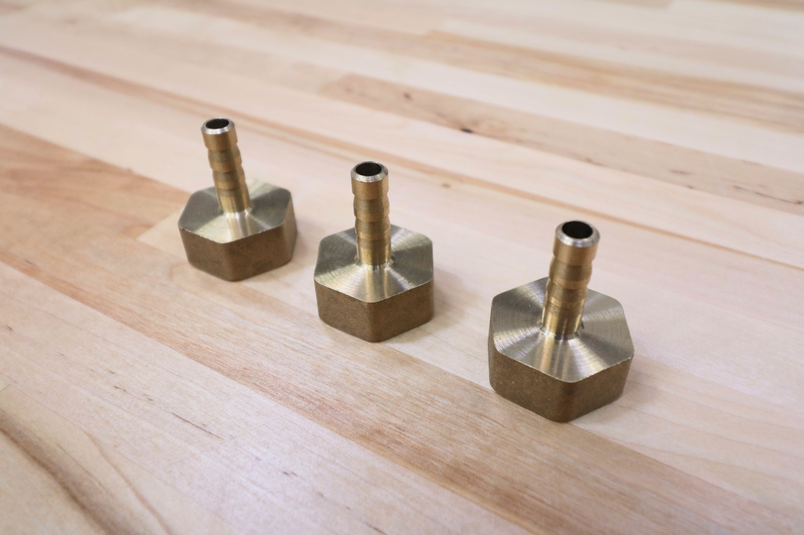
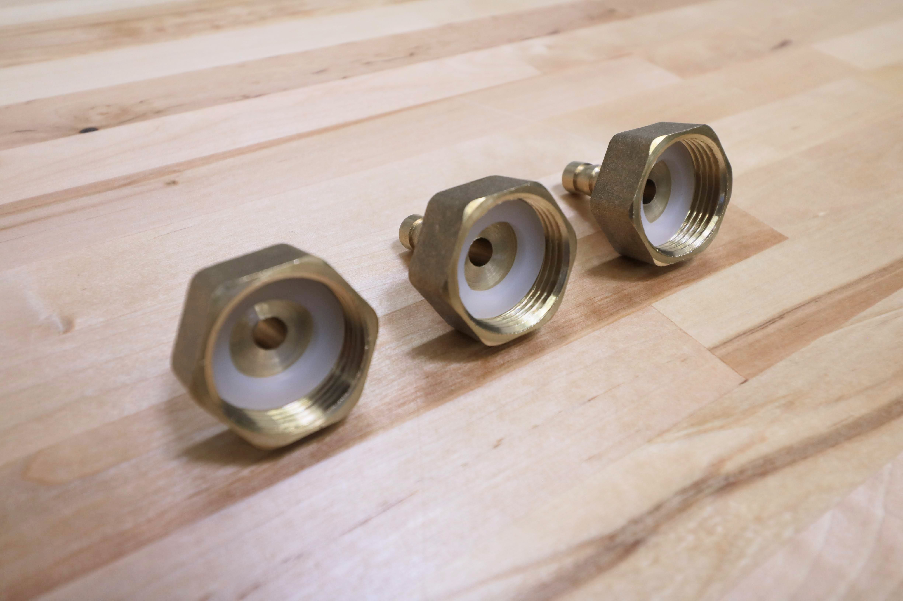
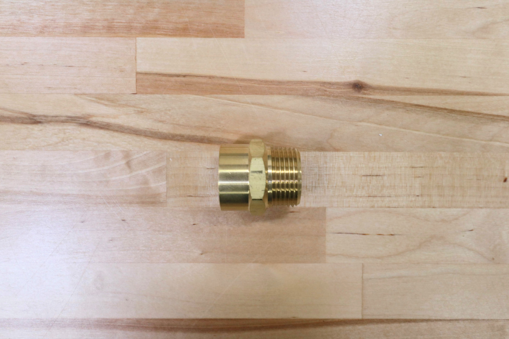
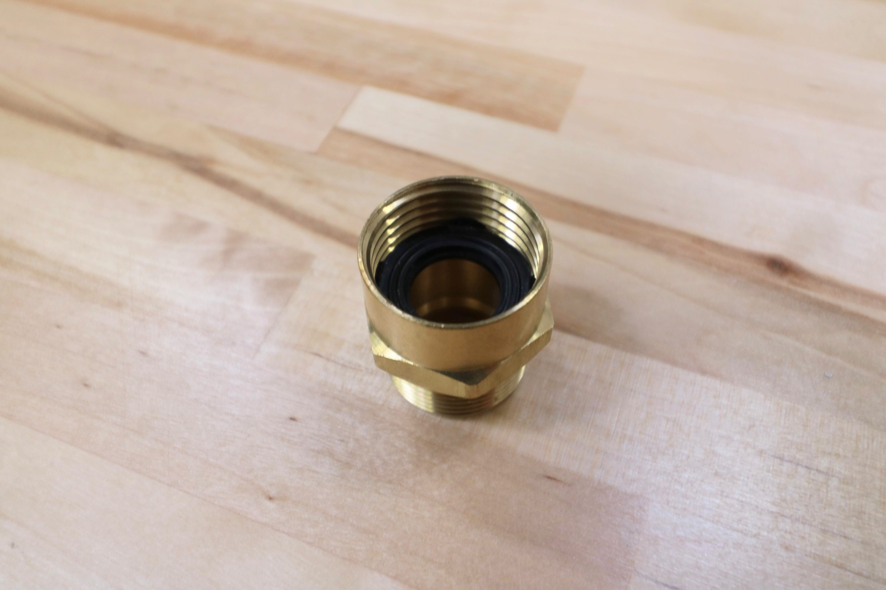
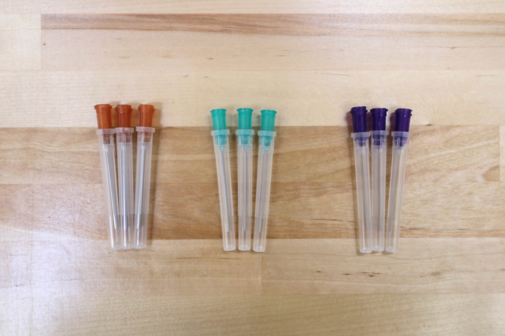

|Component                     |$/Unit                        |Genesis Qty                   |Genesis Subtotal              |XL Qty                        |XL Subtotal                   |
|------------------------------|------------------------------|------------------------------|------------------------------|------------------------------|------------------------------|
|[Water Tubes](#liquidgas-tubes)|$10.00 to $15.00              |2                             |$20.00                        |2                             |$30.00
|[Vacuum Air Tube](#liquidgas-tubes)|$5.00                         |1                             |$5.00                         |1                             |$5.00
|[Barbs](#barbs)       |$6.00                         |3                             |$18.00                        |3                             |$18.00
|[Barbed Adapter](#barbed-adapter)|$5.00                         |3                             |$15.00                        |3                             |$15.00
|[Garden Hose Adapter](#garden-hose-adapter)|$7.00                         |1                             |$7.00                         |1                             |$7.00
|[O-rings](#o-rings)   |$0.50                         |3                             |$1.50                         |3                             |$1.50
|[Pressure Regulator](#pressure-regulator)|$8.00                         |1                             |$8.00                         |1                             |$8.00
|[Luer Lock Adapter](#luer-lock-adapter)|$5.00                         |1                             |$5.00                         |1                             |$5.00
|[Luer Lock Needles](#luer-lock-needles)|$3.00                         |9                             |$27.00                        |9                             |$27.00
|[Teflon Tape](#teflon-tape)|$5.00                         |1                             |$5.00                         |1                             |$5.00
|**TOTALS**                    |                              |**25**                        |**$111.50**                   |**25**                        |**$121.50**

# Liquid/Gas Tubes
These ultra flexible silicone tubes carry water to the UTM and suck vacuum air.

|                              |                              |
|------------------------------|------------------------------|
|**Lengths**                   |Genesis 3m, 3m, and 0.4m  Genesis XL 4.5m, 4.5m, and 0.4m
|**Material**                  |Silcone
|**Color**                     |Semi-clear
|**Flexibility**               |Very Flexible
|**Compatible Tube Fittings**  |Barbs
|**Inner Diameter**            |6mm
|**Outer Diameter**            |9mm
|**Wall Thickness**            |1.5mm
|**Price**                     |$5.00 - 0.4m $10.00 - 3m $15.00 - 4.5m
|**Quantity**                  |See above lengths

<iframe class="embedly-embed" src="//cdn.embedly.com/widgets/media.html?src=https%3A%2F%2Fwww.youtube.com%2Fembed%2FWQltVvwRYfE%3Ffeature%3Doembed&url=http%3A%2F%2Fwww.youtube.com%2Fwatch%3Fv%3DWQltVvwRYfE&image=https%3A%2F%2Fi.ytimg.com%2Fvi%2FWQltVvwRYfE%2Fhqdefault.jpg&key=02466f963b9b4bb8845a05b53d3235d7&type=text%2Fhtml&schema=youtube" width="854" height="480" scrolling="no" frameborder="0" allowfullscreen></iframe>

# Barbs
These brass barbs screw into the UTM's three liquid/gas ports and accept the three liquid/gas lines coming from the z-axis cable carrier. As of the v1.4 release, these barbs come pre-installed on the UTM.

|                              |                              |
|------------------------------|------------------------------|
|**For Tube ID**               |6mm
|**Threads**                   |M5
|**Hex Size**                  |8mm
|**Gasket?**                   |Yes
|**Material**                  |Brass
|**Price**                     |$6.00
|**Quantity**                  |3

# Barbed Adapter
These adapters are used throughout the water tubing system.

|                              |                              |
|------------------------------|------------------------------|
|**Material**                  |Brass
|**For Tube ID**               |6mm
|**Threads**                   |3/4" female NPT (National Pipe Thread)
|**Rubber Gasket?**            |Included
|**Price**                     |$5.00
|**Quantity**                  |3



# Garden Hose Adapter
This adapter connects standard US garden hoses to a barbed adapter.

|                              |                              |
|------------------------------|------------------------------|
|**Material**                  |Brass
|**Threads**                   |3/4" Female GHT (Garden Hose Thread) 3/4" Male NPT (National Pipe Thread)
|**Rubber Gasket?**            |Included
|**Price**                     |$7.00
|**Quantity**                  |1



# O-rings
These O-rings fit onto the UTM's liquid/gas ports and create a solid seal when tools are mounted. As of the v1.4 release, these components come pre-installed on the UTM.

|                              |                              |
|------------------------------|------------------------------|
|**Material**                  |Buna-N
|**Durometer**                 |A70 (Medium)
|**Outer Diameter**            |10.5mm
|**Inner Diameter**            |7.5mm
|**Thickness**                 |1.5mm
|**Temperature Range**         |-30° to 212° F
|**Color**                     |Black
|**Price**                     |$0.50
|**Quantity**                  |3

# Pressure Regulator
This pressure regulator reduces the pressure from a municipal water supply down to 15 PSI (103 kpa, 1.03 bar) so that FarmBot can more easily control the amount of water it disperses.

|                              |                              |
|------------------------------|------------------------------|
|**Material**                  |UV resistant plastic
|**Inlet**                     |3/4 in. female pipe thread
|**Outlet**                    |3/4 in. male pipe thread
|**Color**                     |Black
|**Length**                    |6 inches (152.4mm)
|**Outer Diameter**            |1.25 inches (31.75mm)
|**Outlet Pressure**           |15 PSI (103 kpa, 1.02 bar)
|**Max Input Pressure**        |100 PSI (688 kpa, 6.88 bar)
|**Price**                     |$8.00
|**Quantity**                  |1



# Luer Lock Adapter

|                              |                              |
|------------------------------|------------------------------|
|**Price**                     |$5.00
|**Quantity**                  |1



# Luer Lock Needles

|                              |                              |
|------------------------------|------------------------------|
|**Gauges**                    |16, 19, and 22
|**Length**                    |40mm
|**Covers?**                   |Included
|**Price**                     |$3.00
|**Quantity**                  |3 of each gauge



# Teflon Tape
This plumber's tape is used to seal the pipe thread connections in FarmBot's watering system.

|                              |                              |
|------------------------------|------------------------------|
|**Material**                  |PTFE
|**Length**                    |9m
|**Width**                     |1.5cm
|**Price**                     |$5.00
|**Quantity**                  |1

