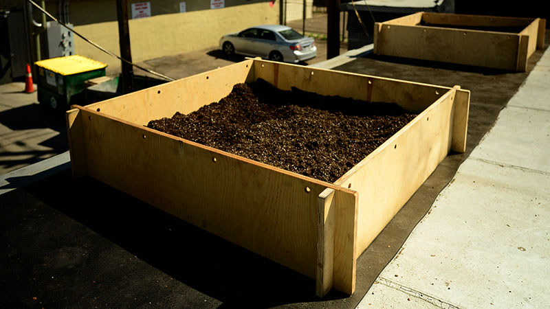
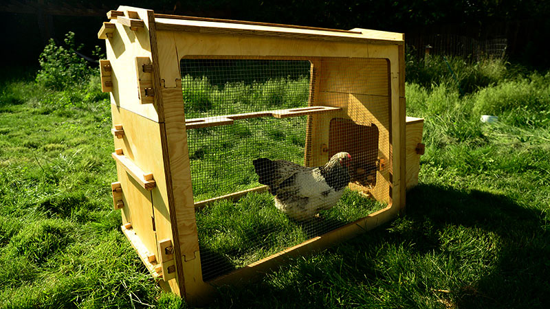
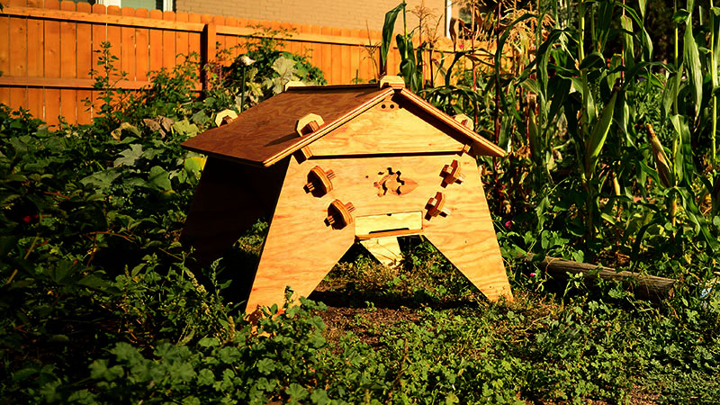
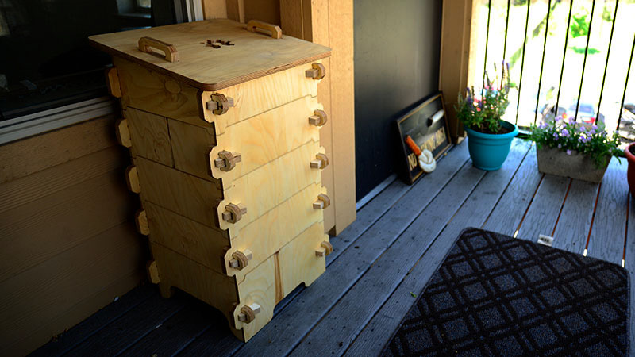

* toc
{:toc}

Our friends at the [AKER project](http://akerkits.com) share a similar vision for the future of food as us. They have created simple garden kits that snap together without tools, which we recommend adding to your FarmBot so you can have a more complete food system right in your backyard!

All of their designs are open-source and can be CNC routed at your local MakerSpace, or purchased from them directly at [akerkits.com](http://akerkits.com).

<iframe width="100%" height="300" src="https://sketchfab.com/models/27324ad86e7c46c0a9233f71ce8f9876/embed" frameborder="0" allowfullscreen mozallowfullscreen="true" webkitallowfullscreen="true" onmousewheel=""></iframe>

# GrowSquare

The GrowSquare is a simple, easy to assemble raised bed. It’s a great entry-level kit that snaps together in under a minute and can slot seamlessly into a backyard or rooftop environment to start growing vegetables.



Learn more and purchase the GrowSquare [here](http://akerkits.com).

# EggHaus

The EggHaus is a modern chicken coop designed to house up to two hens. The sturdy snap-fit design creates a protective and well ventilated shelter during the night, while the locking door gives the hens an easy exit and re-entrance during the day.

The EggHaus includes a roosting pole, open floor fertilizing feature and raised nesting box, making it super easy to collect fresh eggs each morning. With your hens laying up to seven eggs per week, a full EggHaus will meet your breakfast needs.

Learn more and purchase the EggHaus [here](http://akerkits.com).

# Colorado Top Bar bee hive

The Colorado Top Bar is a beautiful beehive for your backyard, community garden or rooftop. Designed by a team in Colorado and inspired by the classic Kenyan Top Bar design, the CTB contains minimal parts and requires no equipment to harvest honey and wax.

The CTB embraces natural beekeeping methods, allowing bees to build “natural” or “free” comb. Other styles of hive such as the Langstroth typically use pre-made plastic foundations or commercially produced wax comb.

Learn more and purchase the Colorado Top Bar [here](http://akerkits.com).

# WormHaus

The WormHaus is a compact vermicomposting system offering a sustainable way to convert your food waste into nutrient-rich organic fertilizer (for your FarmBot bed!) Worms within the system process your organic scraps to nourish other plants and vegetables growing in your home.

The WormHaus can convert an amazing 3kg / 7lbs of food waste per week, making it perfect for small families and much more efficient than standard hot or cold composting systems. The kit comes with five stackable levels, allowing the system to expand and contract depending on how much waste is being created.

Learn more and purchase a WormHause [here](http://akerkits.com).

