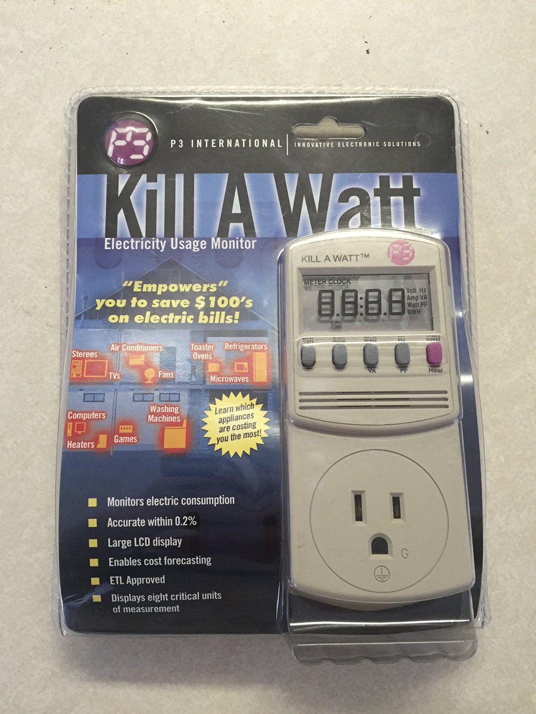
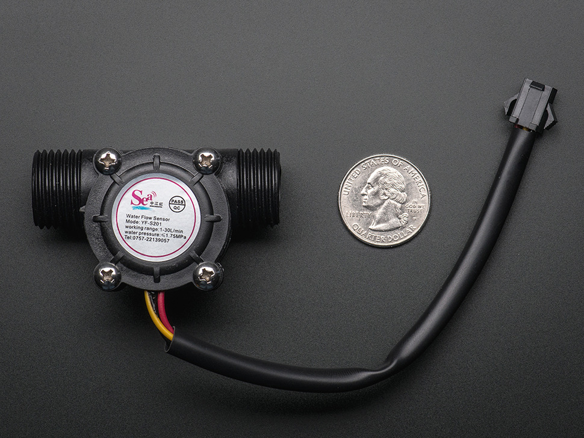

* toc
{:toc}

Interested in how many liters of water your FarmBot uses? How about how many kWh? Use these guides to help you monitor the exact amount of each of these resources your FarmBot uses.

# Electricity

The easiest way to record how much electricity FarmBot uses is to place a device called a [Kill a Watt](http://www.amazon.com/P3-P4400-Electricity-Usage-Monitor/dp/B00009MDBU/ref=sr_1_1?ie=UTF8&qid=1455855137&sr=8-1&keywords=kill+a+watt+p4480) in between your power source and FarmBot. This will allow you to measure the cumulative amount of energy your FarmBot uses in kWh, as well as the current rate of consumption in watts.

While you will not be able to collect and view historical data of energy usage, the Kill a Watt is the easiest way to measure your FarmBot's energy use - just look at the screen after a few days, weeks, or months. You can also use the device to measure other appliances in your home!

There are other options for monitoring energy. For example, you could [hack your Kill a Watt to stream its data over wifi](http://gizmosnack.blogspot.se/2014/11/power-plug-energy-meter-now-wireless.html). Maybe you could hack it to feed the data directly into FarmBot's Arduino!

# Water

Using an affordable water flow meter from [Adafruit](https://www.adafruit.com/products/828), you can measure the amount of water that FarmBot uses and then pipe that data to the web app.



