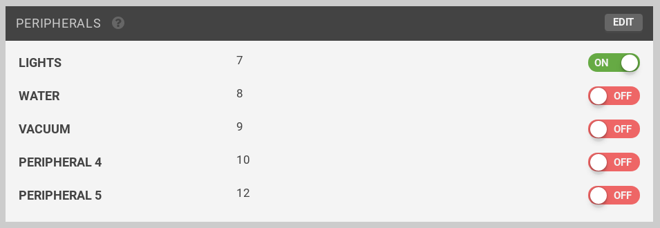

* toc
{:toc}

Refer to this reference table to control Farmduino's peripherals from the Web App Controls page Peripherals widget or in a Sequence.

|Peripheral                    |Pin Number                    |
|------------------------------|------------------------------|
|LIGHTING                      |7
|WATER                         |8
|VACUUM                        |9
|PERIPH 4                      |10
|PERIPH 5                      |12



